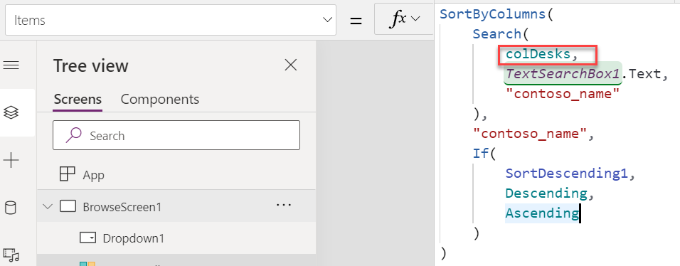

Power Apps provides users with an efficient way to work with their business data and processes. Apps can access data by using connectors. Commonly, when an app starts or a new screen is displayed, some information is retrieved for initial display. Controls on the screens are often bound directly to connectors, and data is retrieved when the screen is rendered for the user. Navigating from screen to screen can also cause the data to be retrieved again. In some cases, if not optimized, this process can result in a substandard user experience or additional processing. By evaluating your users' needs and how data is loaded, you can develop a strategy to improve performance.

As you evaluate your app, consider the following key questions:

- **Is the initial data that is being shown to the user useful?** Often, app makers want to show data when users arrive at a screen. This behavior can make the app look appealing and it demos well; however, it's inefficient when the initial list isn't used regularly. This situation can result in unintentional slowness of the app when users are preloading a large quantity of unfiltered records.

- **Does the app offer the correct data filters?** Adding controls so that users can enter criteria to reduce the number of rows that are displayed can be helpful for user productivity and performance.

- **Are you incurring overhead from showing related data?** If you're using a data source that provides access to relational data, and you use related values in a gallery, the app might perform lookup queries for each row that is shown. You can identify this issue by running the app with Monitor and then reviewing the results. Preloading the related data into a collection and then looking up from the collection instead can be more efficient.

- **Do you know what data is static and what data is updated frequently?** Before you consider preloading data, make sure that you know if it's frequently updated. Caching of infrequently changing or static data can help improve the performance of the application by having the data ready when the screen is displayed. Caching data that frequently changes can have a detrimental impact on the application performance or it can present stale data to the user.

- **Do you want to show a loading indicator to the user?** If you're binding data from the connector directly to the control, you don't have the option of showing and hiding a loading indicator as you would if you cached the data in a collection.

- **How much data will be loaded from the data source?** If you're considering caching, make sure that the data source that you're going to cache doesn't have more rows than configured for the data row limit in the app settings.

- **Do you need to calculate columns or manipulate the data that you loaded?** If the data source supports required calculations, and the column is useful across multiple apps, try to implement these columns in the data source. For example, Microsoft Dataverse has calculated and rollup column capabilities.

- **How frequently do you need to see data added/modified by another app or automation?** If you are preloading data into a collection, only the updated information will display if you reload the collection.

## Direct data source binding

When you set the **Items** property of a gallery to the table of a tabular connector, or if you use an expression like a Filter() function that is based on the table, you are doing direct data source binding. The following expression binds directly to the Desks table.

    SortByColumns(Filter([@Desks], StartsWith(Title, TextSearchBox1.Text)), "Title", If(SortDescending1, Descending, Ascending))

This approach is most basic to data loading. Data is retrieved directly from the connector as the criteria on the filter changes. This approach is a declarative way of loading data where the Power Apps runtime can decide to load and refresh the data. As a result, you don't have the option of a loading indicator being shown to the user.

After data has loaded, it can be used by controls without retrieving from the data source each time. You can manually refresh the data from the data source by using **Refresh(tableName)**. The data that is displayed in controls is automatically refreshed when data is modified elsewhere in the app.

Another significant advantage of direct binding is that you are not limited by the **Data row limit** app setting if your connector supports delegation. For example, if you had 100,000 contact rows in Microsoft Dataverse and you bound a gallery directly to the table, the gallery would load an initial set of items and then get more as the user scrolled. The following screenshot shows Monitor events that include a **getRows** call to load the initial data, followed by several **getMoreRows** calls as the user scrolls the gallery. These calls are done automatically by Power Apps, and the app doesn't need to handle paging of the data.

> [!div class="mx-imgBorder"]
> 

As previously mentioned, you don't want to present the user with 100,000 rows. Instead, with data sources that support delegation, you can add a filter and then let the connector process the filter criteria and only return rows that match.

## Preload data into a collection

Preloading data into a collection allows you to control the load of the data in either the **App.OnStart** or **OnVisible** properties. Preloading data in **App.OnStart** is a good choice if you need the same data on multiple screens. Alternatively, preloading data from **OnVisible** allows you to defer the load until that screen is used. Either option allows you to show a loading indicator while the data is loaded.

The following expression clears the colDesks collection and loads all Desks table rows up to the **Data row limit** app setting.

    ClearCollect(colDesks,Desks)

To use the preloaded data, change your relevant formulas to use the collection.

> [!div class="mx-imgBorder"]
> 

When you use data that is preloaded into a collection, the data isn't refreshed unless you use the ClearCollect() function again to bring in the latest data. This scenario is different from the direct data source binding, where refresh is automatically managed by Power Apps.

Another advantage of this approach is that you can allow your user to modify and review multiple rows as they go, without having to save each one by using the data source. After changes are completed, you can commit them back to the data source by using a single Patch() function call. If you want to undo all changes before the commit, you can refresh the collection. The following example shows the process of using the Patch() function to commit changes in the colDesks collection back to the Desks table in Dataverse.

    Patch(Desks,colDesks)

## Load from persisted storage

A variation of the simple preload approach is to load data from your device's local storage first and then continue to load directly from the data source. This strategy is helpful when the data source is slow or available intermittently. To implement this pattern, follow these steps:

1. Load the data, if it exists, from the device's local storage by using the LoadData() function. At this point, any control that is bound to the collection would show the data.

1. Load data directly from the data source connector into the same collection. At this point, any control that is bound to the collection would show the updated data that is loaded from the connector.

1. Use the SaveData() function to persist the most recent data to the device's local storage.

Your formulas would look similar to the following formulas:

    LoadData(colDesks,"LocalDesks",true);

    ClearCollect(colDesks,Desks);

    SaveData(colDesks,"LocalDesks");

If your users are occasionally not connected, you can add a conditional check if they are connected prior to attempting to load new data. The revised formula would look similar to the following formula:

    LoadData(colDesks,"LocalDesks", true);

    If (Connection.Connected,

    ClearCollect(colDesks,Desks);

    SaveData(colDesks,"LocalDesks")

    )

## Preload into a variable

When working with non-tabular connectors, such as Office 365 Users, you can improve performance by saving the results from a function call into a variable. In the following example, the formula is calling the function three times to get information from the profile:

    Set(profileDisplayName,Office365Users.MyProfileV2().displayName);

    Set(profileHireDate,Office365Users.MyProfileV2().hireDate);

    Set(profileCity,Office365Users.MyProfileV2().city);

The following expression is more efficient because it only calls the connector once but still populates the three variables:

    Set(profile,Office365Users.MyProfileV2());

    Set(profileDisplayName,profile.displayName);

    Set(profileHireDate,profile.hireDate);

    Set(profileCity,profile.city);

You could also simplify it further to one variable named **Profile** and then use the dot notation to access the properties whenever required For example, you can use the **profile.hireDate** property instead of the **profileHireDate** variable. To do so, you would only use the following expression in **App.OnStart**:

    Set(profile,Office365Users.MyProfileV2());

Then, instead of using the **If(IsBlank(profileHireDate),Red,Green)** expression, which uses individual variables to set a controls color, you would use the **If(IsBlank(profile.hireDate),Red,Green)** expression, which uses the dot notation **profile.hireDate** instead.

## Load data concurrently

If you are preloading data from connectors and have multiple items that you're caching, by default, they will run one at a time sequentially. The following example shows the process of loading two tables and the user profile into collections and a global variable.

    ClearCollect(colDesks,Desks);

    ClearCollect(colDeskFeatures,'Desk Features');

    Set(userProfile, Office365Users.MyProfileV2())

If each table is independently preloading data, then you can run them in parallel by using the Concurrent() function.

    Concurrent(

    ClearCollect( colDesks,Desks ),

    ClearCollect( colDeskFeatures, 'Desk Features' ),

    Set( userProfile, Office365Users.MyProfileV2() )

    )

## Load data once

If you preload data in **App.OnStart**, it will only run once when your app starts. If you use the **OnVisible** property instead to defer, then preload to the first time when the screen is used, and **OnVisible** will run each time that the screen is navigated to. This approach will potentially refresh your collection too frequently. To avoid this situation, instead of doing a ClearCollect() function, you would need to check first if you have already loaded the data.

Replace the **ClearCollect(colDesks,Desks)** function call with the **If(IsEmpty(colDesks),ClearCollect(colDesks,Desks))** expression, which includes the check if the collection is empty.

## App settings and data loading

As previously mentioned, app settings can affect your app's performance and behaviors. If you are using collections to preload data, the **Data row limit** applies and can make larger datasets unsuitable for preloading.

Another setting to be aware of is **Delay load**. This setting delays running screen expression calls until they are needed and then runs them on demand. This setting is turned on by default for all new apps and can be turned on manually for older apps.

Optimizing your app's data loading is unique to each app. This topic explained how to evaluate the needs of your users and the app to tailor your data-loading strategy for best performance and user experience. Optimizing is not a one-time exercise but something that you will do over the lifetime of the app. Additionally, you will want to take advantage of any new platform capabilities that optimize data loading as they become available.
