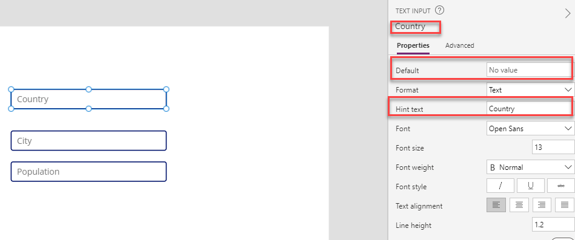
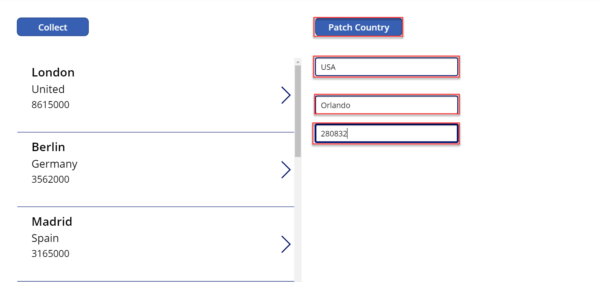
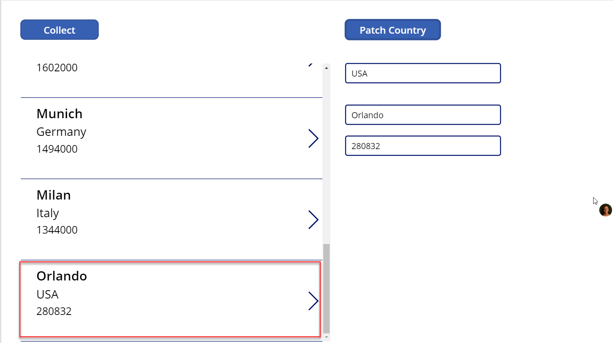

This hands-on lab shows you how to use the Patch function in a gallery. 

1.  Sign in to [Power Apps](https://make.powerapps.com/?azure-portal=true).

1.  On the Home screen select **Canvas app from blank**.

	

1.	Name your app **New App** , format **Tablet** and click **Create**.

	

1. Select the **Insert** tab and add a button, and set its **OnSelect** property to this formula:

	```powerappsfl
	ClearCollect(CityPopulations, {City:"London", Country:"United
	Kingdom", Population:8615000}, {City:"Berlin",
	Country:"Germany", Population:3562000}, {City:"Madrid",
	Country:"Spain", Population:3165000}, {City:"Rome",
	Country:"Italy", Population:2874000}, {City:"Paris",
	Country:"France", Population:2273000}, {City:"Hamburg",
	Country:"Germany", Population:1760000}, {City:"Barcelona",
	Country:"Spain", Population:1602000}, {City:"Munich",
	Country:"Germany", Population:1494000}, {City:"Milan",
	Country:"Italy", Population:1344000})
	```

1.  Press and hold **Alt Key**, and select the **Button** control, and set its **Text** property to "Collect" (This
    will create your collection and store all the information.).

1.  Select the **Gallery** dropdown at the top and choose **Blank vertical** gallery and choose **CityPopulations** from the data source pop up.

1.  With the gallery selected, in the right pane, change the layout from blank to **Title, subtitle, and body**.

1. Select the **Insert** tab and add a Text input, delete text input from the default, rename the text-input to Country and set its **Hint Text** property to "Country".

1. Select the **Insert** tab and add a Text input, delete text input from the default, rename the text-input to City and set its **Hint Text** property to "City".

1. Select the **Insert** tab and add a Text input, delete text input from the default, rename the text-input to Population, and set its **Hint Text** property to "Population".

	

1. Select the **Insert** tab add a button, set its **Text** property to "Patch Country" and 
set its **OnSelect** property to this formula:

	```powerappsfl
	Patch(CityPopulations,Defaults(CityPopulations),{Country:Country.Text,City:City.Text,Population:Value(Population.Text)})
	```			
1. Now lets add additional Countries to our Gallery. Go to the right-hand side of the screen and click the Preview icon.

	

1. In the Country text input enter "USA" in the City text input enter "Orlando" in the Population text input enter "280832" 

	

1. Now press the Patch Country **Button** and scroll down the Gallery1, you should see the new records you added.
 
	

You have now used the Patch command to add new records to a Gallery.