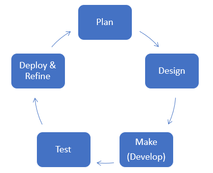

In this learning path, you have learned how to translate a pre-existing and outdated business solution into a modern solution by using Microsoft Power Platform. Additionally, you learned how to create a data model and how to implement that data model in Microsoft Dataverse. Now, you can begin building the app. First, you need to consider how this app will appear and function. You might be tempted to skip these planning stages and immediately start building. However, not taking the time to methodically plan your app can result in implementing a partial solution or needing to make several changes later. Apps go through a development cycle, sometimes referred to as application lifecycle management (ALM). The following flowchart shows the stages in the development cycle.

> [!div class="mx-imgBorder"]
> 

You've already been in the planning phase because you've worked out the data model. Now, it's time to plan the app's appearance and mechanics.

You can plan an app in many ways. You could start from your data model and consider how you'll go through it in the application. However, the best way to start planning is from a user's perspective, and you can start by asking yourself the following questions:

- Who will use this app?

- What will the user need to do?

- How will the user complete the activity?

In this case, you know that travelers will use the app. They need to log expenses and view previous expense reports. How they plan to complete those actions is where you will need to make in-depth considerations. The goal is for you to examine the mechanics of the use case, not the broad technical answers. By evaluating these questions, you will have a use case scenario that you can place in a narrative format, such as the following scenario.

> A traveler will sign in to the app on their phone and will start a report when they begin to accrue expenses. They'll continue to log expenses as the trip progresses. When all expenses have been logged, the traveler will submit the expenses, which will be sent to their supervisor. The traveler needs the ability to check when the expenses have been approved and sent to accounting so that they can predict when the reimbursement will be available.

This use case shows that travelers need to submit expenses and save them as a draft to return to later. They need to view expense reports that they've submitted in the past but shouldn't be able to view other travelers' expenses. As a result, the traveler will need the following components:

- A screen where they can submit a new expense report or view previous reports, including those that are being drafted

- A screen to edit expense reports, whether a new or previous draft

- A screen to view all previous reports

The use case also indicates that the app needs the functionality to save drafts and send information to a supervisor, possibly in the form of an email.

Consider writing another use case to expand functionality beyond the traveler's needs. You could have the supervisors approve through the app or accounting check expenses in the app. The different types of users will have different requirements and a possible need for different screens or functionality. Now, you have learned how to plan a complete app by exploring various use cases.
