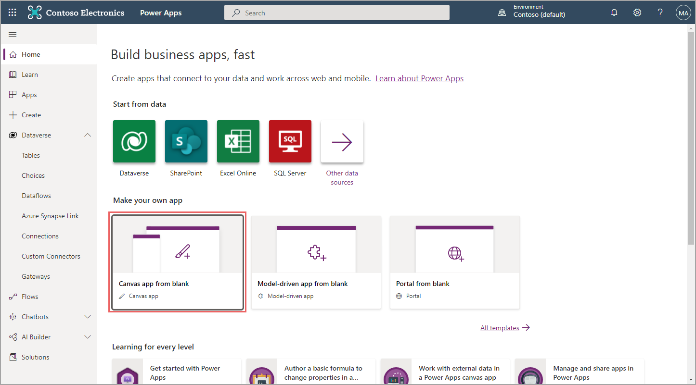
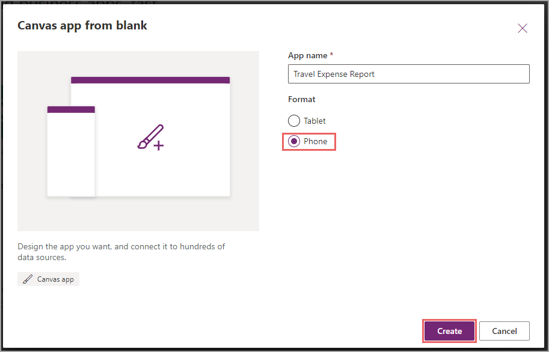
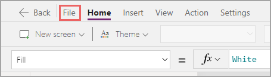
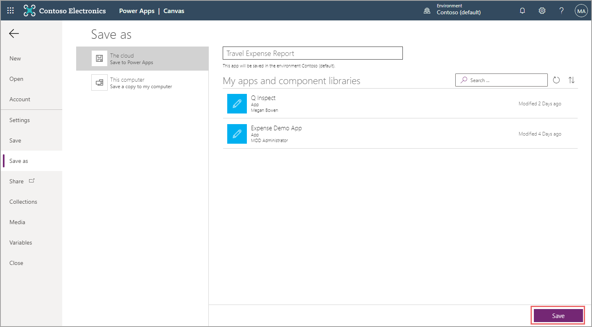

Now that you've planned your app, you're ready to start building by following these steps:

1. In your browser, go to [make.powerapps.com](https://make.powerapps.com/?azure-portal=true) and select **Canvas app from blank**.

   > [!div class="mx-imgBorder"]
   > 

   A dialog will appear, prompting you for more information.

1. Name your app. For this example, name the app **Travel Expense Report** and then select **Phone** for your format. You know that it needs to be a phone layout because of the previous use case.

1. Select **Create**.

   > [!div class="mx-imgBorder"]
   > 

   The Microsoft Power Apps Studio page will open, where you'll build your entire app (and where you'll spend time in the next three modules). Canvas apps save automatically every two minutes when you're building in Power Apps Studio, except for the first time. Therefore, after you have set up your app, it's a good idea to save by following these steps:

1. In the upper-left corner, select **File**.

   > [!div class="mx-imgBorder"]
   > 

1. In the lower-right corner, select **Save**.

   > [!div class="mx-imgBorder"]
   > 

   Power Apps will prompt you to share your app, but you don't need to do so until you've completed your solution.

1. Select the **Back** arrow to return to Power Apps Studio.

Take a moment to become familiar with Power Apps Studio. The top ribbon should appear familiar because it's similar in most Microsoft programs. The Tree view is located on the left side, where all screens and controls will be listed. The **Properties** pane to the right will provide details about properties for the selected control, which in this case is a blank screen.

You can build canvas apps by placing controls on the screen and then setting the properties for these controls. You'll learn about a few of these controls and the properties that they have in the next unit, where you will create your first screen.
