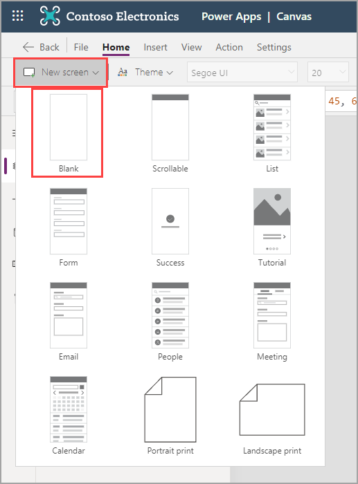
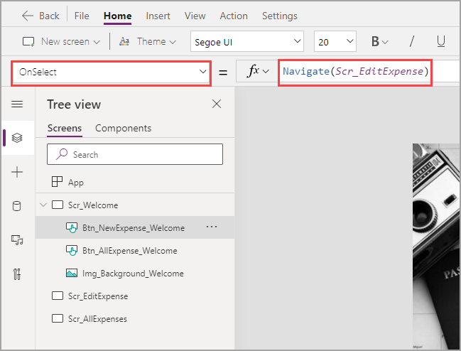
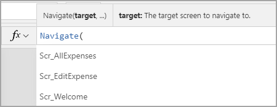

Now that you've designed your first screen, building the functionality for this screen is simple. The main goal here is to direct users to other screens where they'll perform their purpose for visiting the app. But before programming the controls to work appropriately, we need somewhere for the users to go. Go ahead and add a couple of blank screens by following the steps below:

1. Select **New Screen** and then select **Blank** twice.

   > [!div class="mx-imgBorder"]
   > 

1. Rename one of the screens '**Scr_EditExpense**' and rename the other to '**Scr_AllExpenses**' using the methods you learned in the previous unit.

1. Select **Scr_Welcome** to go back to your first screen.

1. Select **Btn_NewExpense_Welcome**. If you've been following this module in a single Power Apps session, the properties dropdown will likely be on Color.

1. Change the dropdown to **OnSelect** (hint: it's in alphabetical order). This property sets the action of the button when selected by a user and is automatically set to '**false**' or do nothing.

1. Set the **OnSelect** property to **Navigate(Scr_EditExpense)**.

   > [!div class="mx-imgBorder"]
   > 

1. Change the **OnSelect** property for the other button to **Navigate(Scr_AllExpenses)**. You may notice as you type that Power Apps gives you suggestions below your formula bar. Pay attention to these suggestions as they may clue you in to what the formula needs as you type. You can also select the suggestions to make building faster. Besides the suggestions below, Power Apps gives you hints above the formula bar to offer some explanation about what the formula needs or does.

   > [!div class="mx-imgBorder"]
   > 

1. Hold down the **Alt key** on your keyboard and press one of the buttons to see the OnSelect property in action.

Now you've completed the functionality of your welcome screen.
