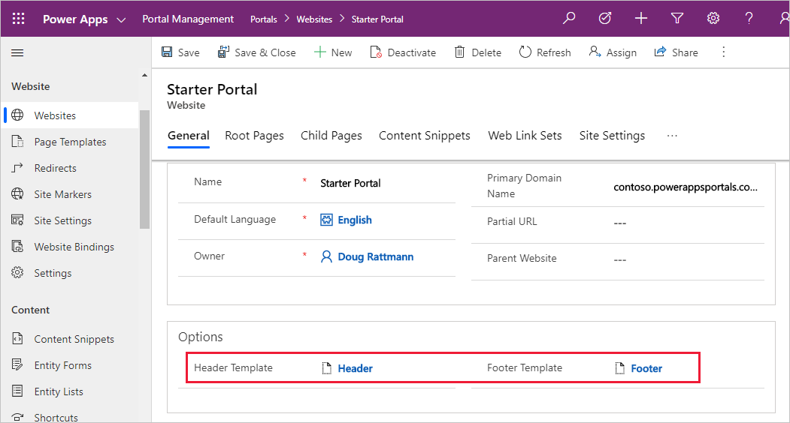

# Liquid and web templates 

Liquid is an [open-source template language](http://dotliquidmarkup.org/?azure-portal=true) that can be used to add dynamic content to pages. Liquid code can be used anywhere in the portals where HTML or text content can be entered. That includes web pages content, content snippets, and web templates. 

Liquid has various language constructs that help you to build content, apply transformations, and control the execution flow. Ability to access Common Data Service data using fetchxml query language or directly retrieving entities by identifiers makes Liquid the primary choice for building data-driven web pages. It also includes a number of special tags (or processing instructions) that specifically target building reusable web templates. Let's have a look how templates are used in Power Apps portals.

## Templates

In Power Apps portals, **Web Page** itself does not define how the page looks when rendered on the portal. Instead, it's linked to the **Page Template** record that defines the layout and the behavior. 

There are two types of the templates that can be used in Power Apps portals.

* **Rewrite**. These templates use server-side processing to implement specialized behavior required by some of the components and special pages such as an error page, sitemap, search, and others. 
* **Web Template**. The linked layout template defines how the content of the page is rendered for output. 

Rewrite templates offer limited customizations. Liquid template language can be used as part of the content or inside content snippets but the page layout and behavior are predefined.

Web Templates, on the other hand, are entirely template-based and use Liquid to define how the content is rendered. Templates are very flexible. A template can include other templates for parts of the content. A template can also be based on another template, extending the base functionality. The real power of web templates comes from the ability to contain Liquid code that adds processing capabilities to the static content, including access to Common Data Service data.

> [!TIP]
> Web Templates can also contain HTML, CSS and JavaScript

Web templates can be used to define an entire web page, a part of a page, or common elements such as the site header and footer. This approach creates consistent look and feel throughout the portal and makes it easy to modify the appearance and data rendered. This is what a typical simple template might look like:

```csharp
<div class="container">
  <div class="page-heading">
    
    
  </div>
  <div class="row">
    <div class="col-md-12">
    
      

      
        
      
    
      
        
      

		
    </div>
  </div>
</div>
```

It includes other templates to render common bits and pieces, it defines content block that can be rendered differently by a derived template, and it renders the Common Data Service data using related Entity List and Entity Form records.

## Web templates as website headers and footers

Web templates can be used to override the global header and footer used by a Power Apps portal. To do this, set the **Header Template** or **Footer Template** field of your website to the web template of your choice. 



If you override **Header Template**, your selected template assumes responsibility for rendering the primary navigation, sign-in/sign-out links, search interface, and so on for your site interface elements that are normally handled by the default header template.

> [!TIP]
> If you don't specify a header or a footer template in the Website record, the default content is rendered. To remove, specify a blank template.
