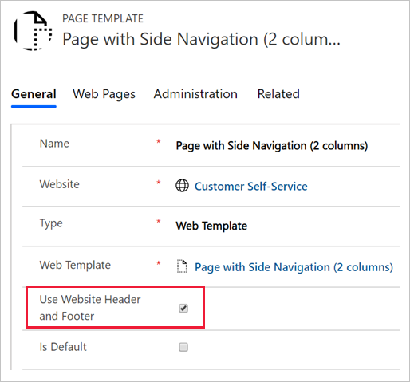

The **Page Template** entity has a setting that specifies whether the page should use the common website header and footer templates when the web template is used. 



When the website header and footer are not used, the template assumes responsibility for generating the entire page output. In the case when you're rendering HTML, this output includes everything from the doctype to the root `<html>` tags, and everything in between. This approach could be useful in a couple different scenarios:

- Special purpose pages need to appear different from the rest of the portal, for example, marketing campaign landing pages.

- The web template generates non-HTML content, returning data in XML, json, or other formats.

For example, you can create a web template that returns a list of accounts, or any other data that the current user has access to, in `json` format. 

```twig

[

    {
        "name": "{{ acc.name }}",
        "phone": "{{ acc.telephone1 }}"
    },

]

```

> [!NOTE]
> In this example, instead of the `entityview` tag,  you can use a FetchXML query inside the `fetchxml` tag. Using inline FetchXML adds some flexibility to the query. The query can be built dynamically by using template parameters or even a `request` object that contains query string parameters of a current HTTP page request.

This template would be used without a header and footer, with the MIME type set to `application/json`. The output would be similar to the following example:

```json
[
  {
      "name": "A Datum Corporation",
      "phone": "425-555-0182"
  },
  {
      "name": "A Datum Fabrication",
      "phone": "303-555-0134"
  },
  {
      "name": "A Datum Integration",
      "phone": "512-555-0163"
  },
  {
      "name": "A. Datum",
      "phone": "+86-23-4444-0100"
  },
  {
      "name": "Adventure Works",
      "phone": "+27-264-1234567"
  }
]
```

The page that uses this web template wouldn't be used by people who are in a browser; instead, it will be called from JavaScript code, effectively defining an API endpoint for your solution. JavaScript on another page would be able to load and render this data as required.

Authorization will be in place, and accessing Common Data Service data by using this "headless" template is no different than if the output was rendered as HTML. The calling page would typically require user authentication prior to calling the endpoint.
