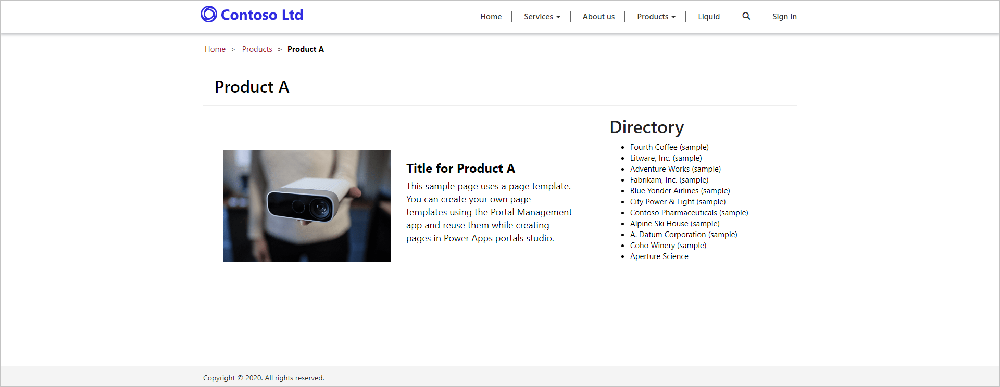

The purpose of this hands-on-lab is to introduce the concept of building and extending Liquid templates.

The exercises work best when you have some sample data to work with. Depending on if the environment, you are working with, you may want to install some sample data to assist with exercises. Common Data Service does provide the ability to add sample data as needed. If the environment you are working in does not have any sample data installed, follow steps in [Add or remove sample data](https://docs.microsoft.com/power-platform/admin/add-remove-sample-data) to install the sample data into your environment.

## Learning Objectives

At the end of these exercises, you will be able to accomplish the following:

* Extend Liquid templates using `extends` and `block` tags
* Reuse Liquid templates via `include` tag
* Apply entity permissions to the results of 

### Prerequisites

For this exercise you will need to have the following in your environment:

1. A Power Apps portal provisioned. If you do not have a Power Apps portal available, follow [Create Portal](https://docs.microsoft.com/powerapps/maker/portals/create-portal) instructions to create one.
2. Access to the Power Apps maker portal.

## High-Level Steps

To finish the exercise you need to complete the following tasks:

* Create partial template accessing Common Data Service data to be used as a layout block
* Create new template that extends a two-column layout web template.
* Overwrite the side panel to include the partial template
* Change template of an existing web page
* Configure entity permissions to display data for anonymous users

## Detailed Steps

To complete the exercise we need to build a new page template that includes a side panel that lists all accounts in our Common Data Service.  

### Create partial template

Our first task is to create a partial template that will not be used to render a page but instead will be inserted into another template.

1. Open https://home.dynamics.com
2. Select Portals Management app
3. Select **Web Templates**
4. Press **New**
5. Enter the following values:
   * **Name**: Directory 
   * **Website**: Select your current website
   * **Source**: enter the following content

```twig

<fetch>
  <entity name="account">
    <attribute name="name" />
  </entity>
</fetch>



  <ul>
     
    <li>{{ account.name }}</li>
    
  </ul>

  <div class="alert alert-warning">You do not have permissions to access the directory.</div>

```

6. Press **Save & Close**

### Extend existing template

Now let's create a new template that extends an existing Liquid template and inserts the template we created previously.

1. Select **Web Templates**
4. Press **New**
5. Enter the following values:
   * **Name**: Directory Template
   * **Website**: Select your current website
   * **Source**: enter the following content

```twig



  <h2>Directory</h2>
  

```

6. Press **Save & Close**

### Create page template and associate with the page

Now we need to create a page template that will use our new web template and include the Directory output.

1. Select **Page Templates**
2. Press **New**
3. Enter the following values:
   * **Name**: Directory Page Template
   * **Website**: select current website
   * **Type**: select Web Template
   * **Web Template**: select Directory Template
   * **Entity Name**: select Web Page
4. Press **Save and Close**

### Test

1. Open Power Apps portal Studio in a new browser tab. You can follow these steps:
   * Navigate to Power Apps maker portal at https://make.powerapps.com.
   * Select the target environment using the environment selector in the top right-hand corner.
   * From the list of Apps select the application of type **Portal**.
   * Click **Edit** menu.
2. On the toolbelt, select **Pages** icon
3. Select existing page, for example **Product A** under **Services**. Note: names and hierarchy of pages on your portal may differ.
4. Locate **Template** property in the **Component** panel on the right-hand side
5. Select **Directory Page Template** as new template
6. The list of accounts should be displayed because Portal Studio runs under the maker account and uses Common Data Service security instead of entity permissions to filter the data.
7. Click **Browse website**
8. The message "You do not have permissions to access the directory." should be displayed.

### Add entity permission

1. Switch back to Portal Management app
2. Select **Entity Permissions**
3. Press **+ New**
4. Enter the following values:
   * **Name**: Account Directory
   * **Entity Name**: Select account entity
   * **Website**: Select your current website
   * **Scope**: Select Global
   * **Privileges**: Select Read
5. Press **Save**
6. Scroll to **Web Roles** subgrid
7. Press **Add Existing Web Role**
8. Locate and select **Anonymous users** and **Authenticated users**
9. Press **Add**

### Test

1. Switch to Portal Studio
2. Press **Browse website**. Note: this command rebuilds the site cache. Simple browser page refresh will not be sufficient to update the data.
3. The page should now be displayed and include the list of accounts


