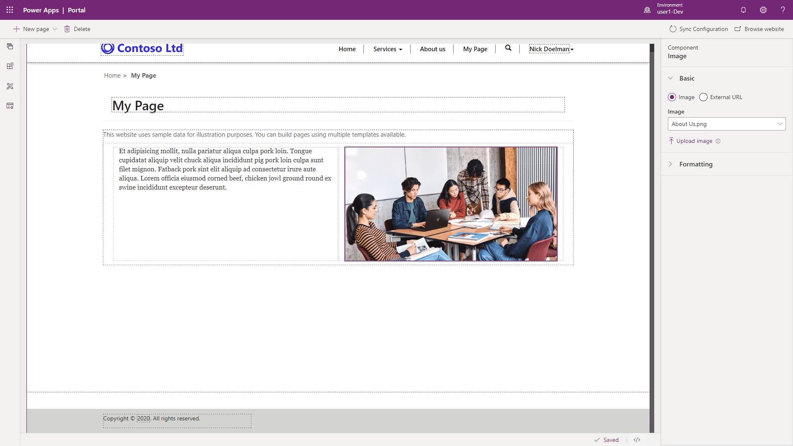
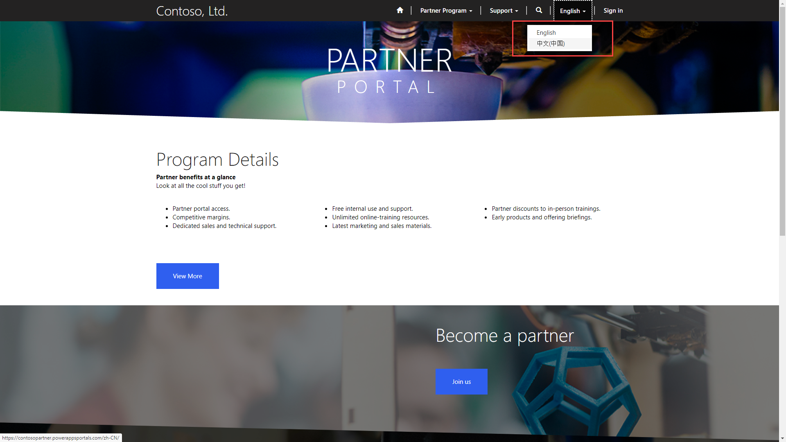
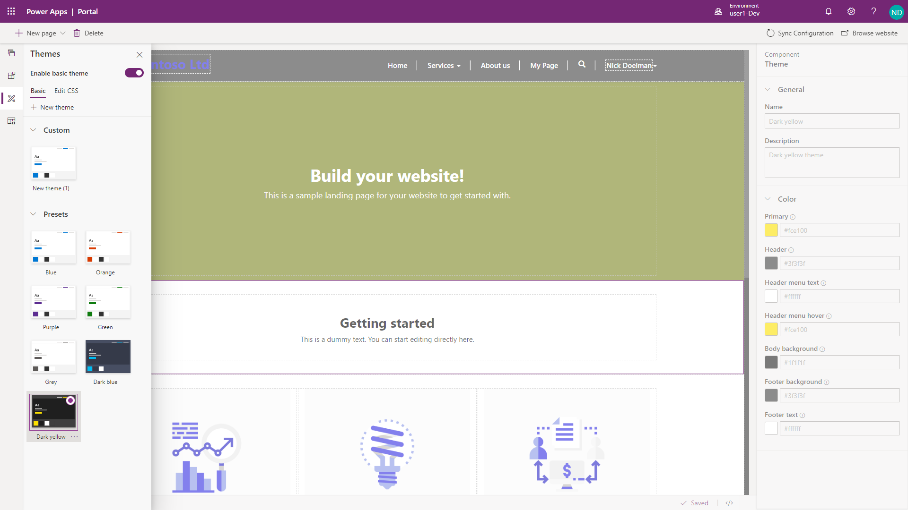
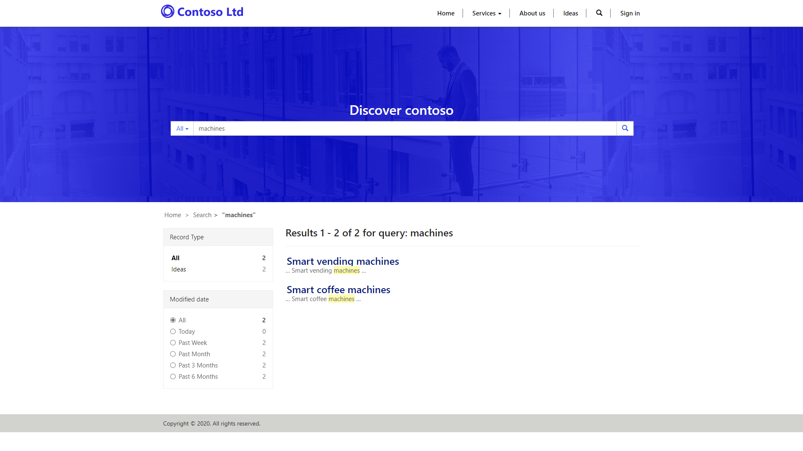
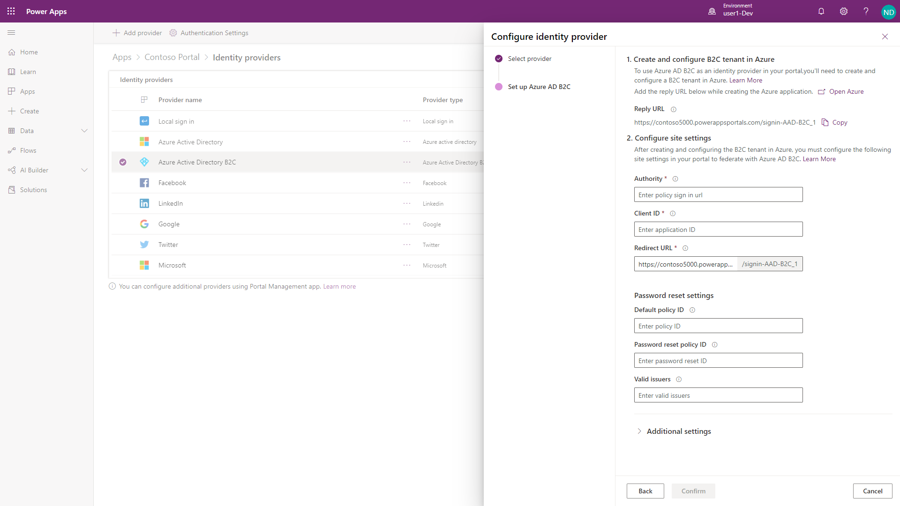
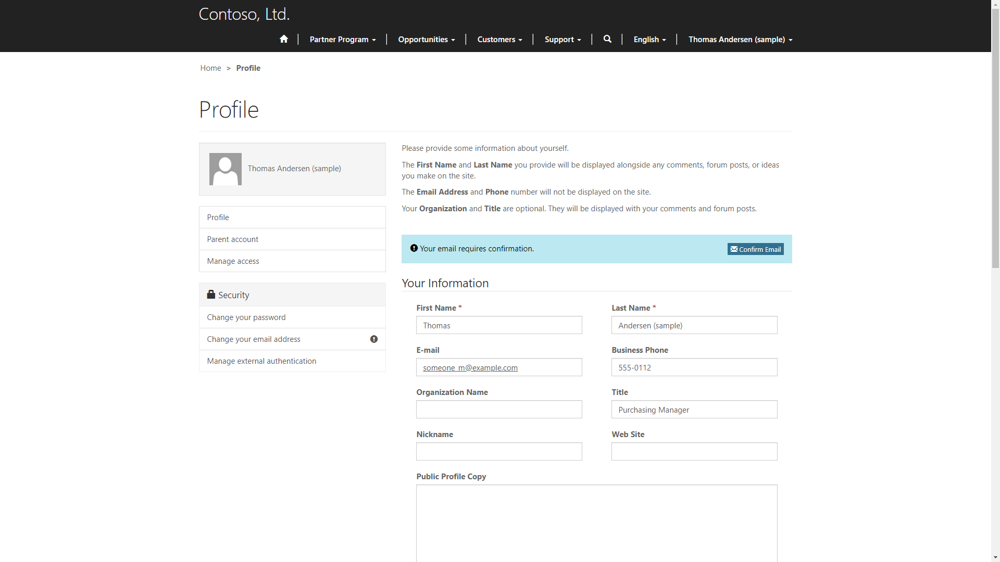
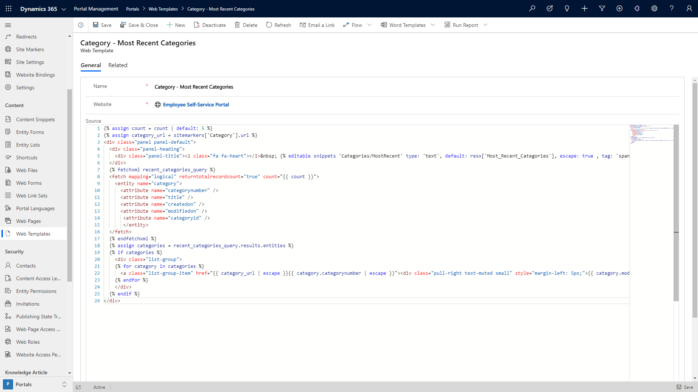

Regardless of the portal template chosen, a Power Apps portals application has a set of core features that allows makers to build or configure a powerful externally facing web application on the Power Platform. 

## Content management

Web pages, static text, images, and other content can be quickly surfaced in a portal web application using the portal studio and other tools.  

> [!div class="mx-imgBorder"]
> 

## Multi-language

Portals content and navigation can be viewed in up to 43 different languages.  Portal visitors will be able to switch different languages and not lose their current page or navigation.  Additional languages will need to be provision within CDS/Dynamics 365 in order to use the multi-language capabilities in a portal.

> [!NOTE] 
> Content will still need to be translated and updated on the web pages and in the content snippets for the specified enabled languages.  Any Common Data Service assets surfaced to the portal such as entities, forms, views or fields will also need to have corresponding label translations using the Dynamics 365/Common Data Service multilingual functionality.

> [!div class="mx-imgBorder"]
> 

## Access to Common Data Service data

The main feature of Power Apps portals is the ability to surface and interact with records in the Common Data Service.  List of CDS records can be surfaced on a portal page using Entity Lists or through custom web templates.  Individual records can be created and edited individually using Entity Forms or as part of a step-by-step process using Web Forms.  The data is protected using a combination of web roles and entity permissions to ensure that portal visitors only have the appropriate access to the Common Data Service records.

> [!VIDEO https://www.microsoft.com/videoplayer/embed/RE4yWn4]

## Theming

A portal maker has the ability to apply their unique corporate branding and styling directly to a Power Apps portal using dedicated CSS and Bootstrap toolkit.

> [!div class="mx-imgBorder"]
> 

## Global search

Portal makers can configure the portal to search across specified Common Data Service records to allow users to quickly locate specific data on a portal results page.  Configuration of the global search is protected by entity permissions so that portal users do not inadvertently discover protected information.

> [!div class="mx-imgBorder"]
> 

## Authentication and security

Users browsing to a Power Apps portal application will be able to authenticate using a built-in authentication or using an integrated external authentication provider such as Azure AD B2C, LinkedIn, Facebook, or other authentication providers.

An authenticated portal user can be assigned a web role with associated entity permissions and web page access control rules to control access to specific web pages and CDS records.

> [!div class="mx-imgBorder"]
> 

## Profile management

An authenticated portal user will be able to manage their own profile information on a dedicated portal entity form that will update their corresponding Dynamics 365 or Common Data Service contact record.  This feature allows stakeholders to ensure that their contact information is up to date.

> [!div class="mx-imgBorder"]
> 

## Customization and extensibility

Power Apps portals provide many tools to create content, surface CDS data and configure the look and feel of a portal application.  Portal capabilities can also be further extended using custom web templates, Liquid markup, JavaScript, and CSS.  Portals can also utilize other Power Platform development technologies such as plug-ins, Power Automate and workflows.

> [!div class="mx-imgBorder"]
> 
