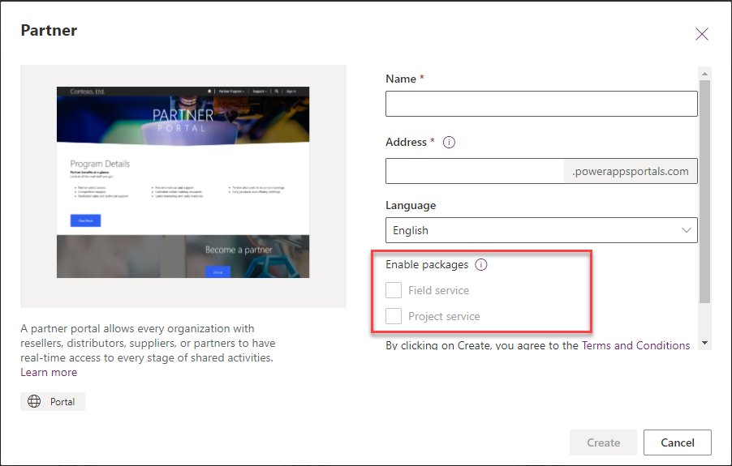
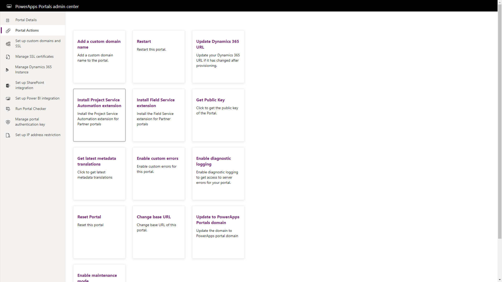

The portal templates provide additional features that extend the functionality of the Dynamics 365 first-party apps. The following is a list of features that can be found in portal templates.

## Case management

The case management capabilities extend Dynamics 365 Customer Service by surfacing the ability for portal users to log and update support cases, tickets and questions. This information is stored in the Dynamics 365 case entity and communications are tracked using portal comments.

This feature is a very common use case for portals and provide customer service organizations with a key channel to interact with their customers. A key benefit is that customers wanting to submit a ticket are presented with options to review existing Knowledge Articles and Forum posts, as these items may resolve the customers question in a faster manner.

> [!VIDEO https://www.microsoft.com/videoplayer/embed/RWrBLh]

## Knowledge management

One way for an organization to provide its external stakeholders with access to corporate information is to utilize the knowledge management features of Power Apps portals.

Knowledge articles can be created, approved and curated in Dynamics 365 Customer Service and surfaced to the portal. Portal users will be able to browse and search Knowledge articles.

Portal users attempting to log a support case can be presented with a list of potential knowledge articles that could answer the specific query, deflecting the need to log a support case.

Knowledge management is available by default on the Customer Self-Service, Partner, Employee and Community portal templates.

> [!VIDEO https://www.microsoft.com/videoplayer/embed/RWrEmA]

## Forums

Forums allow members of a particular community with common interests to post questions, start discussions or ask for help.  

Forums are setup and configured using the Portal Management app. For information on how to configure Forums, please refer to: [Set up and manage forums](https://docs.microsoft.com/dynamics365/customer-engagement/portals/setup-manage-forums/?azure-portal=true). Forums feature is also available on the Community, Customer self-service, Employee self-service and Partner portals.

An organization will choose Forums as a way for their community to be able to interact with each other by asking questions, starting discussions or by looking for help.

Different Forums are created within the Portal Management App in the Community Area by creating a Forum record.  Forums can be setup to represent different high level topics based on the needs and goals of an organization, for example;  General Discussions, Support, etc.

Forums fully support multi-lingual deployments and can be either language-agnostic or linked to a specific language. That allows you to create portals encouraging both global and local conversations between the participants. 

When published, the Forums are surfaced on the Portal to allow visitors to create new discussion threads or respond to existing discussions. The visitor can also subscribe to threads to receive updates or new responses to the discussions.

Portal visitors will create new Threads (stored in the Power Apps Portal Metadata as Forum Threads) and will contain at least one Post (Post record).  The Post will contain the discussion details as well as optional file attachments.  Other Portal visitors (depending on permissions) can read or respond to particular threads (this will add additional Post records). The collection of Posts under a Thread will represent a particular discussion or answer to a posted question.  

Having an active and engaging forum will strengthen a particular community as well as potentially alleviate customer and community support resources.

The organization can control who and how Forum Threads and posts are created determined by the related Forum Access Permission which will link to specific Web Roles.

## Blogs

The Community Portal has the ability for members of its online community to post Blog articles.  

See [Manage blogs](https://docs.microsoft.com/dynamics365/customer-engagement/portals/manage-blogs/?azure-portal=true) on how to configure and setup Blogs on the Power Apps portal.

The organization must first create the Blog using the Portal Management app. Once the particular Blog has been created, then the organization can grant a Portal User the Blog Author web role. The Portal User will then be able to use the front side editing tools to create Blog articles by writing text, inserting images and reference links.

Blogs can also be configured to allow authenticated, unauthenticated, moderated and unmoderated comments in response to the Blog article.

Having an engaging Blog will provide updated and engaging content to help promote the community or an organization's products and services.

The Blog feature is unique to the Community portal but can be surfaced on other portal types.

> [!VIDEO https://www.microsoft.com/videoplayer/embed/RWrtZx]

## Ideas

The Ideas feature of the Community Portal is an extension of the Forum feature where it will allow members to of the public to "crowd source" particular ideas or suggestions.

The Ideas feature is available on the Community portal, Customer self-service portal and the Employee self-service portal.

To configure Ideas on the Community portal, please refer to: [Crowdsource ideas](https://docs.microsoft.com/dynamics365/customer-engagement/portals/crowdsource-ideas/?azure-portal=true).

In order for an organization to best serve their customers or constituents, it is important to allow an easy feedback mechanism. The Ideas portal allows for portal visitors to submit a particular suggestion to the organization.  This may be for a policy change, a new feature or even a whole new product or service suggestion. 

When a user is adding a new idea, the auto-complete on the Topic field can be configured to allow visibility of existing ideas to reduce the number of duplicate or similar ideas.  

Once the idea has been posted, other portal visitors will be able to vote on the idea or add their own comments or feedback.  The policies of feedback and voting are configured from the Dynamics 365 Portal App such as the ability to up vote or down vote an idea, number of votes and comment policies.

> [!VIDEO https://www.microsoft.com/videoplayer/embed/RWrrm5]

## Project Service Automation 

The project service automation feature is specific to the Partner portal template. In order to provision the project service automation features, the Dynamics 365 Project Service app will need to be provisioned. The project service automation portal extensions can be selected during the Partner portal installation or it can be installed later from the Portal admin center.

> [!div class="mx-imgBorder"]
> 

> [!div class="mx-imgBorder"]
> 

The key features of the Project Service Automation Extension are:

- Ability for external stakeholders to view project information
- Process to confirm bookable resources
- Approve quotes
- View Invoices
- Review contract and order forms

For more information see [Project Service Portal Extension](https://docs.microsoft.com/en-us/dynamics365/portals/integrate-project-service-automation/?azure-portal=true) documentation.

## Field Service Integration 

The Partner Field Service portal integration extends the Dynamics 365 Field Service module to the Partner portal template.  To add the Field Service portal extension, the Dynamics 365 Field Service app will need to be provisioned.  The Field Service portal features can be selected during the Partner portal installation or can be installed later using the Portal admin center.

> [!div class="mx-imgBorder"]
> [

The main features of the Field Service extension are:
* Ability for external stakeholders to view Customer Assets
* Allow customers to view and request workorders from the portal
* Customers can view invoices on the portal

For more information see [Field Service Portal Extension](https://docs.microsoft.com/en-us/dynamics365/portals/integrate-field-service/?azure-portal=true) documentation.

