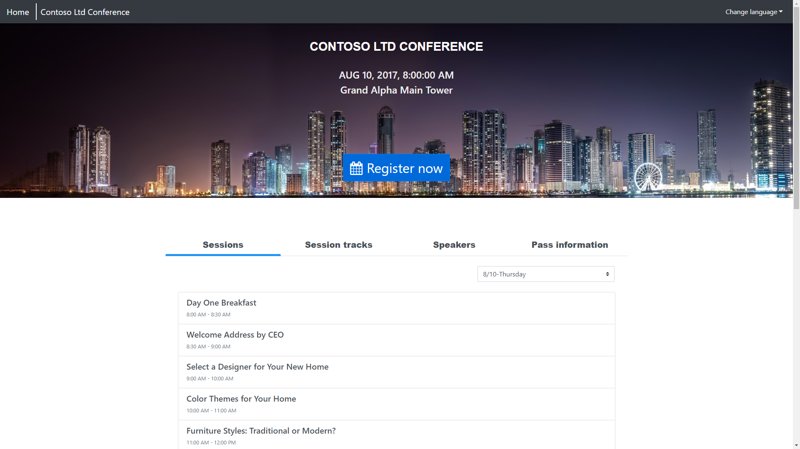

In addition to the core portal features and the features provided by the templates, there are other unique requirements from specific Dynamics 365 applications that are extended using alternate portal applications and templates.

## Event Management Portal (Dynamics 365 Marketing)

The Event Management Portal extends the Dynamics 365 Marketing application by providing an [angular.js](https://angularjs.org/?azure-portal=true) based template application that can be embedded in most industry standard content management systems as well as Power Apps portals.

Using Dynamics 365 Marketing, staff would create a conference or event, graphics, define speakers, sessions, and other registration details.  These assets will be used to render a conference portal using the angular.js template. The features of the Event Management Portal are:

- Allow visitors to view event information, speakers, and sessions
- Interested parties can create an event portal account
- Potential attendees can register themselves or others for the event.
- Event participants can purchase passes for the event or specific sessions
- Participants can modify or cancel their registrations

Integrations to specific payment gateways will need to be custom developed and are not part of the event management portal.

> [!div class="mx-imgBorder"]
> 

For more information, see [Dynamics 365 Marketing Portal](https://docs.microsoft.com/dynamics365/marketing/set-up-event-portal/?azure-portal=true) documentation.

## Customer portal (Dynamics 365 Supply Chain Management)

The customer portal template allows to create an externally facing website that is connected to a Dynamics 365 Supply Chain Management environment. It uses [dual-write capabilities](https://docs.microsoft.com/dynamics365/fin-ops-core/dev-itpro/data-entities/dual-write/dual-write-home-page/?azure-portal=true) to link Common Data Service entities to Dynamics 365 Supply Chain Management data. 

The template provides guidance and a starting point for creating custom websites for business-to-business (B2B) sales-order processing and related scenarios. It helps companies bring dual-write, Power Apps portals, and Dynamics 365 Supply Chain Management together to create a self-service experience for their enterprise customers.

> [!NOTE] 
> You will need to have the dual-write solutions installed on your Common Data Service environment in order to provision the Dynamics 365 Supply Chain Management customer portal

The key features of the customer portal are:

- Visibility to order history
- View account information
- Ability to create orders on the portal

For more information, see [Dynamics 365 Supply Chain Management Customer Portal](https://docs.microsoft.com/dynamics365/supply-chain/sales-marketing/customer-portal-overview/?azure-portal=true) documentation.

