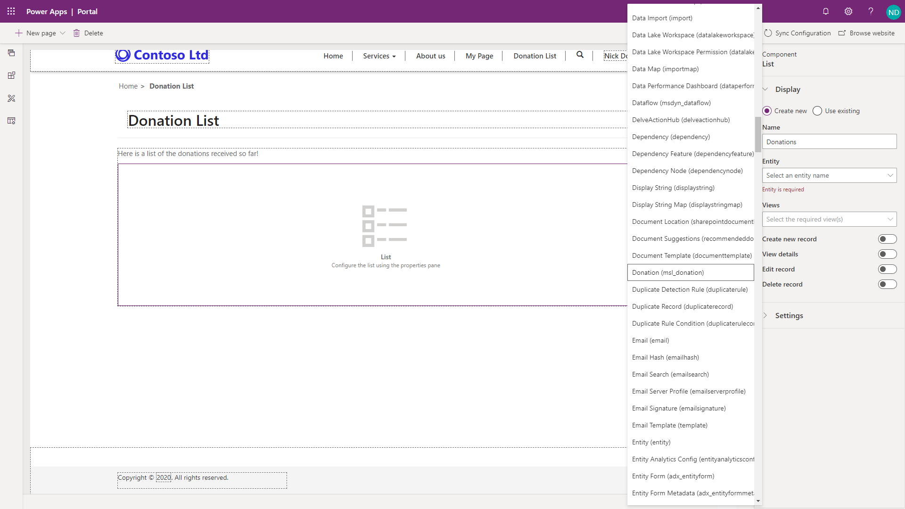
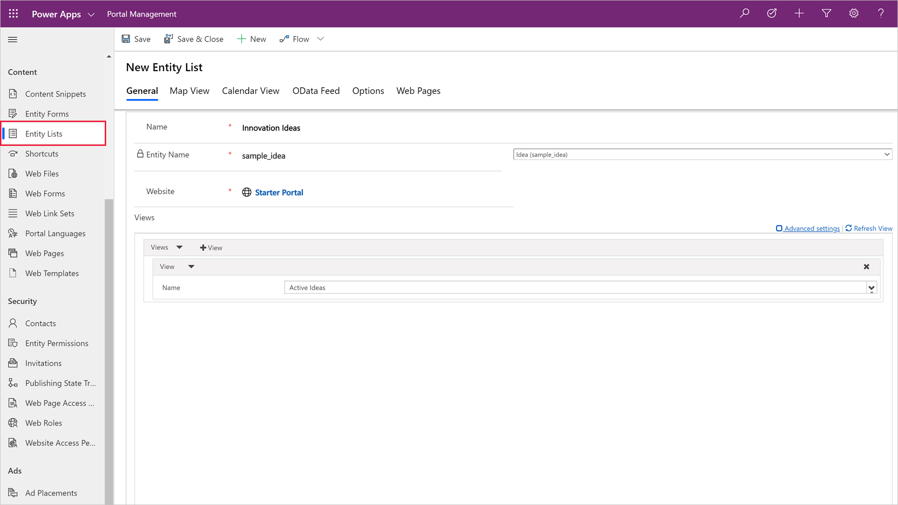
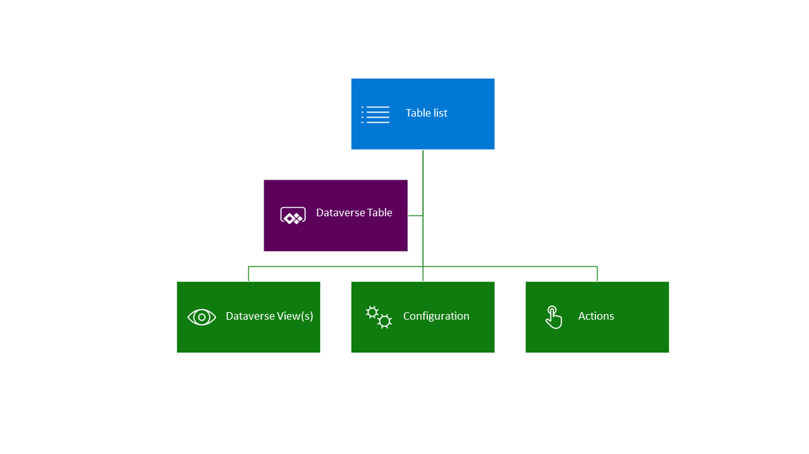
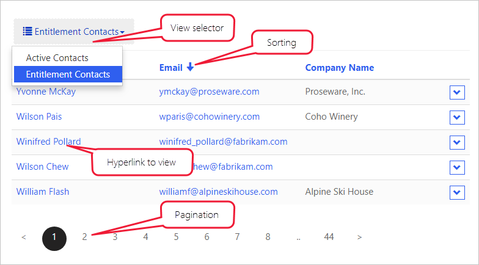
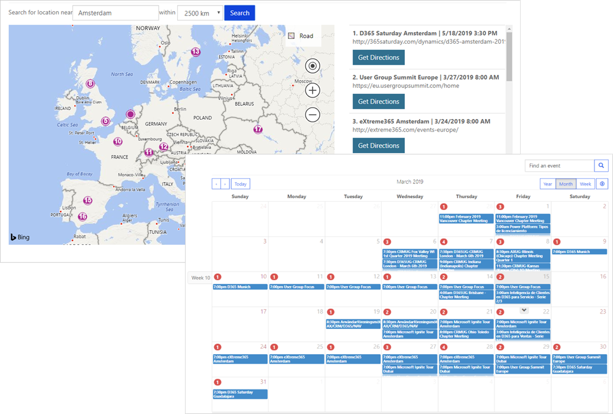
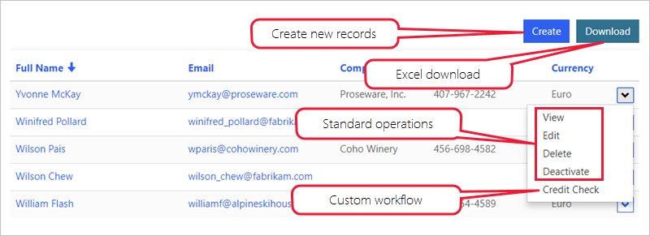

Entity Lists components allow a maker to surface a list of Common Data Service records on a portal web page using configuration only. Entity lists are defined using model-driven app views and can be further configured to filter data based on entity permissions and have additional features enabled such as running workflows and navigating to show detail records. 

## Creating an entity list 

An entity list can be added as component to a web page in the Portal studio.  After placing the list component on a page, the maker will need to set the properties of the entity list.  The maker will choose the entity as well as one or more model-driven views to be used to render the entity list on the page.

> [!div class="mx-imgBorder"]
> [](../media/2-entity-list-portal-studio-ss.png#lightbox)

### List rendering

Adding a list component in the Portal Studio will add the corresponding Liquid tag to the web page content.

When the web page is requested, the list rendering process is as following:

1. Web page is retrieved.
1. Web page will render the entity list based on the Liquid tag that was added when the list component was added to a web page.

    ```twig
    
    ```

## Configure entity list

Portal Studio provides basic interface for creating and configuring entity list. Makers can customize all entity list features and properties using Portal Management app. To access entity lists in the Portal Management app:

1. Navigate to [Power Apps maker portal](https://make.powerapps.com/?azure-portal=true).
1. Select the target environment using the environment selector in the top right-hand corner.
1. From the list of Apps, locate and open the Portal Management app (app Type will be Model-driven).
1. Select Entity Lists in the left navigation.
1. Open the list created earlier in the Portal Studio.

    > [!div class="mx-imgBorder"]
    > [](../media/2-list-portal-app-ssm.png#lightbox)

An entity list can be as simple or as complicated as your business requirements specify. To begin with, the only required properties for the entity list, besides the name and the website, are the target **Entity Name** and one or more **Views**. 

Entity Lists are highly configurable and have many settings defining the list behavior. Lists can also include actions for the user to interact with the items on the list.

> [!div class="mx-imgBorder"]
> [](../media/2-entity-list-overview-c.png#lightbox)

Let's take a quick look at some of the most common features and settings. 

> [!NOTE]
> Most of the options that add interactive elements such as buttons, support customization of the elements in multiple languages. For example, if multiple views are enabled, name for each of the views in the view selector can be customized for each of the enabled portal languages.

### Views

Selected view(s) define the Common Data Service entity fields, list layout, and the default sort order. 

**Multiple views** - If more than one view has been specified, a drop-down list will be rendered to allow the user to switch between the views. 

**Sorting and pagination** - Sorting is enabled on any of the displayed columns and the page size is configurable.

> [!div class="mx-imgBorder"]
> [](../media/2-entity-list-features-ssm.png#lightbox)

> [!NOTE]
> Entity list includes general properties Web Page for Details View and Web Page for Create. These properties are for backward compatibility only. The functionality is included as part of View Actions and Item Actions grid configuration.

### Configuration

#### Filtering and searching

**Search** - When Quick Search is enabled, the portal will render a text search box. It is similar to the quick search feature in model-driven apps. Quick search runs across the view columns and allows to locate the information within the larger lists by using plain text input. Portal users can use the asterisk (*) wildcard character to search on partial text.

**Portal filters** - The list data can be filtered by the current portal user, the current portal user's parent account, and the current portal website. This feature enables some common scenarios without any additional configuration:

- List of product reviews left by the current user.
- List of the buildings on the campus for the department (account) of the current user.
- List of all draft pages for the current website only when multiple portals are provisioned. 

If both current portal user and current portal user's parent account filters are enabled, portal will render a dropdown to allow the user to view their own data (My) or their parent account's data (account name will be displayed).

**Metadata filters** - Records in the list can be filtered on any of the list columns, including ranges, lookups, option sets, and even custom FetchXml expression. Portal users have access to interactive filtering panel when the entity list is rendered.

> [!div class="mx-imgBorder"]
> [](../media/2-entity-list-features-filtering-ssm.png#lightbox)

#### Display options

Views can be rendered as traditional grid lists, calendar, or map. Delivering list content as an OData feed is also supported. 

> [!div class="mx-imgBorder"]
> [](../media/2-entity-list-map-calendar-ss.png#lightbox)

Alternative views may require some additional configuration such as start and end date fields for a calendar, or latitude and longitude fields for a map.

> [!IMPORTANT]
> Map and calendar require page templates that can render the view. When a starter portal is provisioned, **Rewrite** page templates like Page or Full Page support this functionality.  Pages using **web templates** will render the default entity list view.

### Actions

Entity Lists can have actions associated with them to enable per list commands like Create and Download (as Excel spreadsheet), or per record commands like View or Edit, and to trigger workflows.

> [!div class="mx-imgBorder"]
> [](../media/2-entity-list-features-commands-ssm.png#lightbox)

For more detailed information about entity list attributes and relationships, and how to use them to configure the list behavior, see [About entity lists](https://docs.microsoft.com/powerapps/maker/portals/configure/entity-lists/?azure-portal=true).

Watch the following video to learn how to take an existing Common Data Service entity, configure and display the view on a portal page, and add interactive filtering capabilities.

> [!VIDEO https://www.microsoft.com/videoplayer/embed/RE4ArhG]

Now that we've seen how the entity lists are built and rendered, let's take a look how portals can display and interact with the individual records.

