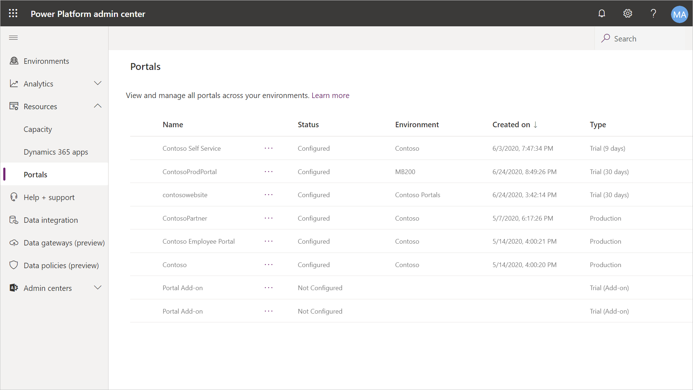
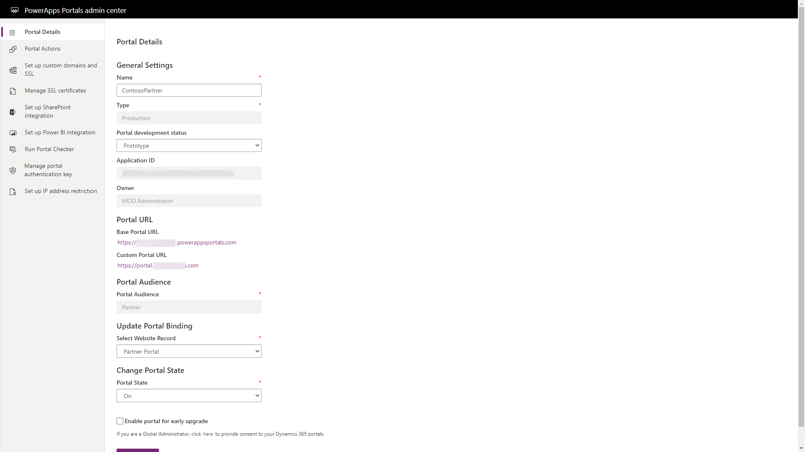
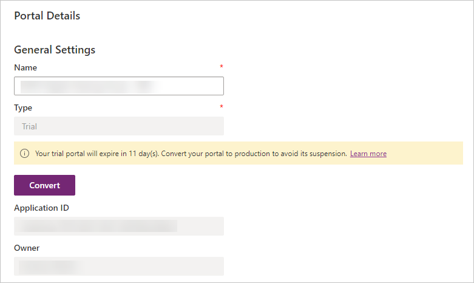
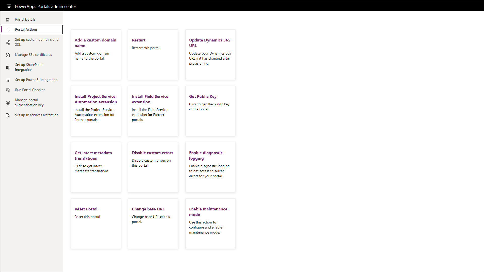
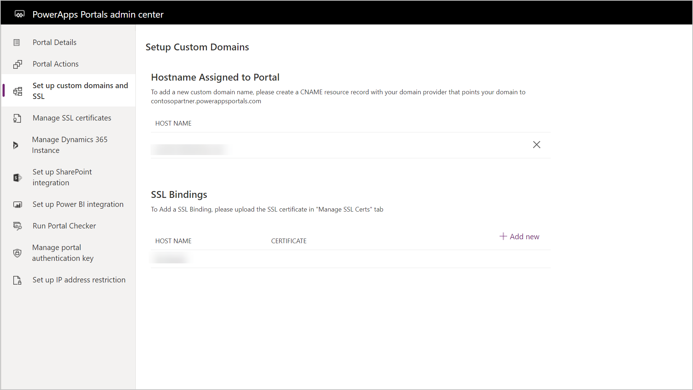
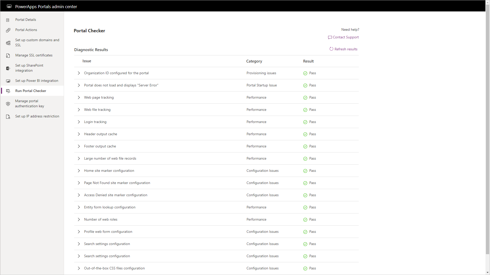

The portal admin center provides a series of functions for administration of a Power Apps portal.

To access the portal admin center:

1. Sign in to the [Power Platform admin center](https://admin.powerplatform.microsoft.com/?azure-portal=true).
1. In the left pane, select **Resources**, and then select **Portals**.
1. Select a portal.
1. Select **Manage** at the top of the page.

> [!div class="mx-imgBorder"]
> 

## Portal details

If you need to see more details about the provisioned portal such as, portal type, application ID, owner of the portal, and so on, you can navigate to the **Portal Details** tab. The user who has created the portal is the owner of the portal.

> [!div class="mx-imgBorder"]
> 

The Portal Details area allows makers to change some key attributes of a Power Apps portal:

* Change or update the portal name.  This is not visible to external portal visitors but helps identify the portal in the Portal Management app.

* Trial mode. By default, portals are provisioned in trial mode and a message is displayed in the admin center. A maker can convert a trial portal to a production portal.  

   > [!div class="mx-imgBorder"]
   > 

   > [!NOTE]
   > Some features such as custom URLs are not available for portals in trial mode.

* The portal binding can be changed to change the portal web application to read a different set of metadata records (website record) from the Common Data Service.

* The portal state can be turned off (or on).  Portal visitors will receive an error when visiting the portal URL.

* The portal can be configured to allow early upgrades to receive updates from Microsoft earlier than regular scheduled updates.

  > [!WARNING]
  > Enabling portal for early upgrade may receive updates that have not gone through the full testing cycle and in rare instances may affect certain functionality of the portal.

## Portal actions

The portal actions section of the portal admin center allow an administrator to configure specific portal settings or perform actions against a configured portal. For detailed instructions see [Power Apps portal admin center](https://docs.microsoft.com/powerapps/maker/portals/admin/admin-overview/?azure-portal=true).

> [!div class="mx-imgBorder"]
> 

| Action | Details |
| ------ | ------- |
| Add a custom domain name | This process will step through the process to configure a vanity URL for the Power Apps portal such as `https://www.contoso.com` instead of the subdomain `https://contoso.powerappsportals.com`.  This option is only available for production portals. |
| Restart | Restarting the portal will turn off the portal web application and restart the process, clearing the cache or potentially stuck processes.  This is the equivalent of restarting a web server and it may take a few minutes until the portal is available again. |
| Update Dynamics 365 URL | In the event that the Common Data Service (or Dynamics 365) environment URL has been modified, this action will re-align the portal web application to point to this updated URL. |
| Install Project Service Automation Extension | This process will load the solutions and metadata to extend the Partner portal with Project service extensions.  Note that this action will only be successful on portals that have provisioned using the Partner template and the connected Dynamics 365 instance has Project Service Automation solution installed. |
| Install Field Service extension | This process will load the solutions and metadata to extend the Partner portal with Filed Service extensions.  Note that this action will only be successful on portals that have provisioned using the Partner portal template and the connected Dynamics 365 instance has Field Service solution installed. |
| Get Public Key | A portal public key is required by the Live Assist by CafeX application to integrate with a Power Apps portal. |
| Get latest metadata translations | For multi-lingual portals, it is important to have the latest translated labels.  This action will prompt an admin to update to the portal solutions which will update the various portal template labels in the particular portal languages provisioned. |
| Disable custom errors | While troubleshooting issues on a portal, disabling the custom errors will show more details about a particular issue instead of a generic error message. |
| Enable diagnostic logging | The enable diagnostic logging action will allow an administrator to specify a Azure Blob connection string and retention period where portal logs will be stored.  If there are issues with a portal, these logs can be examined to determine the root cause of a particular issue. |
| Reset Portal | The reset portal action will delete all the hosted resources associated with the portal. Once the reset operation is finished, your portal URL will not be accessible anymore, and you can provision the portal again. The reset will not re-install any of the portal solutions or delete any of the portal metadata. |
| Change base URL | The change base URL action will allow an administrator to change the base URL (`something.powerappsportals.com`).  The URL will need to be unique and portal visitors will no longer be able to access the portal using the old URL.  If you have a custom URL you will also need to update the CNAME records in your DNS settings. |
| Enable maintenance mode | In instances where an administrator needs to make changes to a portal or updates to the Common Data Service, the portal can be put into maintenance mode where visitors will instead see a message that the portal is in maintenance mode or be redirected to a custom URL. |

## Set up custom domains and SSL

The feature will show any existing host name and associated SSL Bindings for any custom URLs configured for the portal.

> [!div class="mx-imgBorder"]
> 

## Manage SSL certificates

This section will show a listing of all uploaded SSL certificates and when they will expire.

## Set up SharePoint integration

The section will provide the ability to activate the SharePoint integration so that SharePoint document libraries integrated with the Common Data Service and Dynamics 365 can be surfaced through an entity form.

## Set up Power BI integration

This section will allow administrators to enable the Power BI visualization and Power BI Embedded service on portal pages.

## Portal checker

Portal checker is a self-service diagnostic tool that can be used by portal administrators to identify common issues in their portal. Portal checker helps to identify issues with a portal by looking at various configuration parameters and it provides suggestions on how to fix them.

> [!div class="mx-imgBorder"]
> 

The portal checker will examine various configuration aspects of the portal and display warning details and recommended steps to improve portal functionality and performance.

## Manage portal authentication key

Every two years the portal authentication keys needs to be updated in order for the portal web application to be able to continue to communicate with the Common Data Service environment.  This is a security aspect of the applications registered with Azure AD, such as the portal web application.

## Set up IP address restriction

An administrator may wish to restrict access to a portal to only a development/testing team or to specific geographic areas.  The administrator can specify a list of specific IP4 or IP6 addresses or ranges from which the portal can be assessed.  By default, no IP addresses specified means that the portal is accessible from anywhere. See [Restrict portal access by IP address](https://docs.microsoft.com/powerapps/maker/portals/admin/ip-address-restrict/?azure-portal=true) for more information.
