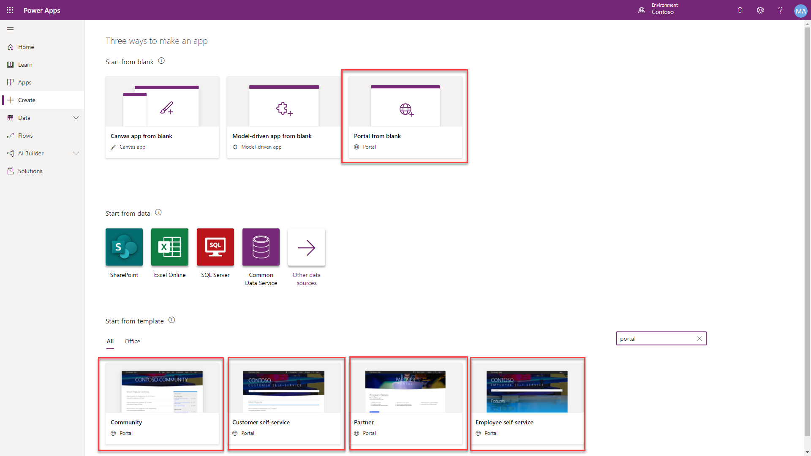
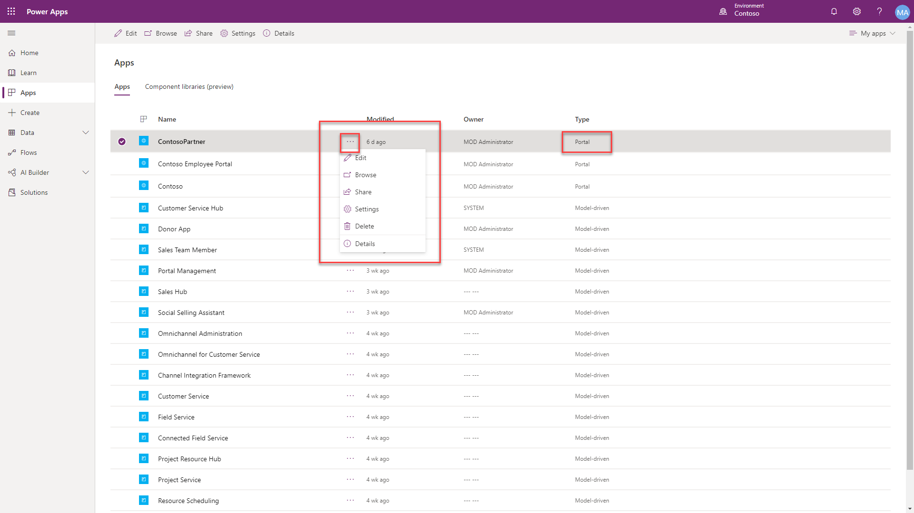
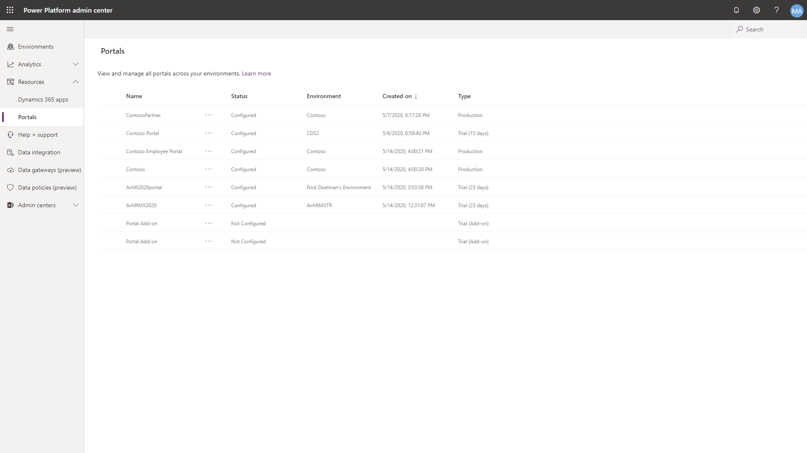

A fully functional portal based on a template is provisioned in an environment with the Common Data Service enabled. This portal can be further configured to meet specific business requirements.

A maker will first choose a particular portal template. There is currently only one option (Portal from blank) for environments without Dynamics 365 and five different portal templates for environments with Dynamics 365 apps enabled.

> [!div class="mx-imgBorder"]
> 

### Portal solutions installation

The provisioning process will first begin to install a series of solutions in the environment. All portal implementations will contain base portal solutions with additional functionality added in separate solutions depending on the portal template chosen. The solutions contain entities, forms, views, processes and a model-driven Portal Management app used to manage the portal metadata.

### Portal metadata 

Once the portal solutions are installed, the process will upload portal metadata records based in the specific portal template chosen. The portal metadata will define the initial configuration for the portal. Each template can be installed only once per environment, however, multiple portal templates can be installed in a single environment. 

> [!NOTE]
> Currently, only environments with Dynamics 365 enabled may contain multiple portal types.

### Portal web application

An Azure web app will be configured for each portal provisioned in an environment. 

### Portal app

The provisioned portal will appear in the Apps list of type *portal*. From this portal app, a maker will be able to edit (go to portal studio), browse, share, go to settings, delete or view details about the portal. 

> [!div class="mx-imgBorder"]
> 

A list of all portals in a Power Platform tenant can be viewed from the Power Platform Admin Center.

> [!div class="mx-imgBorder"]
> 

The Portal Management App will also appear in the list of Apps.

### Trial portal

By default a portal will be provisioned in Trial mode. A maker will have 30 days to convert the portal to production, or it will be automatically deleted.

### Delete portal

If a portal app is deleted, it will remove the portal app from the list of apps and delete the portal web application. It will not delete the portal solutions or portal metadata from the Common Data Service.

> [!VIDEO https://www.microsoft.com/videoplayer/embed/RE4yWm3]

