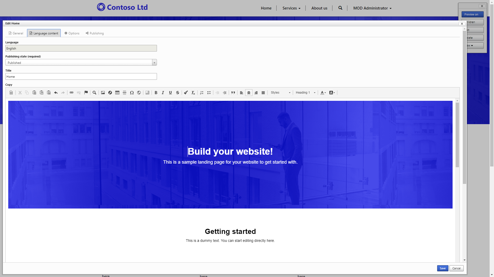

Power Platform provides a number of tools to help you administer, configure, and fine-tune a Power Apps portal to meet specific business requirements.

## Portals Studio

Power Apps portals Studio is a WYSIWYG portal editing tool that allows makers to create and organize webpages, configure page layouts, add portal components, modify CSS, and edit web templates and page source code. Updates and additions that are made in the portals Studio will directly update the portal metadata. The portals Studio is positioned as the main workspace for portal makers.

To access the portals Studio:

1. Go to [Power Apps](https://make.powerapps.com/?azure-portal=true).
1. Select the target environment by using the environment selector in the upper-right corner.
1. Select the application of type Portal from the **Apps** list.
1. Select the **Edit** menu.

The portals Studio is used for quickly defining a site structure with webpage management, creating page layouts, embedding forms and lists, and applying themes to and reviewing page templates.

> [!div class="mx-imgBorder"]
> 

## Portal Management app

Not all portal configuration features are available in the Power Apps portals Studio. Portal Management is a Power Apps model-driven app that allows makers to add, modify, or delete any of the portal metadata records that define the portal functionality and appearance. The Portal Management app can be used for creating and editing content snippets, managing advanced options for entity forms and entity lists, and other advanced configuration tasks.

> [!WARNING]
> Incorrectly modifying the portal metadata might have undesirable effects on the operation and appearance of your portal.

To access the Portal Management app:

1. Go to [Power Apps](https://make.powerapps.com/?azure-portal=true).
1. Select the target environment by using the environment selector in the upper-right corner.
1. In the **Apps** list, select the **Portal Management** model-driven app.

> [!NOTE]
> The Portal Management app might be named Dynamics 365 Portals in existing Dynamics 365 environments.

> [!div class="mx-imgBorder"]
> 

## Portal front-side editing tools

The portal front-side editing tools are legacy tools in which visitors to a portal with specialized web roles (such as administrator) can add and modify portal content and functionality directly when they are browsing portal pages. Along with being able to directly edit content, content creators can add webpages, web links, and web files to the pop-up tools window that appears. Moving forward, we recommend that you modify content by using the portals Studio.

> [!div class="mx-imgBorder"]
> 

## Portals admin center

The Power Apps Portals admin center provides a series of functions for administration of a Power Apps portal such as configuring custom URLs, enabling diagnostic logging, or to enable or install specific features such as SharePoint or Power BI.

To access the Power Apps Portals admin center:

1. Go to [Power Apps](https://make.powerapps.com/?azure-portal=true).
1. Select the target environment by using the environment selector in the upper-right corner.
1. From the **Apps** list, select the application of type **Portal**.
1. Select **Settings** on the command bar.
1. Select the **Administration** link under **Advanced options** in the **Portal settings** flyout panel.

> [!div class="mx-imgBorder"]
> 

> [!VIDEO https://www.microsoft.com/videoplayer/embed/]

