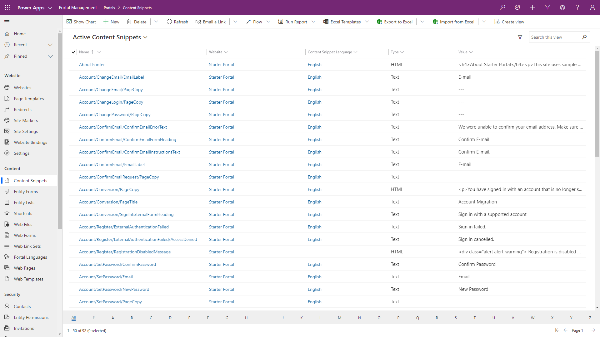
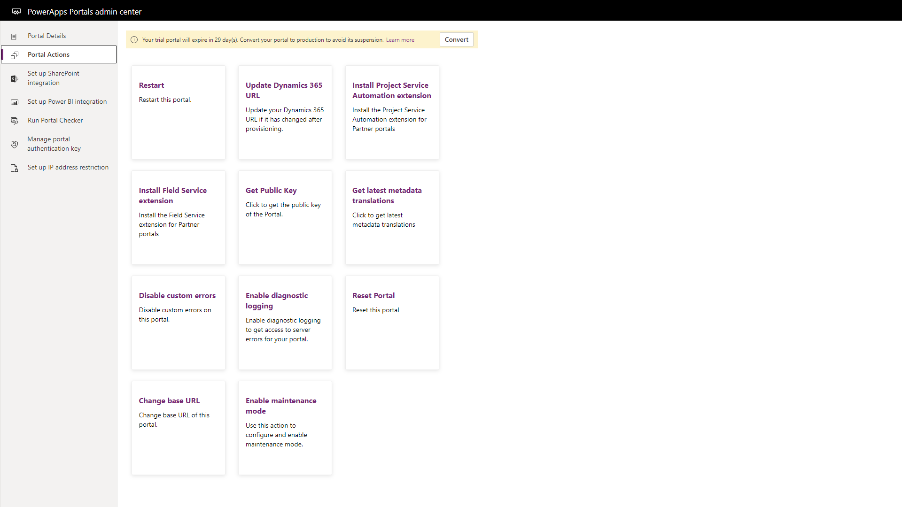

Power Platform provides a number of tools available in the to administer, configure, and fine-tune a Power Apps portal to meet specific business requirements.

## Portal studio

The portal studio is a What-You-See-Is-What-You-Get portal editing tool that allows makers to create and organize web pages, configure page layouts, add portal components, modify CSS and edit web templates and page source code.  Updates and additions made in the portal studio will directly update the portal metadata. The portal studio is positioned as the main workspace for portal makers.

To access the Portal Studio:

1. Navigate to [Power Apps](https://make.powerapps.com/?azure-portal=true).
1. Select the target environment using the environment selector in the top right-hand corner.
1. Select the application of type **Portal** from the list of Apps
1. Click **Edit** menu.

The portal studio is used for quickly defining a site structure with web page management, creating page layouts, and embedding forms and lists and theming & reviewing page templates.

> [!div class="mx-imgBorder"]
> 

## Portal management app

Not all the portal configuration features are available in the Power Apps portal Studio.  The portal management app is a model-driven Power App that allows makers to add, modify or delete any of the portal metadata records that define the portal functionality and appearance. Portal Management app can used for creating and editing content snippets, managing advanced options for entity forms and entity lists, and other advanced configuration tasks.

> [!WARNING]
> Incorrectly modifying the portal metadata may have undesirable affects on the operation and appearance of your portal.

To access Portal Management app:

1. Navigate to [Power Apps](https://make.powerapps.com/?azure-portal=true).
1. Select the target environment using the environment selector in the top right-hand corner.
1. In the list of Apps click **Portal Management** model-driven app.

> [!NOTE]
> The Portal management app may be named the Dynamics 365 Portals in existing Dynamics 365 environments.

> [!div class="mx-imgBorder"]
> 

## Portal front side editing tools

The portal front-side editing tools are legacy tools in which visitors to a portal with specialized web roles (such as administrator) can add and modify portal content and functionality directly when browsing portal pages. Along with being able to directly edit content, a pop-up tools window will appear allowing content creators to add web pages, web links and web files.  Moving forward, the recommended way to modify content is using the Portals Studio.

> [!div class="mx-imgBorder"]
> 

## Portal admin center

The portal admin center provides a series of functions for administration of a Power Apps portal such as configuring custom URLs, enabling diagnostic logging, or to enable or install specific features such as SharePoint or Power BI.

To access Power Apps portals admin center:

1. Navigate to [Power Apps](https://make.powerapps.com/?azure-portal=true).
1. Select the target environment using the environment selector in the top right-hand corner.
1. From the list of Apps select the application of type **Portal**.
1. Click **Settings** on the command bar.
1. Click **Administration** link under **Advanced options** in the flyout **Portal settings** panel.

> [!div class="mx-imgBorder"]
> 

> [!VIDEO https://www.microsoft.com/videoplayer/embed/]

