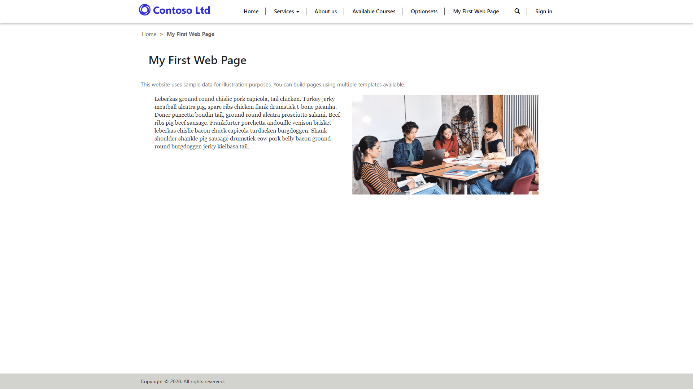

The purpose of this exercise is to create a webpage by using the Power Apps portals Studio.

At the end of these exercises, you will be able to:

- Open the portals Studio to edit your portal.
- Create a new webpage by using existing page templates.
- Add content to your webpage.

For this exercise, you will need to have the following parameters set in your environment:

- A provisioned Power Apps portal. If you do not have a Power Apps portal available, follow the [Create Portal](https://docs.microsoft.com/powerapps/maker/portals/create-portal/?azure-portal=true) instructions to create one.
- Access to the Power Apps maker portal.

## Scenario

Creating and editing a portal webpage is a simple process and allows you to quickly build a Power Apps portal application. In this exercise, you need to complete the following tasks:

- Open your portal in Power Apps portals Studio.
- Create a new webpage. 
- Add a component with two sections. 
- Configure one section to display text. 
- Configure another section to display an existing portal image.

### Launch portals Studio

To launch portals Studio, follow these steps:

1. Go to the [Power Apps maker portal](https://make.powerapps.com/?azure-portal=true).
1. Make sure that the correct environment is selected in the environment selector in the upper-right corner.
1. From the **Apps** list, locate your portal app (Type = Portal).
1. Select the ellipsis (**...**) and then select **Edit**, which will launch the portals Studio.

### Create a new webpage

To create a new webpage, follow these steps:

1. From the command bar, select **New page**.
1. Move the mouse over **Fixed layouts** and then select **Page with title**.
1. A new webpage will appear with the title *New page*.
1. In the properties pane, enter a new name for the webpage, press the **Tab** key, and the webpage will autosave.
1. In the properties pane, enter a name without spaces for the partial URL, press the **Tab** key, and the webpage will autosave.

### Add static content

To add static content, follow these steps:

1. On the canvas, select the text area that contains, "This website uses sample data..."
1. On the tool belt, select **Components** (grid icon).
1. In the **Section layout** area, select **Two columns section**, which will add a two-column section on the webpage canvas.
1. On the canvas, select the left column section.
1. On the tool belt, select **Components** and then select **Text** from the **Portal components** section.
1. On the canvas, add some text to the component.
1. On the canvas, select the right column section.
1. On the tool belt, select **Components** and then select **Image** from the **Portal components** section.
1. On the properties pane, from the drop-down list, select **AboutUs.png**.

### View the webpage

To view your new webpage, from the command bar, select **Browse website**. 

You should now see your new webpage on the portal. A link to your webpage is also on the main menu.

> [!div class="mx-imgBorder"]
> 
