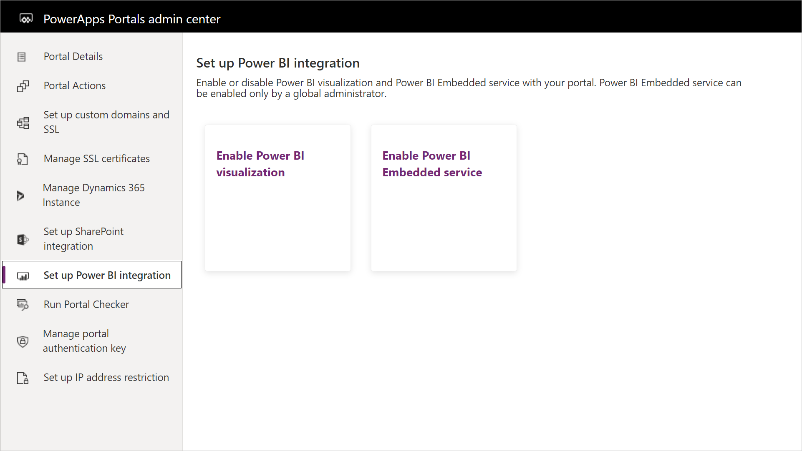
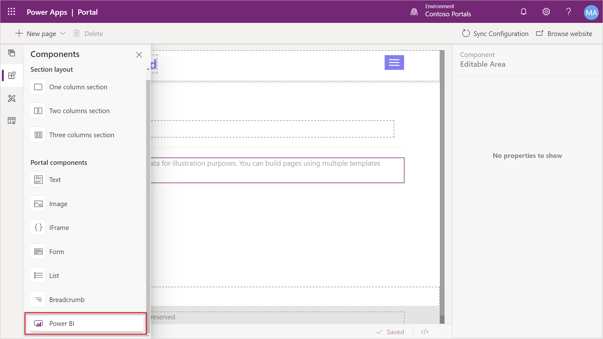
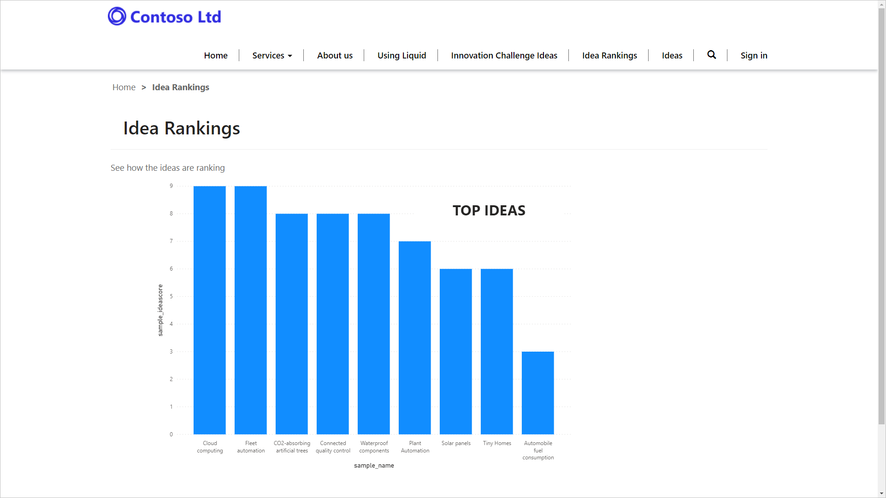
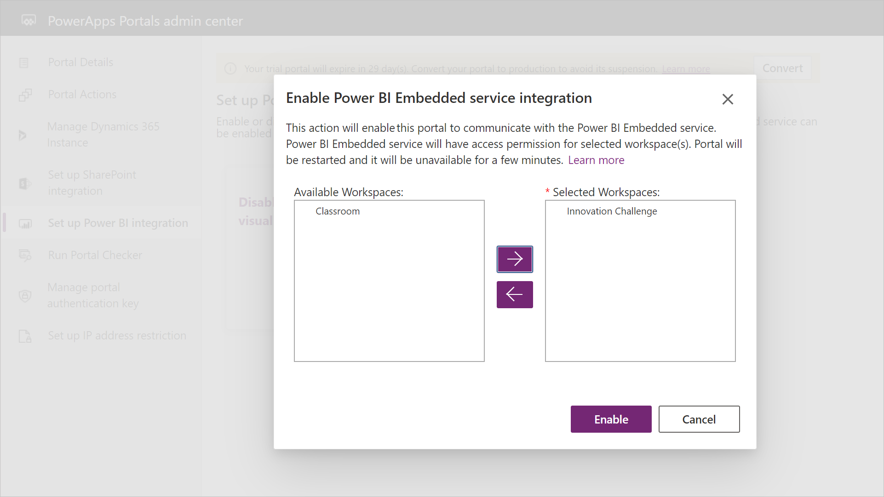
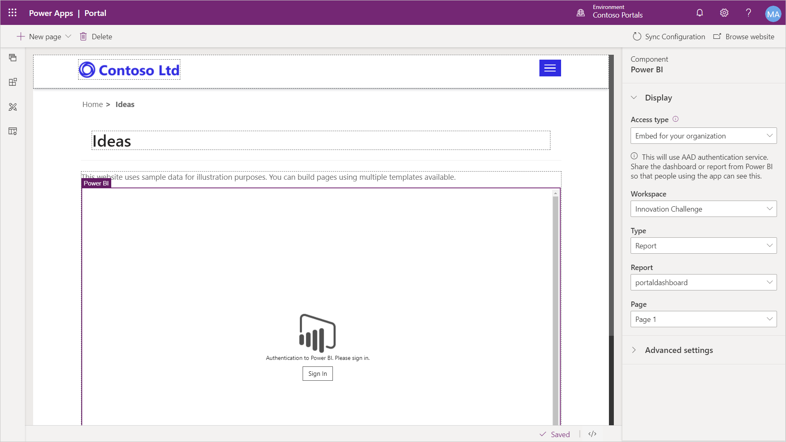

You can add a Power BI report or dashboard to a webpage in a Power Apps portal further extending the portal as a powerful web application.

Before you can add a Power BI report to a Power Apps portal you will need to enable the Power BI visualization or the Power BI Embedded service in the Power Apps portals admin center.

> [!div class="mx-imgBorder"]
> [](../media/enable-power-bi.png#lightbox)

* **Power BI visualization** allows you to embed *publish to web* Power BI reports for anonymous visitors, or share secure Power BI reports or dashboards to Power BI Azure Active Directory authenticated users (for example, on an Employee self-service portal).
* **Power BI Embedded service** allows you to share the secure Power BI reports or dashboards to external users who don't have Power BI license or Azure Active Directory authentication setup. This feature uses the *new workspaces* feature of Power BI (see [Create the new workspaces in Power BI](https://docs.microsoft.com/power-bi/collaborate-share/service-create-the-new-workspaces/?azure-portal=true)).

## Enable Power BI visualization

Enabling the Power BI visualization allows a portal maker to add a Power BI component to a portal page and configure it to display a Power BI report or dashboard that is available for being published on the web.  A report author will need to generate an embed code in the Power BI Dashboard.  

From the Power Apps portal studio, you can add the Power BI component to a portal page.  This will add a Liquid tag to the portal page which can be further configured in the Portal Studio source code editor depending on the specific requirement.

> [!div class="mx-imgBorder"]
> [](../media/power-bi-component.png#lightbox)

### Parameters

The `powerbi` Liquid tag accepts the following parameters:

**path**. Path of the Power BI report or dashboard. If the Power BI report or dashboard is secure, you must provide the authentication type.

```twig

```

**authentication_type**. Type of authentication required for the Power BI report or dashboard. Valid values for this parameter for embedded Power BI visualizations are Anonymous and AAD. The default value is Anonymous. While adding the secure Power BI report or dashboard, ensure that it is shared with Common Data Service Azure AD authenticated users.

```twig

```

You can also filter the report on one or more values. More information on filtering a report: [Filter a report using query string parameters in the URL](https://docs.microsoft.com/power-bi/service-url-filters/?azure-portal=true)

> [!IMPORTANT]
> Anonymous report doesn't support filtering.

Filtering can be based on dynamic values making it a great option to display personalized Power BI visualizations. You can also create a dynamic path by using the `capture` Liquid variable as below:

```twig
https://app.powerbi.com/groups/00000000-0000-0000-0000-000000000000/reports/00000000-0000-0000-0000-000000000001/ReportSection01?filter=Executives/Executive eq '{{user.id}}'

```

**tileid**. Displays the specified tile of the dashboard. You must provide the ID of the tile.

```twig

```

Before adding the secure Power BI report or dashboard to a webpage in portal, you must share it with the required users.

> [!div class="mx-imgBorder"]
> [](../media/power-bi-page.png#lightbox)

## Enable Power BI Embedded service

You can also enable and configure the Power BI Embedded service within the Power Apps portal admin center.  

When you enable the Power BI Embedded service, you will need to specify the Power BI workspaces that will be available for use on the portal.

> [!div class="mx-imgBorder"]
> [](../media/power-bi-embedded.png#lightbox)

When the Power BI Embedded service is activated, this will allow makers to embed Power BI reports on a portal page that will take advantage of the features and functionality of the Power BI Embedded service without needing to write corresponding code on the portal.  You will need to have created a workspace within Power BI and add the appropriate reports, dashboards and tiles.

When adding an embedded Power BI report, you will need to specify if the audience is for your customers (external users) or for your internal employees.  The employees will need to authenticate to the portal using Azure AD. When adding a report for external users, set the value of `authentication_type` to **powerbiembedded**:

```twig

```

> [!div class="mx-imgBorder"]
> [](../media/organization-embedded-power-bi.png#lightbox)

> [!NOTE]
> Power BI sharing requires appropriate licensing to be in place. Licensing requirements depend on the audience and method of sharing.

For more information on setting up Power BI integration: [Set up Power BI integration](https://docs.microsoft.com/powerapps/maker/portals/admin/set-up-power-bi-integration/?azure-portal=true)

For more information on sharing and licensing requirements: [Share Power BI workspace](https://docs.microsoft.com/power-bi/service-how-to-collaborate-distribute-dashboards-reports#collaborate-with-coworkers-in-an-app-workspace/?azure-portal=true) and [Share Power BI dashboard and report](https://docs.microsoft.com/power-bi/service-share-dashboards/?azure-portal=true).
