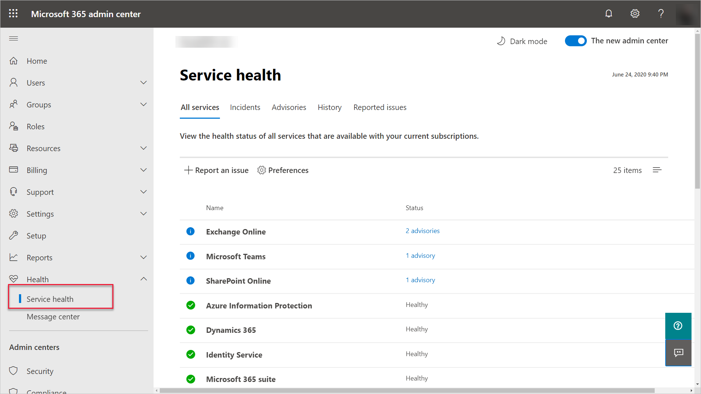
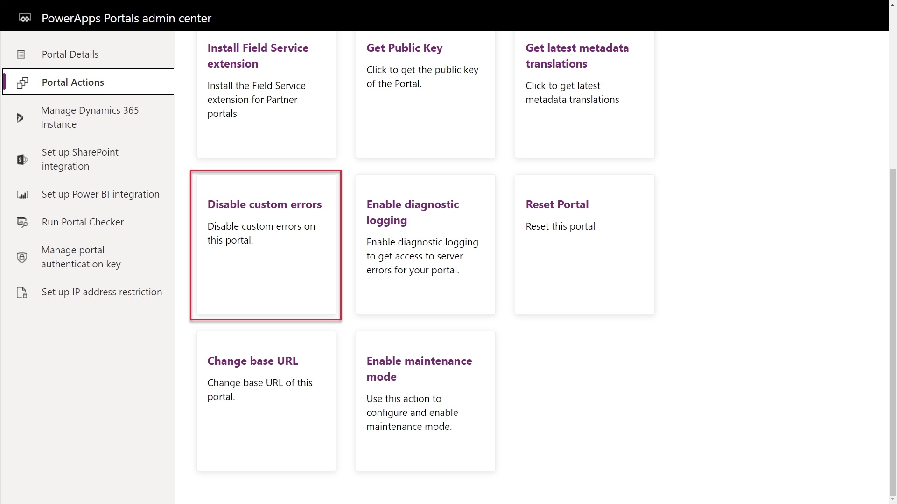
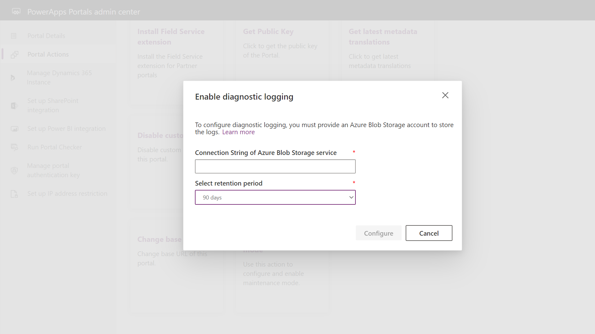

A Power Apps portal is an external facing application often open to an external audience. It's critical that the portal is accessible and operational as it reflects the image of an organization.

## Portal site issues

If a portal is completely inaccessible, there are a number of options that an administrator can investigate, such as:

* Is the portal enabled?
* Are other Common Data Service apps accessible?
* Are there any issues with the infrastructure services portals may depend on such as Azure Active Directory or Azure Web Apps?
* Are there any advisories on the Microsoft 365 admin center?

> [!div class="mx-imgBorder"]
> 

An administrator should also investigate whether some of the portal metadata has been recently modified, such as the **website** or **website binding** records that also may affect portal functionality.

Running the **Portal checker** may also identify potential issues with the site.

## Portal page and functionality issues

A portal administrator at times may be faced with having to resolve errors with specific Power Apps portal pages or functions.

Power Apps portals have a number of tools that will allow an administrator to quickly identify and resolve issues without needing to contact Microsoft support.

### Disable custom errors

A typical error might begin when a portal visitor reports an issue when visiting a portal page.  Often the error message is brief and and doesn't describe the underlying issue.

In the Power Apps Portal admin center, the **Disable custom errors** action will replace the notification with detailed error information on the portal page that could provide additional information for an administrator to troubleshoot the issue.

> [!div class="mx-imgBorder"]
> 

> [!NOTE]
> Disabling custom errors should be a temporary setting as the detailed error message may convey an increased negative experience for portal visitors. It is advisable to only disable custom errors when you are in the development phase and enable custom errors once you go live.

Another option is to personalize the error message by adding a content snippet **Portal Generic Error** with an appropriate message for portal users. For more details about how to configure the error message, see [Display a custom error message](https://docs.microsoft.com/powerapps/maker/portals/admin/view-portal-error-log#display-a-custom-error-message/?azure-portal=true).

### Diagnostic logging

Along with visual errors on portal pages, there potentially could be underlying issues that are not quite as obvious to isolate and troubleshoot.  Power Apps portals can be configured to log diagnostic information.  The diagnostic logs will be stored in Azure Blob storage in a container named **telemetry-logs**.  The administrator can configure the retention period of how long to keep the logs.

> [!div class="mx-imgBorder"]
> 

The logs can provide information of patterns, duration and frequency of specific portal errors to assist in resolving potential errors and issues.

## Additional troubleshooting steps

Since the portal may extend certain functionality of a model-driven app, one technique to eliminate potential portal errors is to attempt the same operation in the model-driven app. For example, if an error is generated when a record is added via the portal, try adding or updating the same data record a portal user is attempting to create or update on a portal. Once the error is resolved in the model-driven app, it is quite often resolved on the portal.

Creating the site setting `Site/EnableCustomPluginError` and setting the value to **True** will display the contents of the plug-in error on a portal page rather than the generic error message.

See [View portal error logs](https://docs.microsoft.com/powerapps/maker/portals/admin/view-portal-error-log/?azure-portal=true) for more information on configuring the diagnostic tools for Power Apps portals.
