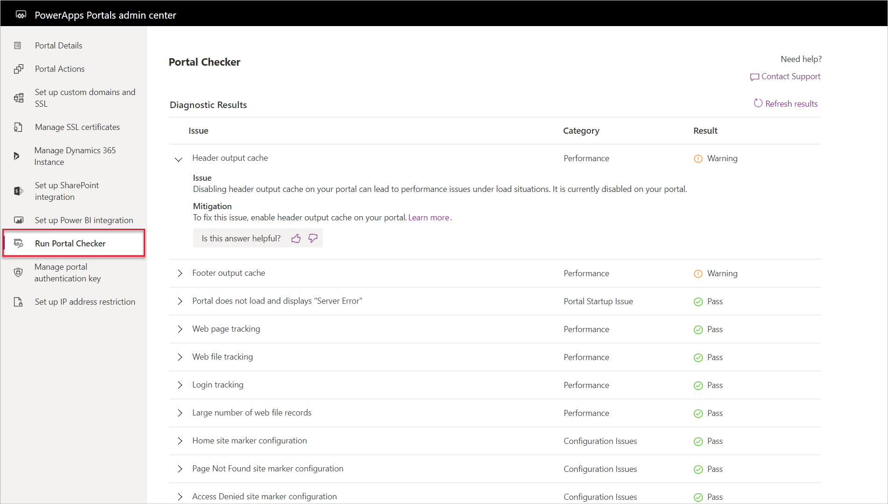
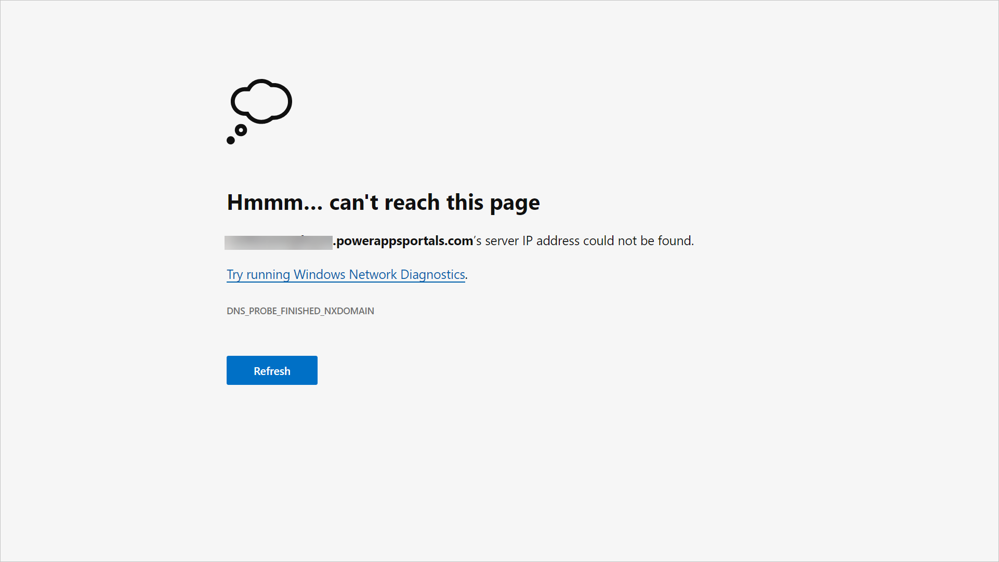
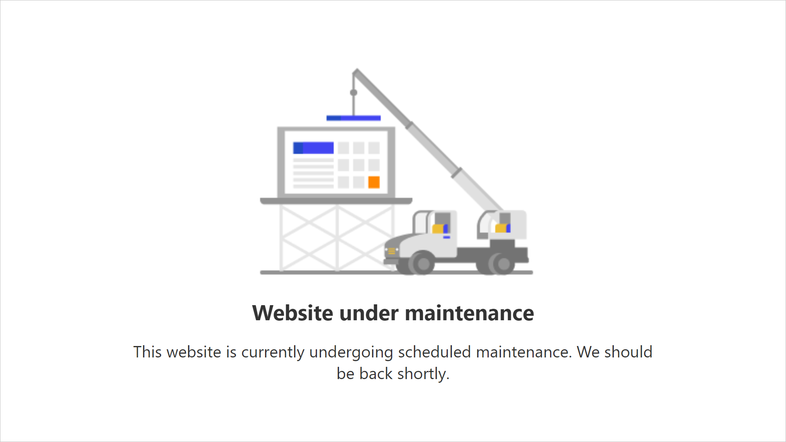
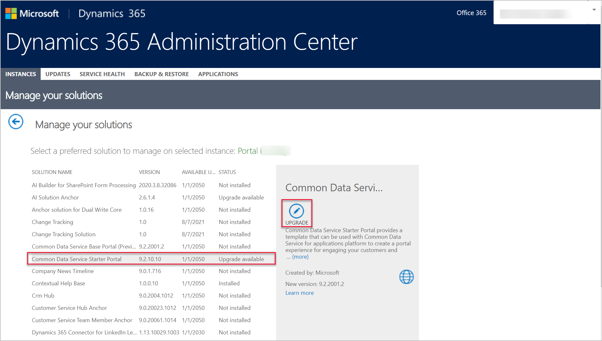

An administrator's role goes beyond ensuring that a Power Apps portal is running correctly yet also configured to run efficiently and quickly. Numerous tools are available to help administrators check the settings and status of a Power Apps portal and provide users with clear messaging if the portal is undergoing maintenance.

## Portal Checker

The **Portal Checker** feature is available in the Power Apps Portals admin center and will run diagnostic checks to protect and advise against common issues that might be encountered when operating a portal.

To run the Portal Checker, follow these steps:

1. From [Power Apps](https://make.powerapps.com/?azure-portal=true), locate your portal app.
1. Select the ellipsis (...) and then select **Settings**.
1. Select **Administration**.
1. Select **Run Portal Checker** from the list of options on the left.
1. Select the **Run Portal Checker** button.

After a few minutes, you should see a list of diagnostic results.

> [!div class="mx-imgBorder"]
> 

The result will also provide mitigation steps or links to help you understand the impact of the issue.

For more information, see [Portal Checker](https://docs.microsoft.com/powerapps/maker/portals/admin/portal-checker/?azure-portal=true).

## Enable maintenance mode

As an administrator, you might have occasions when you don't want portal users to visit or sign in to the Power Apps portal. The reason could be because you might be migrating or updating a series of portal webpages and functionality or uploading a large dataset that you don't want to be available on the portal until the load process is complete.

While you can change the portal state to **Off**, selecting this option would present the portal visitors with a message that the portal cannot be found, leaving the visitors wondering what has happened.

> [!div class="mx-imgBorder"]
> 

Within the Portals admin center actions is the option to enable the **Portal Maintenance** mode. Selecting this mode will provide the portal visitors with a more informational page indicating that the portal is temporarily unavailable.

> [!div class="mx-imgBorder"]
> 

The maintenance mode page can also be replaced with a custom HTML page that is hosted elsewhere and publicly accessible. For more information, see [Enable maintenance mode](https://docs.microsoft.com/powerapps/maker/portals/admin/enable-maintenance-mode#enable-maintenance-mode/?azure-portal=true).

## Upgrade the portal

A benefit of software as a service (SaaS) applications is that many of the software components are updated automatically. Several Power Apps portals components, such as the Azure web application and the various tools, are updated automatically.  

An administrator can also opt to receive early updates in the Portals admin center.

> [!CAUTION]
> You should opt for early updates in development or testing portals only, which will ensure that your production portal remains operational in the unlikely event that an early update might cause issues with your portal application.

While underlying infrastructure is maintained automatically, portal solutions aren't automatically updated. These solutions are installed on Common Data Service and will always be compatible with the current portal web host. An administrator might be advised of the available solution updates from the Microsoft 365 message center.

An administrator can update the portal solutions during an appropriate maintenance window because the update process might cause some performance degradation and portal instability.

Portal solutions can be updated by using the Dynamics 365 admin center (even for Common Data Service portals that don't have Dynamics 365 apps installed).

1. Go to the [Power Platform admin center](https://aka.ms/ppac/?azure-portal=true).
1. Expand **Admin Centers**.
1. Select **Dynamics 365**.
1. Select the environment where the portal is provisioned.
1. In the **Details** section, select the **Manage your solutions** icon.
1. Select the portal solution that has a status of **Upgrade available**.
1. Select **Upgrade** to start the solution upgrade process.

> [!div class="mx-imgBorder"]
> 

> [!VIDEO https://www.microsoft.com/videoplayer/embed/RE4AprS]
