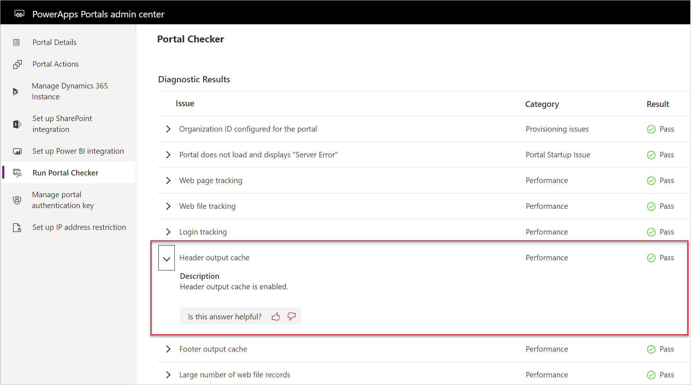

The purpose of this hands-on lab is to see how the Portal Checker can identify potential portal issues.

## Learning objectives

At the end of these exercises, you will be able to:

- Run the Portal Checker.
- Respond to the mitigation advice.
- Rerun the Portal Checker to confirm that the issue has been addressed.

**Estimated time to complete this exercise**: 10 to 15 minutes

### Prerequisites

For this exercise, you need to have the following parameters set up in your environment:

- A Power Apps portal that is provisioned. If you do not have a Power Apps portal available, follow the [Create Portal](https://docs.microsoft.com/powerapps/maker/portals/create-portal/?azure-portal=true) instructions to create one.
- Access to the Power Apps maker portal.

### High-level steps

In this exercise, you will make a few changes to the settings in your portal metadata. Next, you will run the Portal Checker tool from the Power Apps portals admin center and then evaluate the results. After you have addressed the issue, you will rerun the Portal Checker to ensure that the issue has been resolved.

The high-level steps are as follows:

1. Locate the `Header/OutputCache/Enabled` site setting and update the value to **False**.

1. Refresh the cache.

1. Run the Portal Checker.

1. Note the warning message for the header output cache.

1. Locate the `Header/OutputCache/Enabled` site setting and update the value to **True**.

1. Refresh the cache.

1. Run the Portal Checker.

1. Note the message for Header Output cache.

#### Launch the Portal Management app

1. Go to the [Power Apps maker portal](https://make.powerapps.com/?azure-portal=true).
1. Make sure that the correct environment is selected in the environment selector in the upper-right corner.
1. From the **Apps** list, locate and open the Portal Management app (Type = Model-driven).
1. Select **Site Settings**.
1. Locate the `Header/OutputCache/Enabled` site setting, update the value to **False**, and then select **Save**.
1. Leave the Portal Management app open.
1. From another browser tab or session, go to the [maker portal](https://make.powerapps.com/?azure-portal=true) and sign in.  
1. Locate your portal app, select the ellipsis (...), and then select **Edit** to open portals Studio.
1. Select **Browse website** to clear the cache.
1. Close the website.
1. Go to the [maker portal](https://make.powerapps.com/?azure-portal=true) and sign in.  
1. Locate your portal app, select the ellipsis (...), and then select **Settings**.
1. On the fly-out window to the right, select **Administration**.
1. The Power Apps portals admin center will appear. Select **Run Portal Checker**.
1. On the screen, select the **Run Portal Checker** button.
1. Note that the header output cache has a warning; expand the message to get more details.
1. Leave the Portal Checker open.
1. Return to the Portal Management app.
1. Select **Site Settings**.
1. Locate the `Header/OutputCache/Enabled` site setting, update the value to **True**, and then select **Save**.
1. From another browser tab or session, go to the [maker portal](https://make.powerapps.com/?azure-portal=true) and sign in.  
1. Locate your portal app, select the ellipsis (...), and then select **Edit** to open portals Studio.
1. Select **Browse website**, which will clear the cache.
1. Return to the Power Apps portals admin center and select **Run Portal Checker**.
1. On the screen, select the **Run Portal Checker** button.
1. Note that the header output cache issue has been resolved.

> [!div class="mx-imgBorder"]
> 
