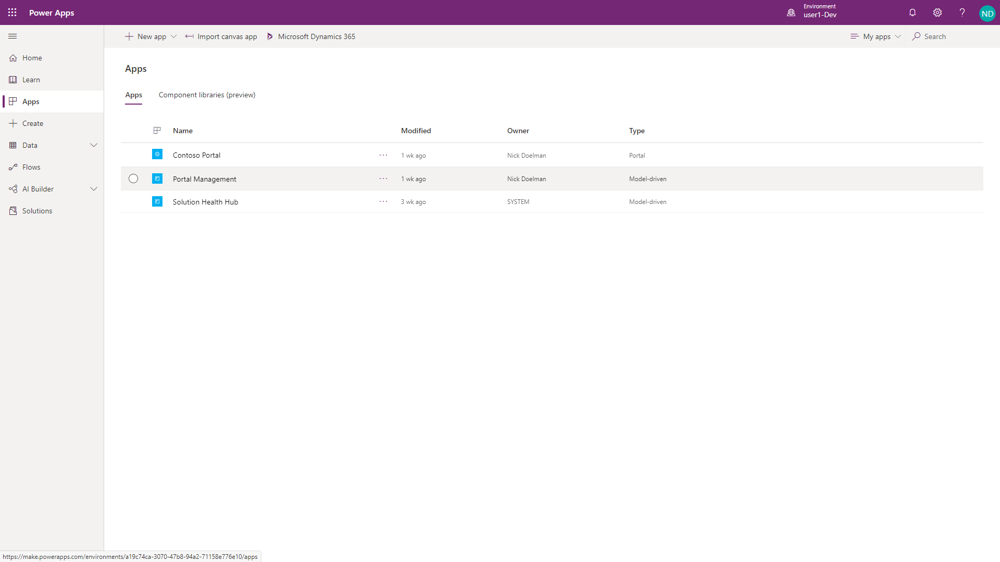
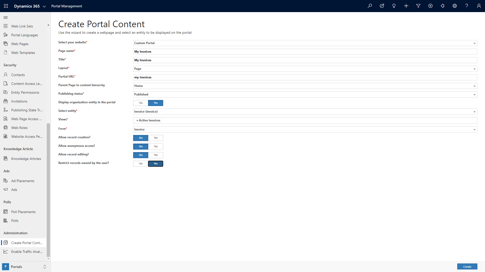

The Portal studio provides a maker with a tool to update static content and also add pages, components and themes to a Power Apps portal. However, there are many aspects of a portal project that cannot be added or edited using the Portal Studio alone. 

When a Power Apps portal is provisioned, one of the assets created on the Common Data Services (CDS) environment is the Portal Management model-driven app. The app may also appear as the Dynamics 365 Portal app for environments with Dynamics 365 app provisioned.

> [!div class="mx-imgBorder"]
> 

## Launch Portal management app

You will have access to the Portal Management app after you have a portal provisioned in your Common Data Service or Dynamics 365 environment. To access the Portal Management app:

1. Navigate to [Power Apps maker portal](https://make.powerapps.com/?azure-portal=true).
1. Select the target environment using the environment selector in the top right-hand corner.
1. From the list of Apps, locate the Portal Management app (app Type will be Model-driven).
1. Click on the app name to open it

This will launch the Portal Management app and allow makers to access all metadata and data that define portal content and behavior.  

> [!TIP]
> Because the Portal Management app is a standard model-driven app you can also open it from the [Dynamics 365 Home page](https://home.dynamics.com/?azure-portal=true).

## App overview

The Portal Management app allows makers to perform advanced configuration actions on the portal by providing direct access to the portal metadata records that define the appearance, language, security and functionality of a portal.  

The Portal Management app mainly composed of standard model-driven views and forms in which to add and update metadata. Some of the record forms will have specialized controls such as HTML editors to allow deeper customization of portal content.

> [!div class="mx-imgBorder"]
> 

Portal Management app has the following areas:

- **Website**: controls various operational aspects of the portal such as site and portal settings, page templates, temporary and permanent redirects within the site, and others.
- **Content:** provides access to static content that appears on the portal, navigation, and records controlling portal access to CDS data.
- **Security:** defines security assets such as web roles and entity permissions.
- **Administration:** includes miscellaneous portal features like portal wizard and integration with traffic analyzers and search engines

## Portal wizard

The Portal Management app includes a portal wizard that can be used to generate web pages with an entity list and a corresponding entity form. This tool can be used to quickly build a working portal application over the existing CDS data.

> [!div class="mx-imgBorder"]
> 

For information how to use the portal wizard see [Create and expose portal content easily](https://docs.microsoft.com/dynamics365/portals/create-expose-portal-content/?azure-portal=true).