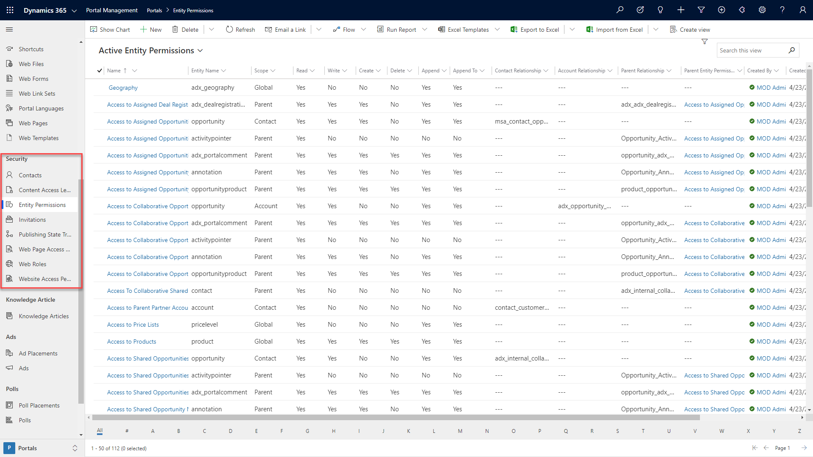

Makers need to understand portal metadata and where it's used to effectively configure a Power Apps portal. While some of the portal configuration and metadata can be created and edited directly on the Power Apps portals Studio or by using other tools, many portal metadata records can only be added or modified by using the Portal Management app.

The following section explains the purpose of portal metadata records. 

## Website

The **Website** portal metadata section defines properties that control the behavior of the portals that are provisioned on the particular Common Data Service environment.

> [!div class="mx-imgBorder"]
> 

| Metadata | Purpose |
| --- | --- |
| Websites | Each provisioned portal will have one website record that is the main parent entity for all website portal metadata. The website record will define the default header and footer templates and the languages. We do not recommend that you create a website and related records manually. Instead, let the system create the metadata through the provisioning or import process. |
| Page Templates | A page template is a record that will be used by a webpage record to point to a legacy aspx page on the portal host application or to a web template record. After a page template record has been created, it will appear as an option on the Power Apps portals Studio when you are creating new webpages. |
| Redirects | A redirect record is meant to be either a temporary or a permanent detour for specific pages or sections that are undergoing maintenance without the need to completely shut down the portal. If a particular URL is intercepted as specified in the redirect record, it can be redirected to an external URL, a webpage, or a site marker. |
| Site Markers | A site marker is a pointer to a specific webpage record. The site marker can be referenced in a Liquid tag on a content snippet, web template, or in webpage content. This feature allows makers to avoid having to hard code specific URLs on portal pages or content. |
| Site Settings | Site settings define specific behaviors of portal functionality and features. Site settings are value pairs that can enable or disable particular items such as authentication settings, searching, and caching. |
| Website Bindings | Website bindings link the particular website to the Azure portal web application. Typically, an admin would not modify this value directly in the Portal Management app but will configure it in the Portal Admin center actions instead. |
| Settings | Similar to settings, the Settings entity contains value pairs that are specific to all portals that are provisioned for the particular environment as opposed to a specific portal. |

## Content

The **Content** section contains the entities that define what and how static and dynamic information is displayed on a Power Apps portal. While some of the content can be added by using the Power Apps portals Studio, certain aspects can only be added or modified by updating the data directly with the Portal Management app.

> [!div class="mx-imgBorder"]
> 

| Metadata | Purpose |
| --- | --- |
| Content Snippets | Content snippets are typically short, reusable content items that can appear on various parts of a portal. An example of a content snippet would be the footer content that would be displayed on most portal webpages. A content snippet can contain text, Liquid code, HTML, and CSS. Typically, a content snippet record would be replicated for each provisioned portal language. |
| Entity Forms | Entity forms use model-driven form definitions to display forms in the portal and enable access to Common Data Service records for portal visitors. An entity form can be configured to display read-only, edit, or create forms. |
| Entity Lists | Entity lists use model-driven view definitions to display lists of Common Data Service records. An entity list can be configured to allow navigation to a selected record or to run workflows. A maker can also enable advanced search and filter capabilities. |
| Shortcuts | A shortcut record allows a portal maker to make a direct link on a webpage to another webpage, web file, or even an external URL, regardless of the hierarchy or site map of the portal. By default, the shortcut link will appear as a link on the parent webpage along with the list of other child pages. |
| Web Files | A web file record provides a metadata record where a file can be attached as a note record. The web file record will define the name and partial URL. Web files are used for the images, CSS, and JavaScript files and to store downloadable content. |
| Web Forms | Web forms are components similar to entity forms, but instead of a single record/form, web forms create a sequence of steps that can be used to build a portal-based business process flow. Web forms can currently only be configured by using the Portal Management app. |
| Web Link Sets | A web link set defines the website menu that can appear in the header of a webpage or as a submenu within a webpage. The Web Link Set record contains a collection of Web Link records that can point to a portal page or external URLs. |
| Portal Languages | List of all languages that are supported by Power Apps portals out-of-the-box. Portal makers can also expand the list and add language variants, like French-Canadian, to cater to international audiences. Any of these records can be associated with the website record to enable selected languages for portal visitors. |
| Web Pages | The webpage record is the core of the website. It defines the actual displayed content, both static and through other components like entity lists and entity forms. A webpage can be created and edited by using Power Apps portals Studio and the Portal Management app. |
| Web Templates | The Web Template record contains the Liquid, HTML, CSS, or JavaScript code that makes up the layout and foundation of how a webpage is rendered. When a portal is provisioned, it includes a set of predefined web templates, which would allow a maker to create a basic portal without needing to understand the code. A maker can create their own web templates or modify existing web templates to satisfy specific requirements and implement custom features of their portal apps. |

## Security

The security capabilities of Power Apps portals are similar to Common Data Service role-based security. The main concept is that a portal user is represented by a contact record and can authenticate and sign in into a portal. The portal user can be assigned to one or more web roles, which can be used to control access to static portal content and Common Data Service records. Currently, this feature can only be managed within the Portal Management app.

> [!div class="mx-imgBorder"]
> 

| Metadata | Purpose |
| --- | --- |
| Contacts | The contact entity is the actual Common Data Service or Dynamics 365 contact entity. All authenticated portal visitors, including internal staff members, must have a corresponding contact record regardless of the authentication method. |
| Entity Permissions | Entity permissions define the scope and the privileges for specific Common Data Service records. Each entity permission record can be associated with a web role, granting configured data access to portal visitors. |
| Invitations | An invitation for an existing Common Data Service contact to join the portal can be created and sent to the contact by using Microsoft Power Automate. After it has been accepted, the invitation will determine the contact's access and permissions for the portal. |
| Publishing State Transition Rules | External users can be given the ability to create and update portal content; however, further rules might be in place to allow for an approval process before the content is viewable by everyone. The Publishing State Transition Rule records define who can publish or unpublish content on the portal.|
| Web Page Access Control Rules | Web Page Access Control Rules link a specific webpage to a web role, which is linked to portal users. This feature controls what webpages that a portal user can access. |
| Web Roles | One or many web role records can be assigned to a portal user (contact). The web role can be linked to entity permissions and Web Page Access Control Rules to control access to content and Common Data Service records.|
| Website Access Permissions | Website access permissions define which high-level editing permissions that specific web roles have on the portal. |

Some of the specific starter portal templates might install additional portal metadata settings for specific features of the portal app, for example, knowledge articles for the Customer self-service portal.

