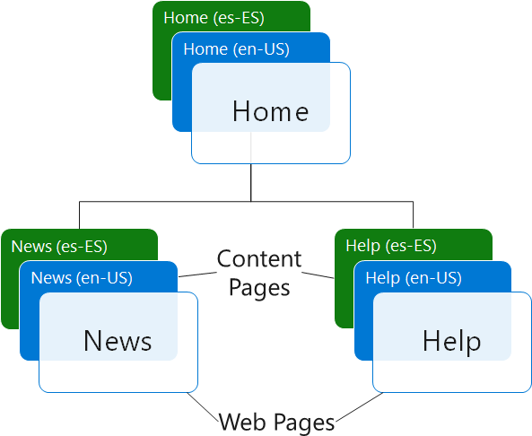
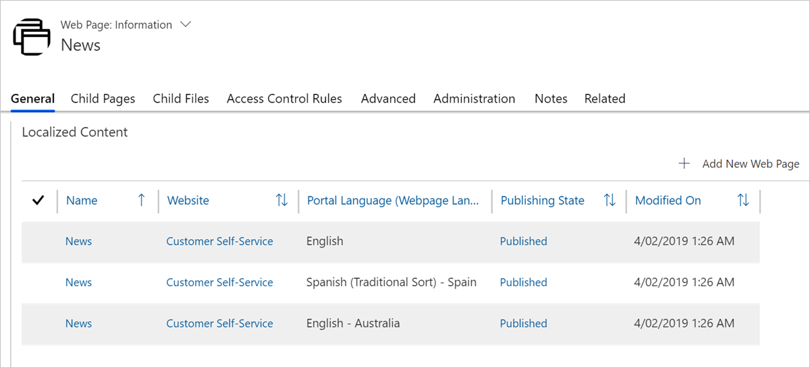

Web pages are the core of any website, including Power Apps portals.  A web page in a Power Apps portal can display both static and dynamic content and can be configured to follow a site hierarchy.  Portal web pages also have a unique structure to allow content to be display in different languages.

Each **Webpage** record within a portal has the following attributes:

- **Website**. The website to which the page belongs. It's a required field that uniquely places the Webpage within a particular portal site. 
- **Parent Page**. The parent web page of the entity, in the website content hierarchy. All web pages should have a parent page except for the single root (Home) page of a website.
- **Partial URL**. The URL path segment used to build the portal URL of this page. The single root (Home) page of your website – the single page that has no associated Parent Page – must have a Partial URL value of `/`.

That hierarchical structure provides enough information for each Webpage to calculate the path that is unique within the website.

| Webpage      | Parent Page  | Partial URL | Calculated Path            |
| ------------ | ------------ | ----------- | -------------------------- |
| Home         | -            | /           | /                          |
| News         | Home         | news        | /news/                     |
| Partner News | News         | partners    | /news/partners/            |
| Price List   | Partner News | price-list  | /news/partners/price-list/ |

When a request is received by the portals web app, the target Common Data Service instance and Website record is determined based on the domain name. The path part of the request is then used to locate the Webpage record with the matching calculated path.

Once the Webpage is determined, the page generation process starts. The high-level steps are:

1. The **Web Page Access Control Rules** are checked to see if the visitor has the permissions to access the page.
1. The **Page Template** linked to the Webpage is retrieved to determine the template that will be used to render the page (either an aspx page or web template).
1. The template is processed and the page output is built based on:
   	- Static content that is determined by the portal metadata. 
   	- Dynamic content that is generated using data from the Common Data Service or Dynamics 365. 

Each webpage represents a specific URL in your site, which users can navigate to. When a user navigates to a URL, the content associated with that URL is displayed. 

## Static content

Static content that is determined by properties of the **Webpage** record, in particular by the Copy field that usually contains the HTML content of the page.  This content can be added or edited in the Portal Studio or added to content web pages. 

### Content pages

When we discussed the **Webpage**, we referred to it as if it were a single record. We did it for convenience but, in fact, there are multiple Webpage entries to every page. There is one root Webpage record that is part the site page hierarchy, the one you edit when you create a new page. There are also multiple child records, or Content pages, pointing to the root entry. This is to support multi-lingual implementations where each child record is responsible for the content in one of the configured languages. 

Every Webpage, even in a single language portal, will have a root Webpage and a Content page for the base language. That way, content for additional languages can be added later on.

> [!div class="mx-imgBorder"]
> 

When a Webpage is first created, all properties like name, partial URL, template, and so on, are saved in the root record. Content entries are created per language, and the page properties are copied across. After that, page properties and the page content are managed on the Content web page record. Pages in different languages can have not only different content, but also a different template, expiration date, navigation, author, they can be published on different dates, etc.

> [!div class="mx-imgBorder"]
> 

As we mentioned above, the path of the request is used to locate the Webpage record, or the root Webpage record, to be exact. The request language is defined either by the request URL, e.g. `https://www.contoso.com/es-ES/news` or by a browser cookie, and the corresponding Content page is located. The Content page defines both the content and the template, but contains no information on how the content is displayed. This is determined by the page template.

### Templates

Besides the content as defined by Copy field of the page, Template can also use other properties such as Title, Summary, Display Date, and others. Templates often include **Content Snippets** as re-usable fragments, for example to render some common information such as a copyright message. 

Template may use references to elements of the sitemap such as **Web Files**, **Shortcuts**, and **Web Links**. Because sitemap elements can be secured, they are validated against the Web Page Access Control Rules. For example, if a visitor does not have permissions to access a target page of a shortcut, by default the shortcut will not be rendered.

## Dynamic content

Dynamic content is generated using the following:

- **Entity Lists**. Entity List uses the view definition of a model-driven Power App to render the list of Common Data Service or Dynamics 365 records as part of a web page without the need for any custom code. When the view definition changes, so will the page output. 
- **Entity Forms**. Entity Form takes the definition of a model-driven Power App form and places it on a web page providing a configuration-only method to render information from Common Data Service or Dynamics 365 records. Entity Forms are not limited to displaying information and can be used to create and edit Common Data Service records.
- **Web Forms**. Web Forms are similar to Entity Forms but include some additional functionality. They can render more than one model-driven app forms on a website and they can work with multiple entities. Web Forms support single- or multi-step navigation and conditional branching logic.
- **Liquid**. Liquid is an open-source template language integrated into portals. It can be used by template developers to add dynamic content to pages, and to create a wide variety of custom templates. Liquid allows access to all portal entities, such as current web page being rendered and its properties, or the site settings, for example. It can also read CDS data using either Entity Lists / Entity Forms, or directly by using FetchXML (see [Build queries with FetchXML](https://docs.microsoft.com/dynamics365/customer-engagement/developer/org-service/build-queries-fetchxml/?azure-portal=true).

To control access to the CDS data, portals use **Entity Permissions**. Entity permissions are scoped using the relationships between a contact and the other records. For example, permissions can be applied to the Case entity to restrict authenticated portal users to accessing only their own cases. 

You can think of Entity Permissions as the portal equivalent of the Common Data Service or Dynamics 365 security roles. Security roles are associated with the Common Data Service users while Entity Permissions apply to portal users (contacts).

In the end, the process of building a web page is fully secured. Any access to portal structures is governed by Web Page Access Control Rules while Entity Permissions secure access to the CDS data.

> [!div class="mx-imgBorder"]
> 

Power Apps Portals include very robust and flexible mechanism for building not only static pages, or the pages that include data from other Common Data Service entities. By using a combination of Entity Lists, Entity and Web Forms, and Liquid you can build complete web applications extending your Common Data Service or Dynamics 365 solutions to external and internal audiences.

For more information about web page properties and the process: [Manage web pages](https://docs.microsoft.com/powerapps/maker/portals/configure/web-page/?azure-portal=true).

