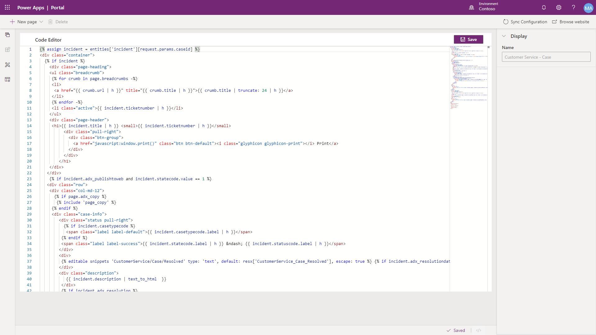

While webpages represent content that is accessible to portal users, page templates help to maintain a consistent appearance throughout your entire website. Templates also define how dynamic content that is based on Common Data Service data is delivered to your users and how users can interact with the portal pages. 

When you create a new webpage in the Power Apps portals Studio or the Portal Management app, choose a page template from the list of existing templates. Several page templates are included with each of the portal templates. 

Two template types control how the template determines what to render:

- **Rewrite** - Uses the **Rewrite URL** field to render a given ASP.NET template.
- **Web Template** - Uses the **Web Template** field to render a given web template.

## Rewrite

The Rewrite template type refers to the physical path to the .aspx page that runs on the Power Apps portals web app and processes the request. Power Apps portals are hosted and do not provide direct access to the app, code, or resources. It is not possible to create new Rewrite templates or change the behavior of the existing templates.

Rewrite templates are useful for specialized content processing such as forums, blogs, and ideas. Several special Rewrite page templates are available, such as Access Denied, Error, and Profile. We do not recommend that you remove or replace these templates.

## Web templates

To create custom page templates, you can use the Web Template property, which is basically a layout template. For example, if a web template includes static HTML, this HTML will be rendered "as-is" in the page output that uses that template. The real power of web templates comes from the ability to contain Liquid code, which adds processing capabilities to the static content, including access to Common Data Service data.

Web templates are flexible; they can be rendered on their own or can be included as part of another template. Web templates support inheritance, where one template is based on and extends functionality of another. Additionally, they can be used to render a standalone fragment of HTML such as page breadcrumbs, the entire custom page, or you can create custom headers and footers for your portal website.

Because the web template defines the content that is delivered to the client, a functional consultant would often engage a designer or developer to add CSS or JavaScript to extend a web template and add client-side functionality to the generated page.

> [!div class="mx-imgBorder"]
> 

> [!NOTE] 
> Web templates can be edited in the portals Studio if they have a corresponding page template. Web templates can't be created in the portals Studio. 

### Web template attributes

A web template is a simple entity with only the following attributes:

- **Name** - When a template is included in other content, or extended by other templates, it is referred to by this name.
- **Source** - The source content of the template. It can be a static text, HTML fragment, or (most often) a layout by using Liquid.
- **MIME type** - Defines what MIME type the server will send to the client when the template is rendered. If a value is not provided, the value will be **text/html is assumed**, which is a standard type for HTML pages. You can create a web template that will render specialized content. For example, you can create a web template that will return some customer's data in JSON format. In this case, the MIME type would be set to **application/json**. People wouldn't use a page that uses this web template in a browser; instead, it will be called from JavaScript code, which effectively defines an API for your solution.

### Website headers and footers

Web templates can also be used to override the global header and footer that is used by a Power Apps portal. To accomplish this task, set the **Header Template** or **Footer Template** field of your website to the web template of your choice. If you override **Header Template**, your selected template assumes responsibility for rendering the primary navigation, sign-in/sign-out links, search interface, and so on, for your site interface elements that are normally handled by the default header template.

> [!TIP]
> If you don't specify a header or a footer template in the website record, the default content is rendered. To remove the header or footer, specify a blank template.

> [!VIDEO https://www.microsoft.com/videoplayer/embed/RWs4Bi]
