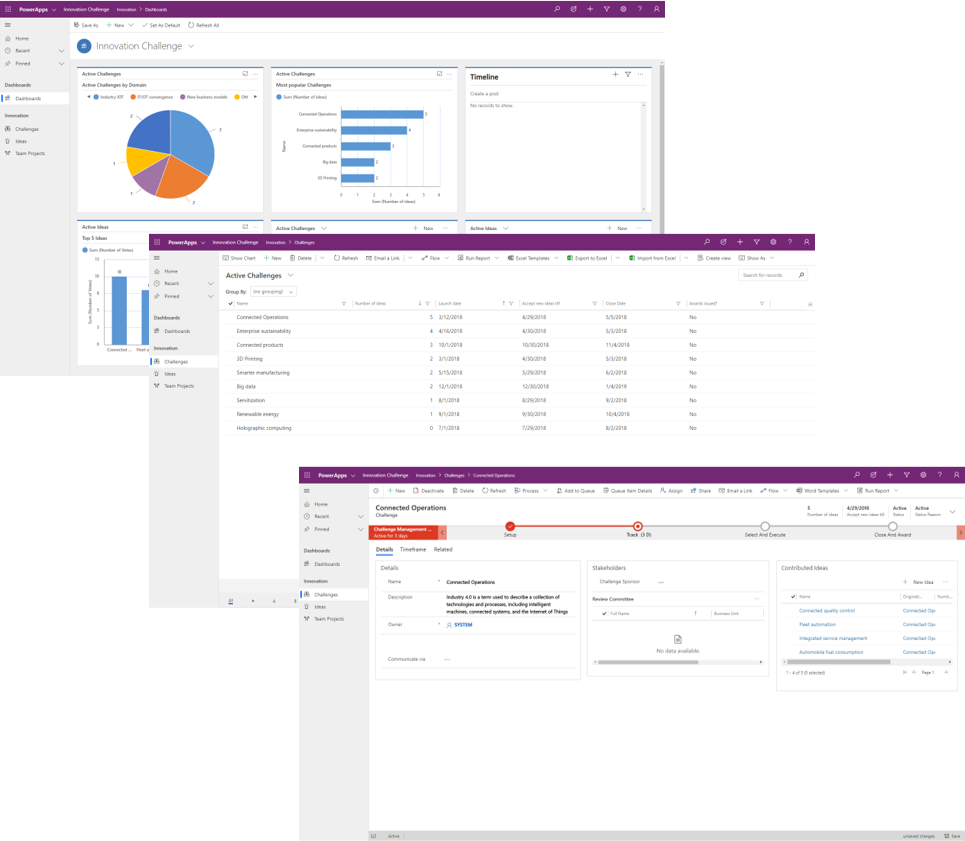
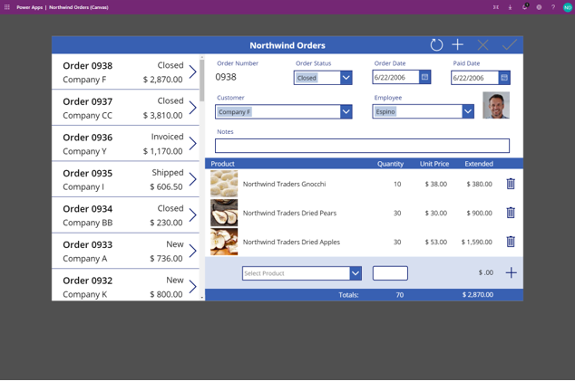
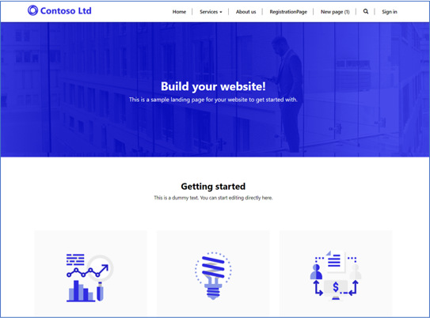
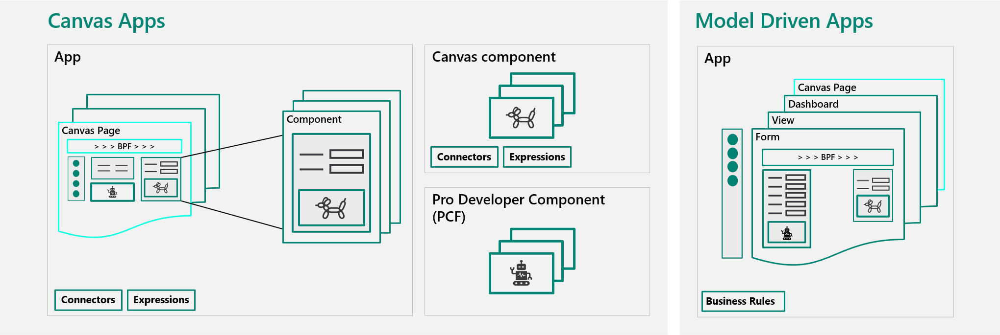
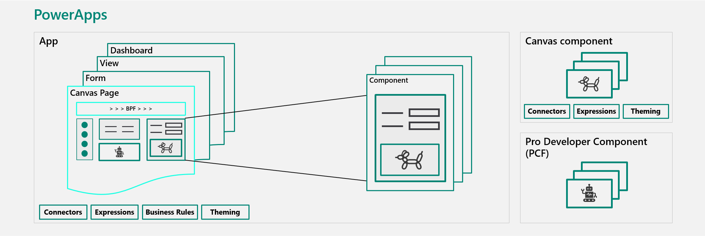

Apps have common patterns that can be beneficial to you in your project.

## Microsoft apps vs. partner apps vs. custom apps

A solution architect should consider using a partner app from Microsoft AppSource. The rest of this module will focus on the creation of custom apps.

The first decision that a solution architect needs to make is which type of app to start with:

- Microsoft Dynamics 365 apps
- A partner app from AppSource
- Custom app(s) 

Dynamics 365 has many types of apps that you can use individually or together. You need an understanding of these apps and their capabilities so that you can decide whether to use the out-of-the-box functionality of the apps, customize the apps, or even build your own custom apps. Consider Microsoft Dynamics 365 apps as model-driven apps in Power Apps that are built on top of Microsoft Dataverse.

A solution architect should start with evaluating whether Dynamics 365 apps can meet the requirement or not. If not, then they need to consider AppSource next, and then finally consider custom apps.

## App types

A model-driven app has the following features:

- Dataverse data driven
- Data relationship navigation
- Consistent UI
- Security trimming of UI
- Responsive UI
- Consistent accessibility
- User personalization
- End-user tooling (Excel, import, export, and so on)
- Back/mid office and process focused

A canvas app has the following features:

- Not Dataverse data driven
- Visual presentation of info
- Custom UI
- Non-responsive UI
- Device integration
- Basic offline support
- SharePoint or Microsoft Teams embedding
- Task focused apps

A portal app has the following features:

- Dataverse data driven
- Web application
- Uses model-driven forms and views as framework to show Dataverse data
- Can be customized with standard web technologies (HTML, JavaScript, CSS, Liquid, and so on)
- External user focused

## Common pattern

When deciding on which app type to use, you should be aware that a solution will typically have multiple apps of different types. The common patterns are:

- **Model-driven** - Administration of data and processes
- **Canvas** - End user focused
- **Portal** - Externally facing portal for non-users

Canvas apps can be used to solve edge cases that would often be ignored.

## Apps in Teams

You can add canvas apps and model-driven apps to Microsoft Teams and then access them from a tab in a channel. This module will explain later how to create apps in Microsoft Teams.

## Embed apps

An embedded canvas app can be embedded in a model-driven app form. This feature enables many different scenarios that can be difficult to achieve without code, such as:

- Including visuals.
- Accessing data that is not in Dataverse by using connectors.
- Using complex logic and operations on Dataverse data.

Limitations of using embedded canvas apps are:

- They are only available during edit; they are not available during creation of new rows.
- The **Save of** form does not save the component data at the same time.

## Roadmap

Currently, canvas and model-driven apps have separate designers, and the integration between canvas and model-driven apps is not seamless. Not all features of each app type are available to the other, as shown in the following diagram.

Microsoft plans to merge and eliminate the differences between canvas and model-driven apps. Ultimately, everything will be merged into Power Apps, with screens made up of canvas and model components, as shown in the following diagram.

