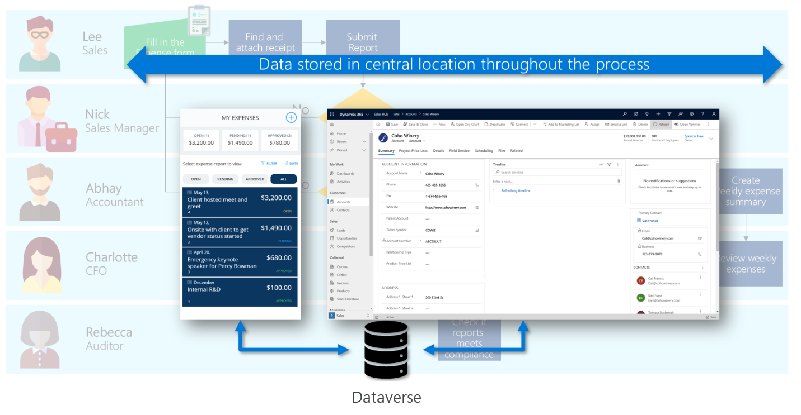

App composition is one of the most important decisions that a solution architect must make. App composition is the process of determining the number and type of apps. So how do you decide how many apps and how do you decide what are features to include in an app?

## Deciding on the number and type of apps

There are some principles when choosing which apps to build:

- Large monolithic apps should be avoided.
- Too many small apps are jarring to the user if they have to context switch frequently.
- Components can be used by multiple apps, allowing composition of apps that target users with specific needs.
- Offer groups of users targeted mobile apps to save time when away from their desk.

> [!IMPORTANT]
> A solution architect needs to consider which user communities will use which app, when they will use the app, and on which devices. It can be a good exercise to map the apps out in such a matrix to help you decide the number and type of app.

## Extending existing apps vs creating new apps

Dynamics 365 apps come with apps like Sales hub and Customer Service hub. You can choose to use and extend these apps, or create your own apps.

Using and modifying an existing app may:

- Expose new features when updates are released.
- Include things you do not need.
- Include things you cannot reuse or replicate in custom apps.

Composing a new app will:

- Provide complete control over what is included.
- Require you to manually add new things to app navigation.
- Enable you to use custom forms and views that you control the structure of.

## Determining which type of app to make

Model-driven apps are built on top of the data model in the Dataverse environment. Views and detail screens for model-driven apps are based on the data structure. Because of this, they offer users a more consistent look and feel from one screen to the next without requiring much effort from the app creator.

Model-driven apps are good for scenarios where the business logic is complex, such as:

- Sophisticated data models.
- Business process management.
- Tracking activities associated with data.

Canvas apps can be built with or without a Dataverse database. They use connectors to access data and services. Canvas apps start with a blank screen, like an artist's canvas, and the creator manually lays out each screen. This gives the creator complete control over the placement of each element on the canvas.

Use canvas apps if the user is expecting a customized user experience. They offer:

- A graphical, intuitive interface.
- The ability to create a tailor-made UI based on user requirements.
- Integration spanning multiple systems by using connectors.

> [!NOTE]
> Consider creating a model-driven app unless your users have a specific need for a canvas app. Model-driven apps enable you to make your app quickly because they don't require you to build out the UI yourself.

Your business process might require more than one app. In the following example, a solution is required for creating and viewing expense reports. Many tasks have been identified that need to be completed by different user roles.

The expense report solution has several task sets that are different, so we should consider making several apps. The data they use is the same, but the user experience will be tailored to the specific scenario and personas.

Canvas apps would be the best fit for employees filling in the expense form, which enables people like Lee to submit an expense report using an attractive mobile app that is intuitive to use and can be used when he is offline.

Abhay has the following requirements:

- Must be able to review all expense reports and receipts
- Responsible for ensuring compliance for every expense report
- Large volume of work; needs to be able to process information quickly
- Must be able to report on how expenses are balancing up to the budget

To be able to process a large volume of work and process information quickly, the best fit would be a model-driven app. It allows Abhay to quickly view all the details of the submitted expense report, see how it affects the budget, and look for related information such as vendor details.

In this example scenario, you can see a combination of both canvas app and model-driven app. Although they are two different types of apps, all the data can be centralized in one place, Dataverse.

