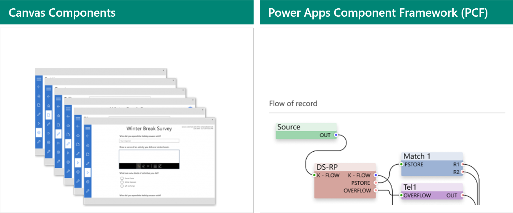

A solution architect needs to consider creating components as part of the app architecture. Components are important because they can promote reuse, enabling multiple makers to collaborate on multiple parts of a canvas app at the build stage.

Characteristics of components are that they:

- Allow reuse within and across apps.
- Can allow multiple makers to work on building a single app.
- Help promote consistency and reduce redundancy.

A solution architect should look for controls that would benefit from being made into a component, headers, common widgets, and so on.

Two types of components in Power Apps are:

- **Canvas components** - Targeted for canvas app makers and work only in canvas apps.
- **Power Apps component framework code components** - Targeted for professional developers.

## Component libraries

Canvas components are reusable building blocks for canvas apps so that app makers can create custom controls to use inside an app or across apps by using a component library. 

Characteristics of canvas components are that they:

- Are ideal for reuse in canvas apps.
- Can be used across multiple apps.
- Allow use of common maker skills, helping to simplify the process for multiple makers.
- Are limited to capabilities of canvas app formulas and connectors.

Component libraries are containers of component definitions that help make it easier for you to:

- Discover and search components.
- Publish updates.
- Notify app makers of available component updates.

> [!IMPORTANT]
> Canvas components should be added to component libraries. Component libraries are the recommended way to reuse components across apps. When you use a component library, an app maintains dependencies on the components that it uses. The app maker will be alerted when the updates to dependent components have become available. Hence, all reusable components should be created within the component libraries.

The solution architect should have a strategy for managing components.

## Code components with Power Apps component framework

Power Apps component framework empowers professional developers and app makers to create code components for model-driven and canvas apps (public preview) to provide an enhanced user experience for the users to work with data on forms, views, and dashboards.

Characteristics of code components are that they:

- Can be used in model-driven and canvas apps in web and mobile.
- Can be used in multiple apps to replace columns and grids.
- Can be used by new record and edit experiences.
- Can typically use multiple components on a form without performance problems.
- Require code developers with TypeScript and HTML skills.
- Allow the use of professional developer skills, meaning that all types of developers can contribute to the solution.

Code components can be packaged in solutions. When the solution is updated, each app that consumes the component automatically recognizes the updated component.

A solution architect should purposefully use code components to create a good user experience.

A large community develops code components. You can reuse these components from the [gallery](https://pcf.gallery/) and [sample component gallery](https://powerusers.microsoft.com/t5/Canvas-Apps-Components-Samples/bd-p/ComponentsGallery).

The following screenshot is for a community control that displays a grid of counts based on calculated risk scores.

