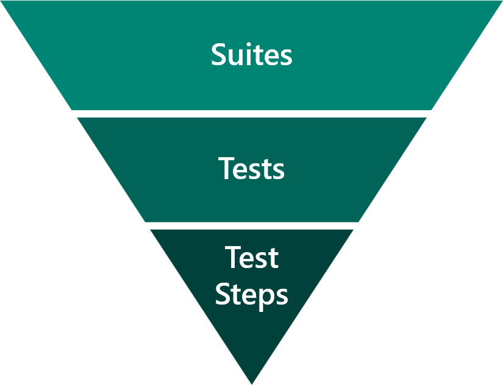

Two main ways of development are imperative and declarative. Imperative development focuses on how to achieve the goal, while declarative development focuses on getting the result. Imperative provides more flexibility because you can control every step in the process, but it requires more code and more complexity. Declarative is simpler and more straightforward to use, but you might lack the ability to have the complete control that you want.

Canvas apps takes your declarative "what" and optimizes the "how." You might not be able to precisely express "what," so Power Apps will help by allowing you to use imperative development. A mistake that makers often make is to use imperative development when declarative development will be simpler to use and will perform better.

Canvas apps can be made to look attractive and, while having an attractive app is important, apps that perform well will get better user adoption.

For more information on imperative and declarative development, see the learn module [Use imperative development techniques for canvas apps in Power Apps](/learn/modules/use-imperative-dev-techniques-powerapps-canvas-app/?azure-portal=true).

The following sections discuss techniques for optimizing canvas app performance.

## Offload work from apps

As formulas in apps get larger and more complex, consider if work should be done somewhere else. Work can be offloaded to Microsoft Power Automate cloud flows, business rules, plug-ins, and other server-side logic in Dataverse.

> [!NOTE]
> A common method is to offload logic into a Power Automate cloud flow that uses the Power Apps trigger. The flow can be called from a Power Apps expression that passes data to the flow and receives a result back from the flow.

You can also create custom connectors to Microsoft Azure Functions or other custom logic. If you find that you are using imperative development inside an app, consider offloading this logic to a more appropriate feature.

## Performance

Common issues with app performance are:

- **Data access** - Initially, the app gets large sets of data into data collections and then uses the data within multiple screens over client-heavy operations like JOIN, Sort, Add Column, and Group By.
- **Formulas in OnStart** - The app triggers many unnecessary data calls in screens, and these data calls return large data records.
- **Repeatedly retrieving data from the source** - Use the **Set** function to cache data from lookup tables locally.

With OnStart, you should encourage makers to use the **ClearCollect** function to cache data locally and the **Concurrent** function to reduce the time to load the cached data. The first image shows the loading of four datasets without the **Concurrent** function, and the second image shows the process with the **Concurrent** function.

With so many options, performance needs to be considered often. Analysis and improving optimizations are ongoing efforts. You should validate best practices by referring to [slow performance sources](/powerapps/maker/canvas-apps/slow-performance-sources), [common performance issues](/powerapps/maker/canvas-apps/common-performance-issue-resolutions), and [performance tips](/powerapps/maker/canvas-apps/performance-tips).

The solution architect should implement a canvas app performance-tuning strategy.

A tuning strategy should:

- Avoid any work than you can.
- Defer work that is less likely to be needed.
- Parallelize work wherever possible.
- Monitor the app in operation; work might not always be obvious.

You should use a progress indicator for the user on long-running work.

## Test Studio, Azure Monitor, and Application Insights

Canvas apps should be properly tested. Microsoft provides Test Studio for regression testing of canvas apps that can be included in automated build processes.

Test Studio includes the following features:

- **Suites** - Test suites are used to organize or group test cases together.
- **Tests** - Test cases are made up of a series of test steps. Test cases are run to validate that your app, or specific features in your app, works as you expect.
- **Test steps** - Instructions or actions. Test steps are written by using the Power Apps expression language.
- **Test assertions** - The expected result of a test.

Microsoft Azure Monitor is a tool that offers makers the ability to view a stream of events from a user's session to diagnose and troubleshoot problems. Canvas app makers can use Monitor to view events while building a new app in Power Apps Studio and to monitor published apps during runtime. Model-driven app makers can monitor page navigation, command implementations, form-related issues, and other major actions to understand app behavior and make improvements.

You can connect your canvas apps with Application Insights, a feature of Azure Monitor. Application Insights includes powerful analytics tools that help you diagnose issues and understand what users actually do with your app.

With your app connected to Application Insights, you can collect telemetry on how users are actually using your app to help you improve the quality of your apps. Some of the telemetry that you can gain from setting up this feature includes:

- Number of active users who are using the app.
- Location of where the app is used.
- Which screens are used most frequently.
- User flow from one screen to another.

As a solution architect, you should decide if Application Insights will be included in the apps that you create.

For more information, see [Application Insights](/powerapps/maker/canvas-apps/application-insights).
