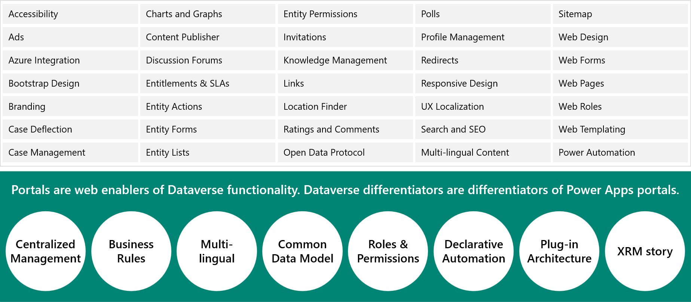
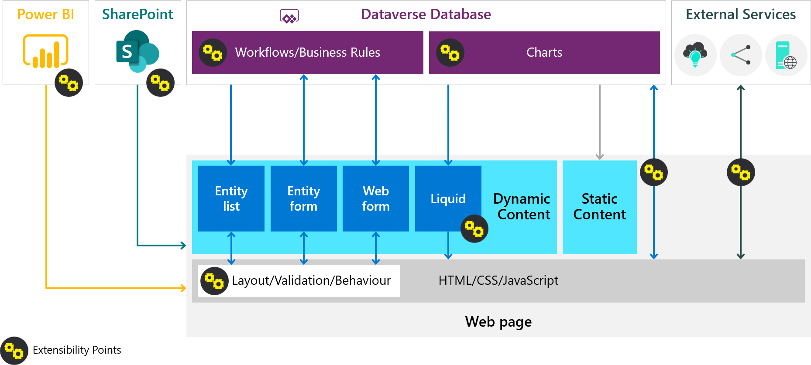
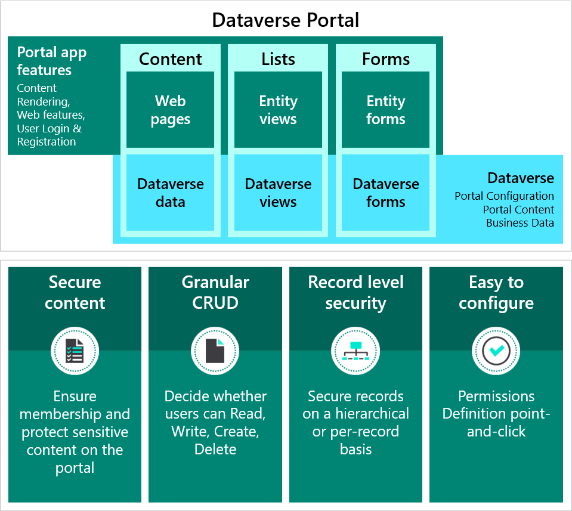

The ability to easily show and interact with Microsoft Dataverse data on an externally facing website is the core benefit for implementing a Power Apps portal.

Power Apps portals are designed for interaction with the internal and external audiences. 

## Features of portal apps

Power Apps portals are built on top of Dataverse. This architecture comes with a major benefit. All differentiating features of model-driven apps in Power Apps are the features of Power Apps portals as well, including:

- Centralized management
- Common Data Model
- Roles and permissions
- Forms and views
- Business rules
- Declarative workflows and actions
- Plug-in architecture
- Integration with other services
- Dataverse extensibility
- Audit

Power Apps portals deliver a complete content management system out of the box, with all content stored in Dataverse. As a result, content can be edited through Power Apps portals Studio and also directly by using the Portal Management app. Additionally, the robust Dataverse security model can help secure the content.

> [!NOTE]
> A portal requires a Dataverse database to be available in the environment to install and configure some key components. While a portal from blank can be configured in an environment without any of the Microsoft Dynamics 365 apps installed, the templates (Customer self-service, Employee self-service, Partner, and Community portals) have dependencies on Microsoft Dynamics 365 apps.

## Portals architecture

Power Apps portals transact directly with Dataverse data. You can create lists and forms over data. Power Apps portals provide built-in components that use model-driven views and forms. The portals can be customized and extended, as shown in the following diagram.

Power Apps portals extend Dataverse solutions to internal and external audiences in a more secure way. Portal visitors can access portals as either anonymous or authenticated users.

## Expose Dataverse data

The following sections describe the several different ways that you can expose Dataverse data.

## Use cases for portals

When to consider using a portal app:

- Interactions with Dataverse for external and internal users is more secure
- Community or self-service sites for customer service
- CRUD on Dataverse data
- Limited resources and budget, business-user, and no-code configuration requirements
- Responsive design, and content is accessible across all devices and browsers
- Multi-lingual implementations
- Single sign-on

When to exercise caution:

- Most data resides in an external (non-Dataverse) system
- Heavy requirements around document management, indexing, and searching.
- Large volumes of users who drive heavy traffic to the portal.
- eCommerce requirements, including processing payments and maintaining an online store.
- Use cases that are more appropriate for direct Power Apps licensed user access.

## Authentication

Power Apps portals allows authenticated and unauthenticated users. The solution architect needs to know if authenticated access will be used and how users will be authenticated, whether it's through Microsoft Azure B2C, Azure Active Directory (Azure AD), or another identity provider.

> [!IMPORTANT]
> You should avoid using locally stored accounts for authentication.

## Implementation considerations

When implementing a portal app, the solution architect needs to consider the following key factors:

- Whether a blank template or a Dynamics 365 template will be used
- The gap from template to requirements
- Which portal pages will require advanced Liquid template-skilled resources
- What data that authenticated users will need access to

## Deployment considerations

Portal assets, such as views and forms, can be packaged in solutions, but most portal configuration is stored as data over many tables. The Configuration Migration tool can help mitigate some of the work when you are moving from development to test to production.

## Further reading

- [Power Apps portals architecture](/learn/modules/portals-architecture/?azure-portal=true).

- [Work with Power Apps portals](/learn/paths/work-power-apps-portals/?azure-portal=true).

- [Extend Power Apps portals](/learn/paths/extend-power-apps-portals/?azure-portal=true)
