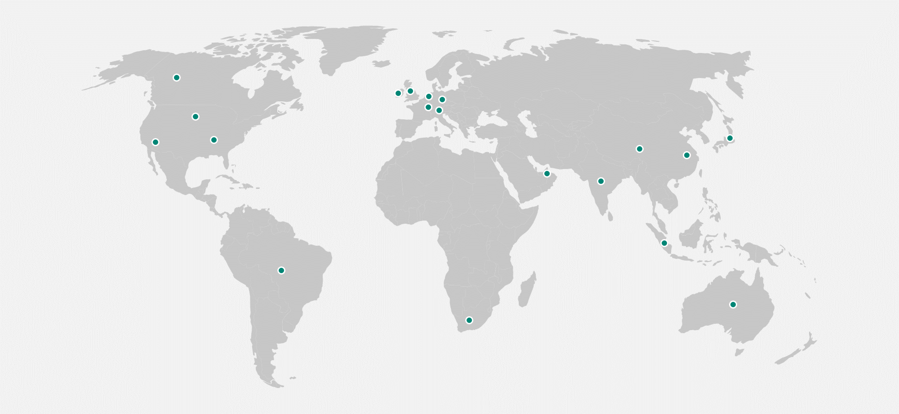

Microsoft has a worldwide network of datacenters (which support Microsoft Power Platform) that are set up in 17 different locations. This level of localization helps organizations more easily meet data residency, sovereignty, and compliance requirements.

When creating an environment, you can specify its geographical location. The data for the environment will be held in the chosen geographical location.

> [!NOTE]
> An environment can be relocated after it has been created, but it is easier to select the correct region from the beginning.

## Regions

Microsoft offers the option of choosing global, local, and sovereign clouds:

- **Global cloud** - A public internet cloud deployment option that lets customers access globally connected cloud services that are deployed from regional Microsoft datacenters. The global clouds are United States, Europe, and Asia Pacific.
- **Local cloud** - A cloud option that addresses local data residency requirements by letting all public cloud users within a country or region keep their data in the country or region. The local clouds are: Canada, Brazil, United Kingdom, France, Germany, India, Japan, Australia, United Arab Emirates, Switzerland, and Republic of South Africa.
- **Sovereign cloud** - A cloud option that adheres to the strictest standards of operation. Data remains inside the country or region of residence always. Sovereign clouds are: US Government and China.

> [!NOTE]
> New locations are planned, so the preceding list might not be complete. See [availability](/power-platform/availability) for the latest information.

The following diagram shows the supported Microsoft Power Platform locations.

## Data residency

Ask yourself the following questions to determine which of the several aspects will influence the choice of location for environments and data:

- Are the users geographically dispersed?
- What latency is acceptable?
- Does the organization have separate autonomous business units where data must not be shared?
- Are the required features available in the region?
- Are security requirements in place that should be considered?
- Are specific data and compliance requirements in place?

If no other factors exist, you should select a location close to most users who need to share data.

> [!NOTE]
> The location of the tenant (billing) can be different from the location of an environment and its data.

## Compliance and data protection

Solution architects must consider regulatory and compliance requirements, such as the General Data Protection Regulation (GDPR), when deciding on a location for the environment and data.

Microsoft will not transfer customer data outside the selected Azure geographic location (geo), except when it is necessary for Microsoft to provide customer support, troubleshoot the service, or comply with legal requirements.

Microsoft Power Platform stores information that is global in nature, such as user identities and profile information, in a datacenter that is located in the United States. All Microsoft Power Platform customer data and the geo-redundant mirrors are maintained within the selected geo.

## When to use multiple environments

A previous module explained how Microsoft Power Platform uses environments to separate development from production and to separate different user groups. When you further consider the location of users in a global organization, consider other reasons for creating multiple environments:

- Handle application lifecycle management (ALM) – Dev / Test / Prod.
- Isolate resources that are not used by the same users or that share data.
- Allow conflicting customizations between different regions or markets, or for compliance with legal and regulatory constraints.
- Keep environments close to users who don’t share data.
- Isolate data that can't be colocated.
- Provide places for makers to experiment.

The next unit will explain how you can work with the data.
