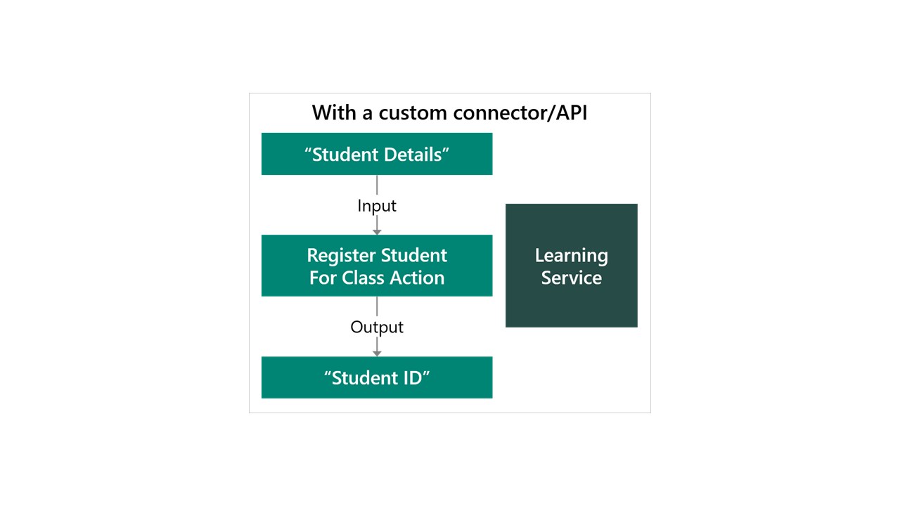
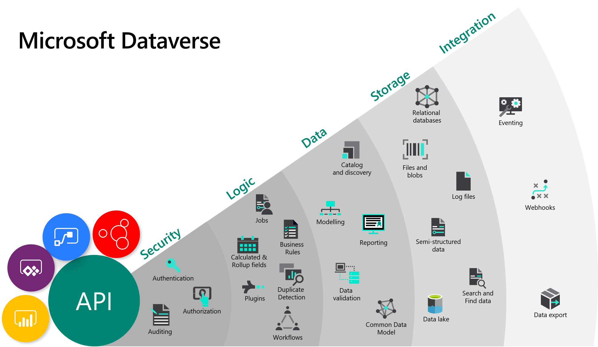
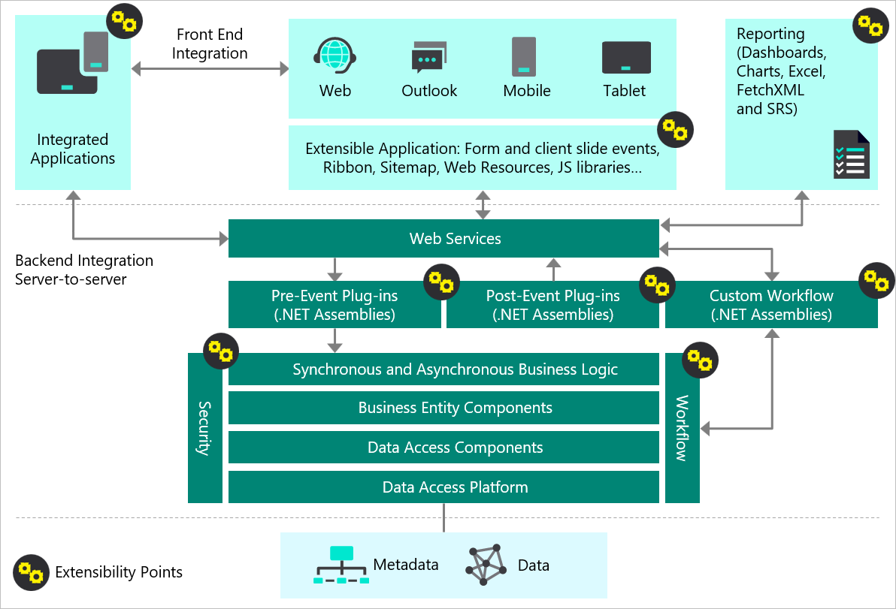
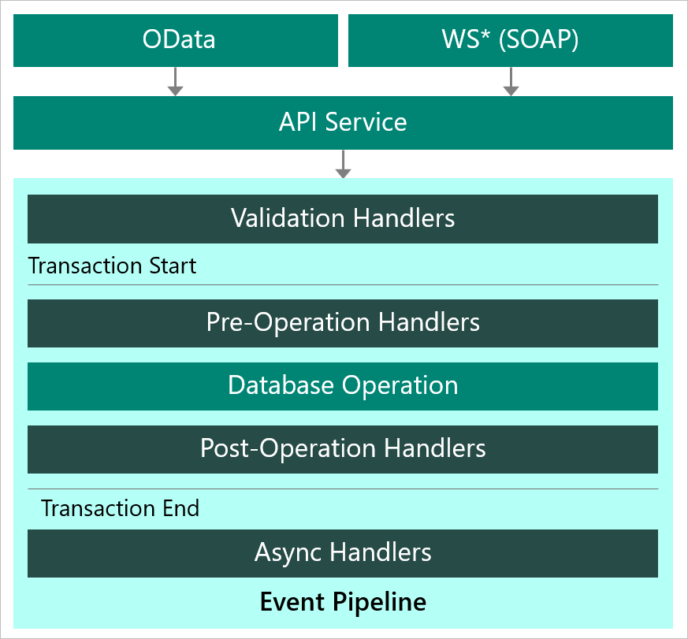

Data is at the center of everything that a business does today, and it powers the insights that can drive what the business should do tomorrow. To thrive and grow, businesses need to capture, analyze, predict, present, and report data and do it all with a high level of agility.

With Microsoft Power Platform, you can:

- Access data from the platform by using connectors.
- Store data in the platform by using Microsoft Dataverse.

## APIs

Microsoft Power Platform uses REST APIs to communicate between apps and data and to perform management activities. REST APIs are built on open standards. You can compose HTTP requests for specific operations or use libraries from other sources to generate classes for whatever language or platform you want.

Connectors and Dataverse use REST API and OData for requests and data.

## Dataverse vs. connectors

Connectors allow you to take advantage of Microsoft Power Platform without moving your data. Power BI, Power Apps, and Power Automate use connectors, which allows you to analyze, act, and automate across data and services.

With connectors, you can:

- Use existing data sources and services.
- Connect to more than 400 systems and services out of the box.
- Access data that is stored on-premises in systems with the data gateway.
- Create custom connectors for internal services and services from other sources.

> [!IMPORTANT]
> Not all public connectors support all actions that the underlying service supports. Solution architects should investigate to ensure that the actions they require are supported; otherwise, a custom connector is required.

Connectors allow you to build your apps without having to migrate the data, which can be time-consuming or costly.

Microsoft Dataverse should be your data source of choice for new data stores or where you want to use Dataverse capabilities (which will be described subsequently) or features of Microsoft Power Platform such as AI Builder or Power Apps portals Apps.

## Custom connectors

In situations when a connector isn't present, but the service has a REST API, a custom connector can be created. Creating a custom connector is straightforward, with several different methods for defining the custom connector, including:

- Importing the Open API definition to describe an existing API.
- Using Postman collection to describe an existing API.
- Creating a Microsoft Azure Functions solution and then using Microsoft Azure API Management.
- Creating a custom API to define your own actions.

> [!NOTE]
> Many other services will publish an Open API definition for their full API.

Custom connectors support OAuth, (including Azure AD), API Key, and basic authorization.

Custom connectors can be packaged and deployed with solutions.

Actions can help make it easier for makers to invoke complex custom logic. For example, consider the following processing steps to register a student for a class:

1. Check if the student exists in the registry.
1. Add the student if they are not shown in the registry.
1. Look up the class by using a course code.
1. Check if the class is over capacity.
1. Check if the student meets class prerequisites.
1. Create a class record for the student.
1. Notify the user of the results.

You could create a custom connector for the learning service with an action called "Register Student for Class" that performs these steps, as shown in the following image.

Makers without the custom connector would need to know the details of the service. Using a custom connector with an action promotes good architectural design; loose coupling could occur in a contract where the calling system doesn't need to know the details because they could change.

## Virtual tables

One further option for accessing data is by using virtual tables. Consider the requirement to access data from an external data source and then combine it with data in Dataverse. Virtual tables allow you to create a virtual table in Dataverse, define an external data source, and then map the table and columns onto the external data source.

An OData v4 Data Provider configuration is included with Dataverse that allows you to connect to an external OData v4 web service. A data provider for the SQL API of Microsoft Azure Cosmos DB is in preview.

> [!NOTE]
> Dataverse requires that all tables have an ID attribute. This ID is known as a unique identifier and the value must be a GUID. You can only map ID columns to external columns with the **Edm.Guid** data type. Hence, the external web service must use a GUID as its ID column.

Currently, virtual tables only permit read operations.

## Dataverse capabilities

Dataverse is more than a database. Dataverse includes many features that make building business solutions easier and provide enhanced functionality.

The following diagram illustrates the capabilities that are provided by Microsoft Dataverse.

The solution architect needs to understand the capabilities of Microsoft Dataverse and how these can be applied when creating solutions.

Because Dataverse is built on Azure, it benefits from the Azure platform's powerful security technologies. Encryption of data, at rest and in transit, preserves confidentiality.

Dataverse uses Azure AD identity and access management mechanisms to help ensure that only authorized users can access the environment, data, and reports. Dataverse uses role-based security to group together a collection of privileges. These security roles can be associated directly with users, or they can be associated with Dataverse teams and business units. In Dataverse, individual rows can be shared on a one-by-one basis with another user. Because row-level control of access isn't adequate for some business scenarios, Dataverse has a column-level security feature to allow more granular control of security at the column level. Dataverse also includes security models that can be used for hierarchies: the manager hierarchy and the position hierarchy. The security mode that Dataverse provides is highly configurable.

Several choices are available for applying custom business logic in Dataverse, including business rules, classic workflows, and Power Automate. Calculated columns and rollup columns reduce the need for processing and custom code. Dataverse has built-in functionality for duplicate detection and to delete stale data.

All components that are created in Dataverse are held as metadata, meaning that the components are discoverable and that the properties for components are accessible to applications and tools. This metadata is used by Power Apps and Power Automate, reducing the effort that is required to create apps and flows. For example, the data type of a column and its range of possible values are held in metadata. In this example, Power Apps studio is able to access this metadata and automatically configure the control when a column is added to a form.

The data that is held in Dataverse is abstracted from the underlying data storage mechanism. The data could be stored in the Elastic Database feature of SQL Database, Microsoft Azure Storage, Cosmos DB, or Azure Data Lake Storage. The maker doesn't have to concern themselves with the storage; they can access the data through the APIs that are provided by Dataverse. Microsoft decides how to store data differently, depending on type, for files, images, and text.

Dataverse provides an event model for integrating with other systems, and import and export data processing capabilities are provided.

Dataverse uses Microsoft Azure Cognitive Search to enable data that is held in Dataverse to be searched.

Dataverse is not restricted to apps that are built with  Microsoft Power Platform; the APIs allow applications to be built with other tools, such as Xamarin, to build an external, customer-facing application.

## Reasons for choosing Dataverse

Building the data infrastructure to enable business insight can be time-consuming and expensive. The data originates from a variety of devices, applications, systems, services, and software as a service (SaaS). This large and growing number of sources often consists of multiple data technologies that store different types of data, expose different APIs, and use a mixture of security models. The developers that are needed for creating these technologies can be expensive and hard to find. Often, developers must have a deep understanding of how to deploy, configure, manage, and integrate these different data technologies.

Dataverse addresses these concerns with a user-friendly, manageable, compliant, scalable, and globally available SaaS data service. Dataverse empowers organizations to work with any type of data and any type of app and then use the data within it to gain insights and drive business action.

As part of Microsoft Power Platform, Dataverse requires no or little code to be written, so it can be used by anyone, from knowledge workers to professional developers.

Standard and custom tables within Dataverse provide a cloud-based storage option for your data. Tables let you create a business-focused definition of your organization's data for use within apps.

If you are not sure whether Dataverse is your best option, consider these benefits:

- **Simple to manage** - Metadata and data are stored in the cloud. You don't have to be concerned about the details of how they're stored.
- **Simple to secure** - Data is stored in a way that users can see it only if you grant them access. Role-based security allows you to control access to tables for different users within your organization.
- **Access your data** – Data from your Microsoft Power Platform applications is also stored within Dataverse, allowing you to quickly build apps that use your data.
- **Rich metadata** - Data types and relationships are used directly within Power Apps.
- **Logic and validation** - Define calculated columns, business rules, workflows, and business process flows to ensure data quality and drive business processes.
- **Productivity tools** - Tables are available within the add-ins for Microsoft Excel to increase productivity and ensure data accessibility.

## Extensibility model

Everything in Microsoft Dataverse is exposed as an API call. All tools and apps can be accessed through the web API, as shown in the following diagram.

Dataverse provides extension capabilities at every horizontal layer. As a solution architect, you need to understand the different types of extensibility paradigms. 

Dataverse has the following features:

- A rich API for integrating with web services and OData
- No-code logic with business rules, calculated columns, rollup columns, business process flows, and more
- Developer support with full .NET SDK with access to the transactional pipeline
- Client-side scripting with TypeScript and JavaScript
- Integration with Microsoft Azure Service Bus and Microsoft Azure Event Hubs
- Custom actions
- Custom API

These capabilities allow complex enterprise applications to be built by using Microsoft Power Platform. Though the solution architect might not have been a developer, they need to be familiar with each of these points and how they can be used in solutions.

## Dataverse API

The Dataverse Web API provides a development experience that can be used across a variety of programming languages, platforms, and devices. The Web API implements the OData version 4.0, an OASIS standard for building and consuming RESTful APIs over rich data sources. The Web API provides a modern, RESTful web service that you can use to interact with data and metadata in Microsoft Dataverse by using a variety of platforms, programming languages, and devices.

> [!NOTE]
> When you are using the Dataverse connectors in Power Automate and Power Apps, they are making calls to the OData API.

A developer can add custom plug-in logic at the Pre and Post-Operation stages of a transaction to perform validation, calculations, and integrations by using the .NET SDK.

> [!NOTE]
> The App API is also exposed to a SOAP endpoint. The SOAP endpoint is deprecated and should not be used directly for new apps.

The next unit explains how to create custom logic.
