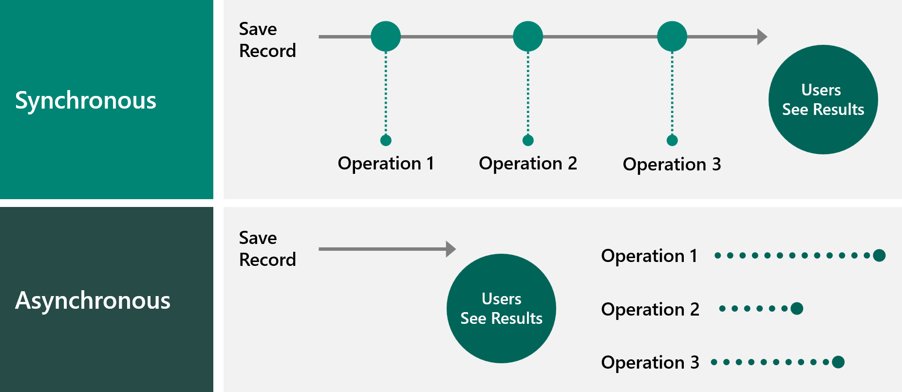

Microsoft Dataverse provides many different ways to perform custom logic.

Several options are available for applying custom business logic in Dataverse, including:

- Business rules
- Classic workflows
- Power Automate cloud flows
- Business process flow
- Calculated columns
- Rollup columns
- Plug-ins
- Custom workflow assemblies
- Custom actions
- Custom API
- Client-side scripting
- Power Apps component framework code components
- Azure Service Bus and Event Hubs integration
- Webhooks

## Create custom logic

The solution architect will need to be able to decide which component of Microsoft Power Platform is used and where it is used in the solution. No rules are imposed for this decision because each option has its own pros and cons.

For instance, the following limitations can occur:

- You can't trigger Power Automate flows from calculated or rollup columns.
- Rollup columns are only recalculated every hour.
- Business rules can only access the columns on the form for its own table.
- Classic workflows can't access rows in 1-to-many relationships.
- Data that is changed by a business rule will not trigger an OnChange event that was created with JavaScript.

This list of limitations is not exhaustive.

Having a no/low code or a code-first approach is not the correct tactic; you need to decide each situation on its own merits. Understanding the capabilities of these options is a prerequisite for an aspiring solution architect.

## Synchronous vs. asynchronous processing

Custom logic can be implemented synchronously or asynchronously. Solution architects need to consider whether custom logic operations should be performed synchronously or asynchronously.

When the operations are performed synchronously, the user's screen is blocked until all operations are completed. The operations can modify data before or after it is saved to the database. Synchronous calls add minimal overhead to handling the processing, but all operations in a synchronous transaction are limited to a total of two minutes. This limit is fixed and can't be changed. Dataverse plug-ins and classic workflows can be performed synchronously. Business rules are performed synchronously if the scope is set to **Table**.

When the operations are performed asynchronously, the user's screen is returned after their data is saved to the database. The operation will be added to a queue and will be performed at a later point in time, which could be within a few seconds, several minutes, or even hours, depending on the workload. Asynchronous means that users will have to refresh their screen to see the results. Additional overhead occurs in running asynchronous jobs. The platform creates rows in the AsyncOperation and WorkflowLog tables. These rows are updated when the operation starts, as it progresses, and after it completes. The rows can be set to be automatically deleted. Dataverse plug-ins and classic workflows can be performed asynchronously. Power Automate cloud flows are performed asynchronously.

## Client vs. server processing

Solution architects need to understand where logic is performed. 

Canvas app formulas, model-driven form script, business rules, and Power Apps component framework logic happens in the user interface and the user will see the result immediately. However, this logic is only enforced in the app in which the logic is implemented.

Plug-ins, Power Automate cloud flows, classic workflows, and business rules (with scope set to **Table**) happen only when the data is sent to the server by an app, flow, or an API call. The user only sees results of service custom logic in their app on refresh of data. Server logic is enforced when any app, flow, or API is used.

Microsoft Power Platform imposes limits on the number of calls that can be made. The solution architect needs to design the solution with these limits in mind.
