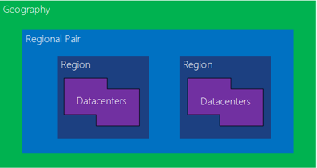

Solution architects need to consider how to include high availability in the solution design. Microsoft handles high availability and disaster recovery for Microsoft Power Platform and its components. The solution architect needs to focus on non-Microsoft Power Platform components, custom code, and integrations.

## Principles of high availability

When creating a solution, the solution architect should follow these principles:

- No single points of failure should exist.
- Use the capabilities of Microsoft Azure whenever possible.
- Use monitoring and health checks to predict and detect problems.

Microsoft deploys a Microsoft Power Platform environment within an Azure region. Within a region, services and data are replicated redundantly across the datacenter(s) to increase availability. Each Azure region has a paired region where Microsoft Power Platform resources are replicated automatically. Microsoft monitors Microsoft Power Platform on your behalf as part of the service.

## Handle failover

Microsoft Power Platform components handle internal integrations; solution architects should focus on external integrations and custom code.

If an issue occurs with the primary datacenter, Microsoft will initiate the failover automatically, if necessary, from the primary location to the regional pair. Microsoft also handles required service recovery.

Users should not notice interruptions in service. At worst, they will have a transient error when saving data. For example, model-driven apps will handle such errors.

However, custom code could have issues. For example, the endpoint for the environment might change. Integrations should use the global discovery service for endpoint discovery to get the latest environment endpoint. Custom code should have transient error handling with automatic retries.
