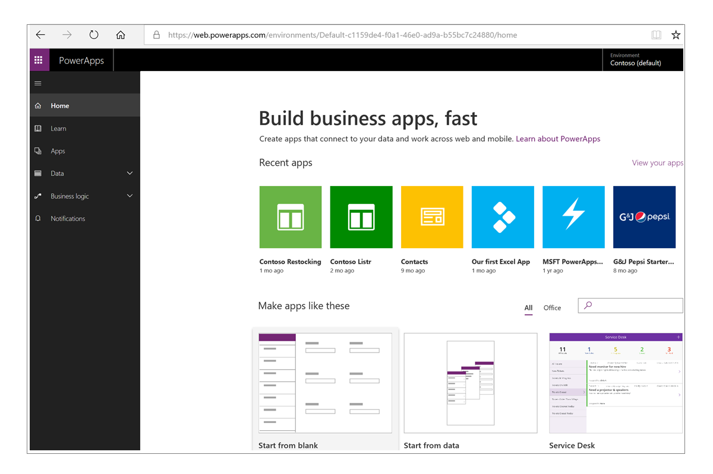

## PowerApps building blocks
In the first unit, you learned about the main parts of Microsoft PowerApps. We're now going to dive deeper into each part. The PowerApps components are:

* **web.powerapps.com**: Apps start here, based on templates or sample apps.
* **PowerApps Studio**: Flesh out your apps by easily adding and arranging controls and buttons, and set up connections to your data.
* **PowerApps Mobile**: Run your apps on Microsoft Windows, Apple iOS, and Google Android devices.
* **PowerApps admin center**: Manage PowerApps environments and other components.

### web.powerapps.com
If you build apps, this is where you'll start. You can build apps from sample apps, from templates, or from a blank slate. All the apps you've built will be shown here. You'll often go back here to see how your apps are shaping up.

### PowerApps Studio
PowerApps Studio is where you flesh out your apps to make them more effective as a business tool—and to make them more attractive. PowerApps Studio has three panes make app creation feel more like building a slide deck in Microsoft PowerPoint:

- Left pane, where you can see a thumbnail of every screen in your app or a view of all the controls on each screen.
- Middle pane, which shows the app you're working on.
- Right pane, where you set options like the layout and data sources.
- Property drop-down list, where you select the properties that formulas apply to.
- Function bar, where you add formulas (as for Excel worksheet functions) that define app behavior.
- Ribbon, where you add controls and customize design elements.

### PowerApps Mobile
PowerApps Mobile for Windows, iOS, and Android devices provides an environment where you can find and use your apps. Instead of having to go to separate app stores to use all the apps you've created and those that other people have shared with you, you can stay in PowerApps. When you use apps in PowerApps Mobile, you get the most out of your device's capabilities: camera controls, GPS location, and more.

### Admin center
The PowerApps admin center is the centralized place for managing PowerApps for an organization. This is where you define different environments that house the apps, and where you define data connections and other elements. The admin center is also where you manage permissions and data policies.

In the next unit, you'll learn about the set of related technologies that PowerApps works with to make a powerful ecosystem for app development.