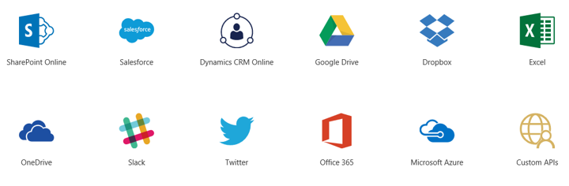

# Related technologies
PowerApps work with other technologies to help build and share your apps across your organization and into the field. Let's take a look at some of these.

- **Microsoft Dynamics 365**: Microsoft Dynamics 365 is the home for all your business apps, including Power BI, Flow, Talent, and many others.
- **Microsoft AppSource**: The AppSource is where you share apps and download other apps that might be useful to your business.
- **Data sources**: Without data, you don't have a business. Data sources bring cloud and on-premises data into your apps. Data sources are accessed using connections, connectors, and gateways.

## Microsoft Dynamics 365
Dynamics 365 is a cloud service with apps that help you address specific business needs like sales automation, operations, or customer service.

The advantage of having the apps in Dynamics 365 is that you have one place to run all your business apps from app builders in your organization, from Microsoft, and from third parties.

## Microsoft AppSource
AppSource is the place to find and evaluate apps from your colleagues, from Microsoft, and from our partners. In PowerApps, you share apps into AppSource. Users can then you view and run those apps in Dynamics 365, as well as on mobile devices or the web. You can choose to make the app available to the public or just for people in your organization.

## Data sources, connections and connectors, and gateways
PowerApps apps uses many data sources and connectors to make connections to them. Some of the most popular data sources are shown below.

Many data sources are cloud services, like Salesforce. Even Twitter can be a data source if you're tracking your company's hashtags. Connectors might not feel like the coolest part of app development, but they are essential when working with data that you, your colleagues, and your customers care about. And when an app lights up with your data source for the first time, suddenly they are plenty cool!

For data that is stored on-premises rather than in the cloud, you use a gateway to provide a reliable connection between PowerApps and your data source. The gateway sits on an on-premises computer and communicates with PowerApps.

## Next steps

Now you have a little more information about all the parts of PowerApps and related technologies. we will continue to deepen your knowledge on each of the parts throughout this course. 

Next up is an introduction to the options you have for creating apps.