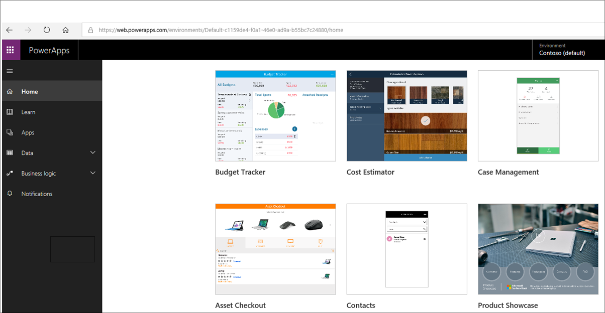

# Ways to build PowerApps
Now that you know the basics of PowerApps, let's get to it. We'll look at sample apps, creating apps from a template, using shared apps, and creating apps from a data source. In the next topic, we will get more hands-on with app creation.

## Check out some sample apps
In web.powerapps.com, you'll be greeted with several sample apps that you can use in your web browser. Explore these apps to get a quick sense of what's possible and how PowerApps can help your business.

Each sample app is designed for a specific purpose, such as:
- Managing a budget
- Inspecting a site
- Tracking service tickets

These apps contain sample data to inspire your thinking. 

The following app shows how a flooring company could help service representatives deliver accurate and immediate cost estimates when visiting customer locations.

## Create an app from a template
Another good way to start is by starting with a template. They use sample data to help you get a sense of what's possible, and opening them in PowerApps Studio will help you see hands-on how an app is built.

For example, with the Budget Tracker template, you can create an app that helps you track the budget for projects and events, with custom categories, easy data entry, and visuals that highlight expenditures for easy inspection. Unlike sample apps, app templates allow you explore the data source behind them, called a Common Data Source.

## Use shared apps
If your team has started using PowerApps, people might have shared apps with you already. When people share apps with you, they show up in MIcrosoft AppSource and also in Dynamics 365 if an app developer chose to add them there. If you're a contributor to those apps, they also show up in web.powerapps.com.

## Create an app from a data source
A great way to get started is to generate an app from your own data. Just point PowerApps at the data source of your choice (for example, a SharePoint list) and watch as PowerApps automatically builds a three-screen app. 

This app below was started from a SharePoint list. It'll let you browse the list, view detailed records, and edit data. You can then start customizing this app to look and behave exactly how you want. 

## Build from the bottom up
You can also build applications from scratch and add all the pieces as you go. Then you can branch out and let your imagination run wild. There will be plenty of that later in the course! 

But the easiest way to learn about PowerApps is to start with a sample or a template, or connect to your data source and have PowerApps generate the app for you. 

In the next topic, you will learn how to generate an app from data.