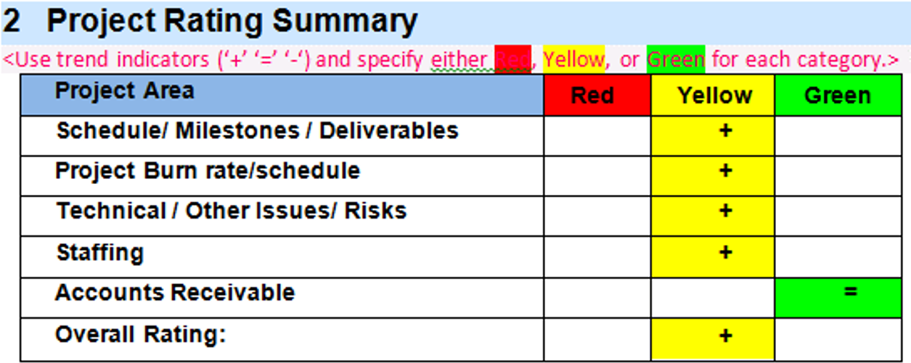

The solution architect should ensure that the project is always moving toward the project's goals. Additionally, the solution architect should establish good practices to ensure that the customer and team members are aware of the project's current status and of the issues that affect its progress.

## Scenarios for failure

Common areas of failure in a project include:

- Not documenting assumptions
- Not conducting risk management
- Excessive analysis and impact assessment
- Over-promising
- Designing with incorrect assumptions or requirements
- Organizational politics
- Not having buy-in from senior management
- Inability to have a complete enterprise vision

This list is not exhaustive; many other factors can cause project failure.

## Scenarios for success

Good projects have the following characteristics:

- Knowing what a finished project looks like from the customer’s perspective, not yours
- Having a change control board to manage change
- Managing risk proactively
- Being more agile
- Performing project checkpoints to assess how you are doing
- Having retrospectives and evaluating lessons learned to assess how you did

This list is not exhaustive and many more things that go into making a project successful.

## Project checkpoints

The solution architect should insist on establishing a way to measure progress of the project. They should also implement regular progress reporting and have checkpoints at critical points in the project.

For example, the solution architect can use a simple red, yellow, and green color-coding system.

The previous screenshot highlights the red, yellow, and green color-coding concept, which provides a quick glance of the project's visual health and overall condition of each area. Good teams raise issues early, mitigate the issue, and escalate to red without last-minute surprises.

This exact method doesn’t have to be used, but the solution architect should agree on a simple health check process.

## Retrospectives

At regular points in the project, the solution architect should evaluate how the project performed. Waiting until the end of the project to review how it performed is useless because it doesn't allow the team members to make corrections. It is important to gain an understanding of your customer's opinion of your performance so that you can address their concerns immediately.

The solution architect should establish checkpoints to look back at progress. Before the checkpoint, the solution architect should gather feedback from inside and outside the project team.

During the checkpoint meeting, the solution architect should push for no-fault discussions. The aim is to turn failures into goals for the next checkpoint review.

The next unit examines how the solution architect works as part of a team.
