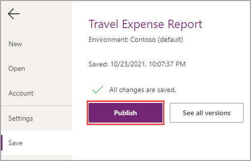
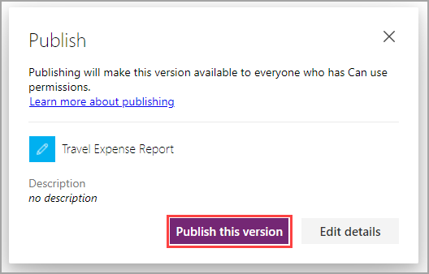

You may have noticed that once you save your application, you can publish and share it. But you may be curious as to the differences and or what it means when your app is Saved vs. Published. When you Save your app, this simply ensures you do not lose any of work you have done, as you would expect. Keep in mind though, just saving your changes will not affect the published app version your users are currently running. To roll out your latest app changes, the app needs to be published. Try to think of it this way, saving is like a "Draft" and when you publish, all your changes get pushed out, making them "Live". As mentioned in the previous unit, this doesn't necessarily mean your app is complete, just that it has reached a new stage.

In our example, we've yet to publish the Travel Expense App but that is what we're about to do in this unit. Let's get to it!

> [!NOTE]
> If your app is still open in Power Apps Studio from the previous module, then you can skip steps 1-3.

1. In your browser, navigate to [http://make.powerapps.com](http://make.powerapps.com/?azure-portal=true).

1. Select **Apps**, on the left.

1. Locate your app and to the right of it select the ellipses "**...**", then select **Edit**.

1. From the Menu Bar, in the top left, select **File** and then select **Save**.

1. After the app is saved, select **Publish**.

    > [!div class="mx-imgBorder"]
    > 

1. In the subsequent dialogue box, select **Publish this version**.

    > [!div class="mx-imgBorder"]
    > 

It's as simple as that! You have successfully published your app and are ready to share it with some users for testing and feedback. You will notice the button now says **Share**, this is to help guide you through the development process. If you select **Share** from here, it would open a new tab allowing you to manage the sharing permissions for this app. You can select on it if you would like just to see, but you'll also need manage the sharing permissions for this app without publishing any changes. So in the next unit, you will learn how to access the sharing permissions for your app another way.
