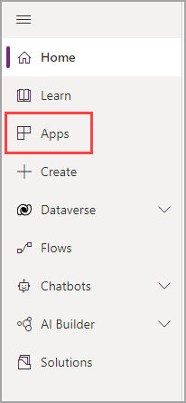
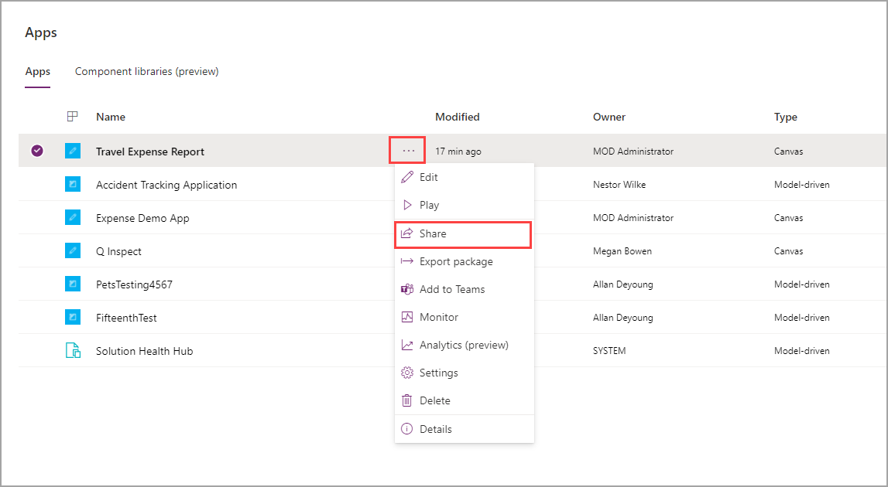
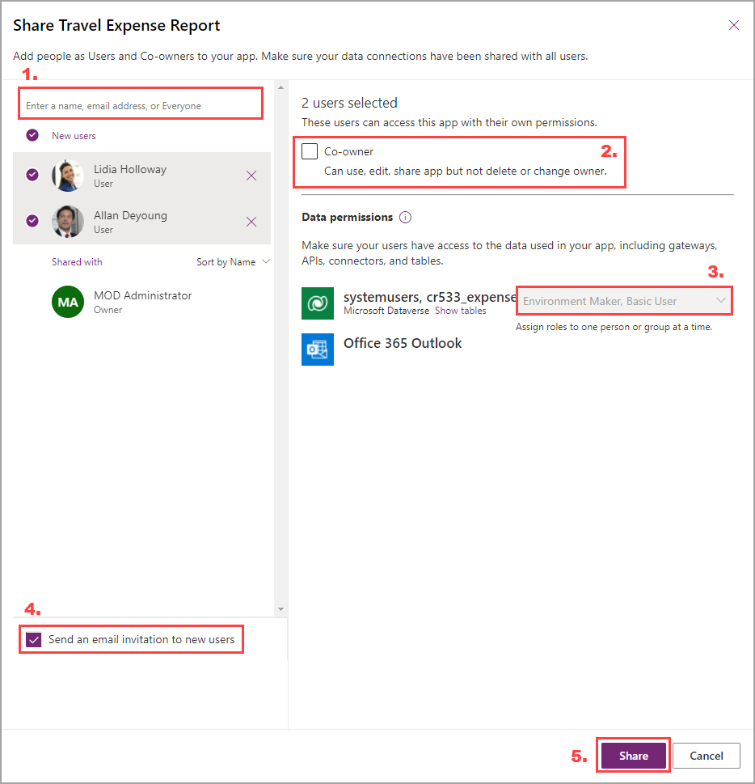
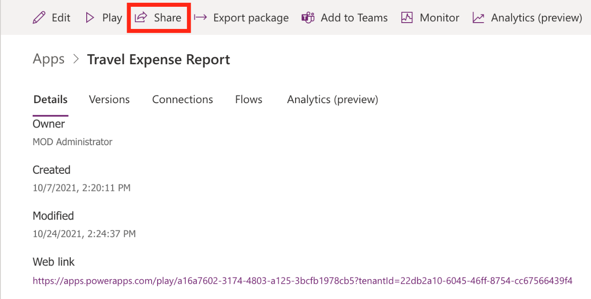
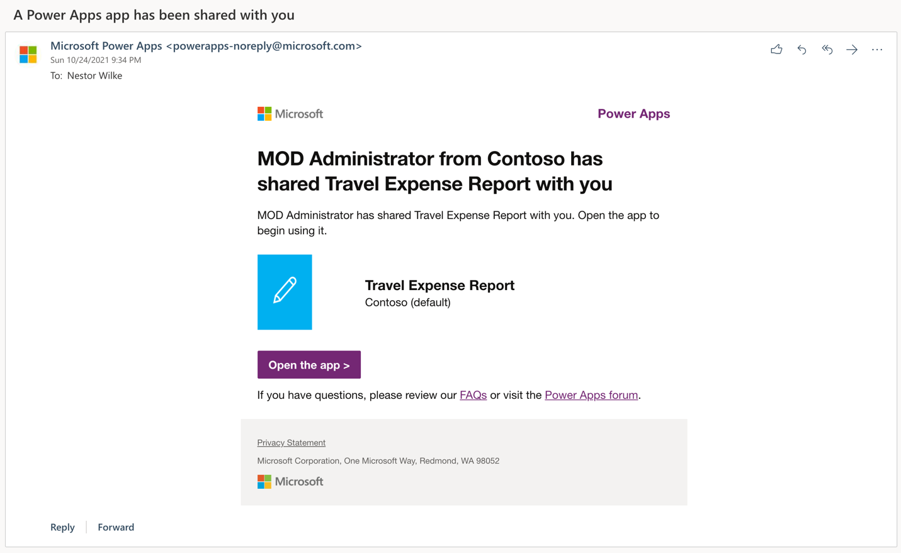
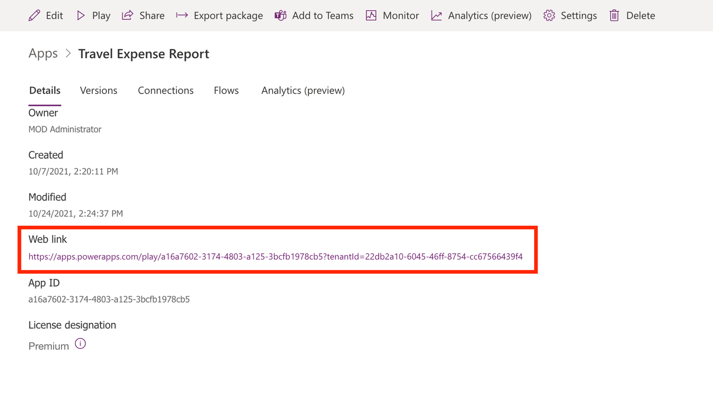
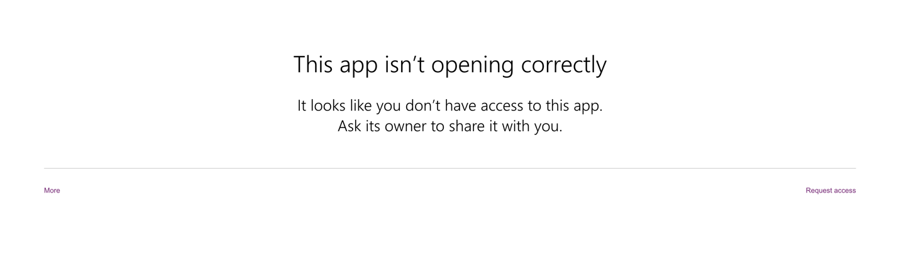

After you've successfully published your app, it's time to share it so that users can begin testing the app.

1. Go to [http://make.powerapps.com](http://make.powerapps.com/?azure-portal=true). Your app should be listed in the lower part of the screen. If you can't find your app, select **Apps** in the navigation menu.

    > [!div class="mx-imgBorder"]
    > 

1. Find your app and then select the ellipses (**...**) beside it. In the pop-up menu, select **Share**.

    > [!div class="mx-imgBorder"]
    > 

A sharing flyout menu will appear. Before you begin adding/editing users, make sure that you note several important details or options.

> [!div class="mx-imgBorder"]
> 

1. Add users from your Microsoft Azure Active Directory (Azure AD) service by typing their names or email addresses in the box. Selected users will appear below the field so that you can add several at once.

1. Select the **Co-owner** checkbox so that users can make changes to your app. They will not be able to delete the creator, or owner, of the app. Likely, each app will have only one or two developers and the remainder will be added as users.

1. To add only one person or group and use Microsoft Dataverse as a data source, set user roles so that app users can make changes to the underlying data. Regardless of your data source, users need to have the proper roles or permissions to take action on data.

1. Select the **Send an email invitation to new users** checkbox so that an email will be sent to users with a link to access the application.

1. Select the **Share** button to share the app with your users. The **Share** button will also enact changes that you made to other users' permissions.

    Take a few moments to share the app with some users in your organization.

1. When you're finished adding users, select **Share** and then close the flyout menu.

If you accidentally shared the app with someone, or if you need to remove a user(s) permission, follow these steps:

1. On the app **Details** screen, select **Share**.

    > [!div class="mx-imgBorder"]
    > 

1. Select the user or hover the cursor over their name and then select the **X** icon.

    > [!div class="mx-imgBorder"]
    > 

1. Select **Share** in the lower part of the screen to save your updated sharing permissions.

In addition to adding users one-by-one, you can type **everyone** to share with every user in your tenant.

Previously, when you were adding users with whom to share the app, if you left the **Send an email invitation to new users** checkbox selected, the invitation email would look similar to the following image.

> [!div class="mx-imgBorder"]
> 

If you cleared the **Send an email invitation to new users** checkbox, you can still send a link to the users of your app. You can find the link for your app on the app **Details** screen in the **Web link** section.

> [!div class="mx-imgBorder"]
> 

You still need to share the app with user(s) whom you want to have access. If you sent someone the link to your app, and they've not been given access from the sharing flyout menu, then they'll receive a generic permission/access error message.

> [!div class="mx-imgBorder"]
> 

Now, you have shared your app, and users who have access can begin testing. In the next section, you will learn how to maintain your app.
