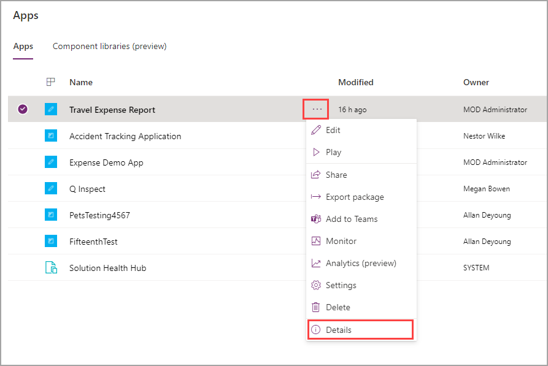
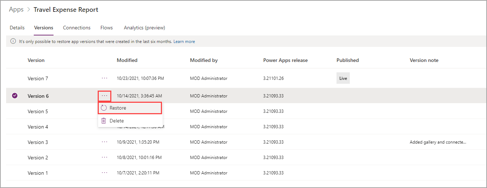

Even the most proficient app builders can make mistakes when developing apps. The key is understanding how to undo a premature release of your app or revert to a previous version if bugs occur. If necessary, you can revert your app to a previous version by following these steps:

1. Go to [http://make.powerapps.com](http://make.powerapps.com/?azure-portal=true). Your app should be listed in the lower part of the screen. If you don't find your app, select **Apps** in the navigation menu.

1. Find your app and then select the ellipses (**...**) menu beside it. This time, select **Details**.

    > [!div class="mx-imgBorder"]
    > 

    On the app **Details** screen, basic information will display about your app, including the name, web link, and license designation. Select the **Connections** tab to view more information, the **Flows** tab to view Microsoft Power Automate flows that are used in your app, and the **Analytics (preview)** tab for basic usage analytics.

1. Select **Versions**.

    > [!div class="mx-imgBorder"]
    > 

    You can view all versions of your app that have been created and notes that you included when saving. The most recently published version shows as "**Live**" in the **Published** column. You can restore or delete any version that was created in the last six months. Restoring a previous version will not move up the version; instead, it will create a new version that you can then publish. For example, the following image shows that version 6 would stay the same, but a new version (version 8) would be created as a copy of version 6.

    > [!div class="mx-imgBorder"]
    > 
