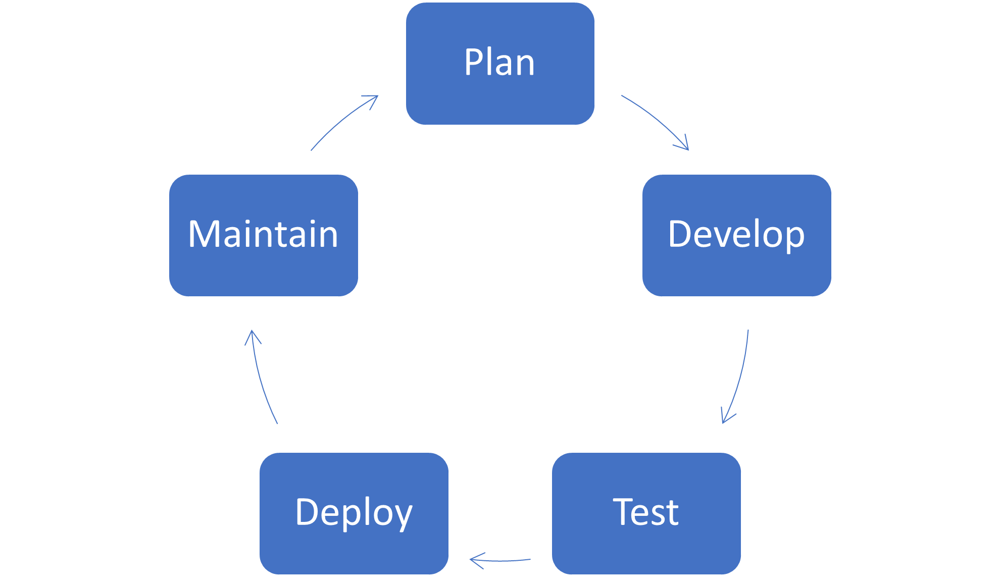

Now that you understand the mechanics of sharing, publishing, and maintaining your app, what are the next steps?

In the first unit, you learned that app development is not a race with a clear beginning and end, but more like a cycle. Apps are related to processes, which are constantly changing and improving. Not only that, but as new technology is released and best practices change, your apps will require more updates. This process is sometimes referred to as Application Lifecycle Management. It begins with a concept or process and continues through the first iteration of planning and subsequent development. From there it goes through testing with a small group of users, deployment to remaining users, and finally general maintenance before a change occurs and the process begins all over again.

> [!div class="mx-imgBorder"]
> 

Consider the Travel Expense App example we created in this learning path. If you choose to add an approvals piece, you'll need to go back to the planning phase to consider how that fits into your existing data model. Next, you will need to plan and build out the screens, then roll out to a small group of users for testing. Finally you can deploy your app, rolling it out to all users and then maintain it until the next major change, such as adding in expenses other than travel.

It is important to note that these stages may be shorter or lengthier in terms of time and resources. For example, there may be months between changes where you are simply maintaining your app, or you may have a major series of changes, which take a year from planning to rollout. In addition, not every change requires extensive planning or testing. It may just be planning and testing on the part of the developer, especially for minor changes such as adding a field to a drop-down or changing some colors. Major or minor change, it will help you in your building to consider these stages throughout the life of your app.
