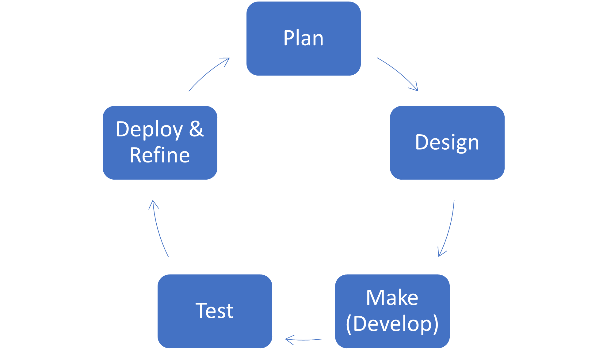

Previously, you learned that app development is not a process with a clear beginning and end but is more like a cycle. Apps are related to processes, which are constantly changing and improving. As new technology is released and best practices change, your apps will require more updates. This process is sometimes referred to as application lifecycle management (ALM). It begins with a concept or process and continues through the first iteration of planning and subsequent development. Then, the app goes through testing with a small group of users, deployment to remaining users, general maintenance before a change occurs, and then the process begins again.

> [!div class="mx-imgBorder"]
> 

Consider the Travel Expense Report app example that you created in this learning path. If you choose to add an approvals piece, you'll need to return to the planning phase to consider how that component fits into your existing data model. Next, you will need to plan and build the screens and then submit to a small group of users for testing. Finally, you can deploy your app by sending it to all users and then maintain it until the next major change, such as adding expenses other than travel.

These stages might be shorter or lengthier in terms of time and resources. For example, months might span between changes where you are maintaining your app, or you might have a major series of changes that take a year from planning to implementation. Furthermore, not every change requires extensive planning or testing. It might involve planning and testing on the part of the developer, especially for minor changes such as adding a field to a dropdown menu or changing colors. Whether a major or minor change, ALM will help you in your building process to consider these stages throughout the life of your app.
