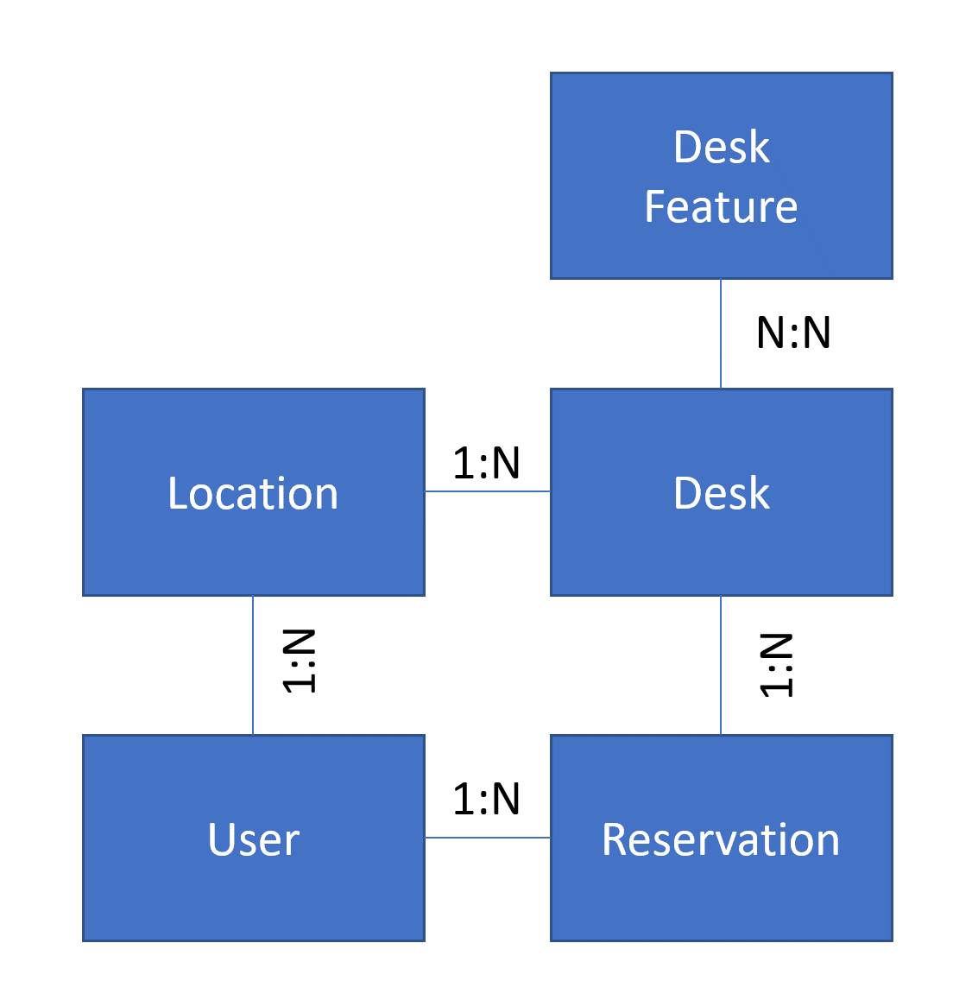

When data is modeled in Microsoft Dataverse, separate tables are used to represent distinct objects and concepts. More tables can be used to secure specific information, avoid data repetition, describe other properties, or even make the reporting easier, to name but a few reasons. As the real-life objects are related to each other, the relationships are used in Dataverse to link rows in one table to another. Relationships also can provide constraints and behaviors that apply when actions are performed on the records.

In simple terms, Dataverse tables and relationships together tell the story of your data. When building a good user experience in a Power Apps canvas app using the tables and relationships, you would want to hide unnecessary complexity of the data model. To accomplish that, your formulas and use of the data must efficiently navigate the tables using the relationships. This module will look at how to use the different types of relationships Dataverse offers.

## Introducing Contoso hot-desking

In this module, we're going to use a common business scenario to walk through how Dataverse relationships work with canvas apps. Contoso, like many companies, has multiple locations and allows employees to work from home. Occasionally, these employees need to come into the office and need a desk to use during their visit. Previously, Contoso had their employees show up and walk around to find an available desk. They now plan to build a solution the employees can use to see in advance what desks are available and reserve one. The team building the solution identified the following tables as part of their Dataverse data model:

|     Table Name      |     Description                                                                                                                                                                                                                              |
|---------------------|----------------------------------------------------------------------------------------------------------------------------------------------------------------------------------------------------------------------------------------------|
|     Location        |     This will represent the individual buildings   and contain columns like the address and phone number.  Each location will have a primary contact   person.                                                                               |
|     Desk            |     This represents the actual desk that somebody   can reserve.  Desks are located at a   specific location.                                                                                                                                |
|     Desk Feature    |     Different desks have different features. For   example, some may have a speakerphone, and some may be enclosed in a   room.   There will be a standard list   of desk features, and each desk can have one or more of those features.    |
|     User            |     Users represent people who can reserve the   desk or be a primary contact for a location.                                                                                                                                                |
|     Reservation     |     This table represents the reservation for a user   to use a specific desk at a specific location in a specific timeslot.                                                                                                                 |

## Dataverse relationship types

When you create a relationship between tables, the relationship type defines the cardinality constraints of each side of the relationship. Dataverse supports both one-to-many and many-to-many relationships.

### One-to-many 

The one-to-many relationship (which is also called 1:N or parent-child) includes a primary (parent) table where an individual row can be associated with many related (child) table rows by using a lookup column in the related (child) table. The primary row is called the parent and the related table rows are called child rows. A child row can be associated with only one parent row.

A one-to-many can also be called a many-to-one (or N:1) when you use the relationship starting at the child pointing to the parent. It is the same physical relationship definition just looked at from a different side. In a canvas app, if you are working with the child record and want to display a property from the parent, you would be using the many-to-one relationship navigation property on the child row.

By default, a single table is used as the primary, and the lookup column always points to a row from that table. Dataverse also supports multi-table lookups (sometimes called polymorphic lookups), allowing a lookup field to point to a row from one of the multiple tables providing flexibility for more complex data models. For example, a multi-table lookup column can be configured by creating a column of data type customer. The customer lookup value can be set to point to a contact or to an account table row. On all activity tables (for example, email, task, etc.), the regarding column can point to any table that is enabled for activity tracking. You can also use the [Multi-table lookup](/powerapps/developer/data-platform/webapi/multitable-lookup/?azure-portal=true) column type to configure a custom multi-table lookup column. When working with these multi-table lookup columns in Power Apps canvas apps, you will use the IsType, and AsType Power Fx functions to determine the parent table and use the data.

In our example data model, the following one-to-many relationships have been defined to support the scenario.

|     Primary table    |     Related table     |     Description                                |
|----------------------|-----------------------|------------------------------------------------|
|     Location         |     Desk              |     Each desk is located at a location         |
|     User             |     Location          |     Each location has a primary contact        |
|     User             |     Reservation       |     User that the desk is reserved for         |
|     Desk             |     Reservation       |     Each reservation is for a specific desk    |

When you configure a one-to-many relationship, you can also configure the relationship behaviors. Behaviors determine what should happen when the primary table row is deleted, assigned, shared, unshared, or reparented. The default behavior is reference, which is configured to remove the link between the two tables when the primary table row is deleted. Take the example of Location, that has multiple desks, using the default configuration, if your canvas app deleted a location row then by default all the associated desks would be orphaned. If the business requirement is to remove associated desk records when a location is deleted, one option in your app that you might use a ForAll and delete all the associated desk records first. A better option would be to configure the parental type of behavior for the relationship. This behavior type automatically deletes the associated records when the primary record is deleted. This ensures that you won't have any orphaned desk records.

When you are building a canvas app and using tables that are related, you should know how the behaviors are configured for that relationship to ensure you implement the correct logic.

## Many-to-many

The many-to-many relationship (also called N:N) includes a special hidden table called a relationship table, sometimes called an intersect table. This maps how the many rows of one table can be related to the many rows of another table. Many-to-many relationships can track the association, but you cannot modify the intersect table to add custom columns that describe the relationship.

In our example, Desk and Desk Feature would have a many-to-many relationship. The list of desk features would be shared by all desks and each desk could have one or more features associated. Many-to-many relationships allow knowing the desk has chairs but would not let you store how many chairs each desk had.

In the following video, we will look at how to create relationships between tables.

> [!VIDEO https://www.microsoft.com/en-us/videoplayer/embed/RWOUXs]

After creating all the tables and relationships, the data model for the example scenario now looks like the following:

> [!div class="mx-imgBorder"]
> 

In the rest of this module, we will explore how to work with this data model from a canvas app.