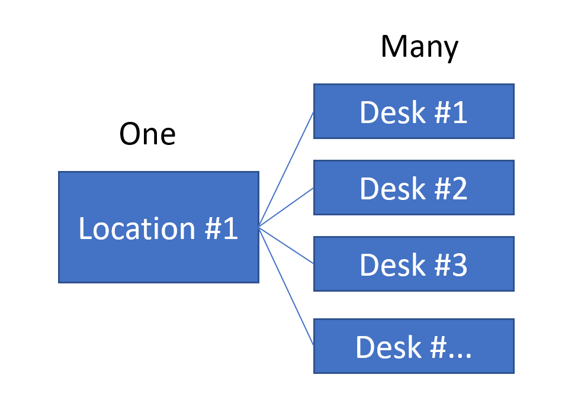
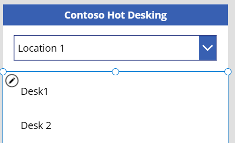
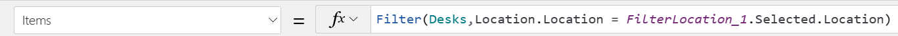
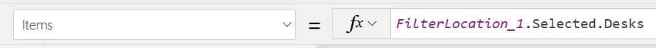
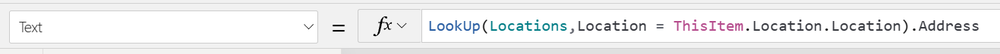
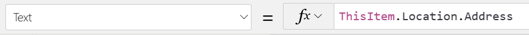
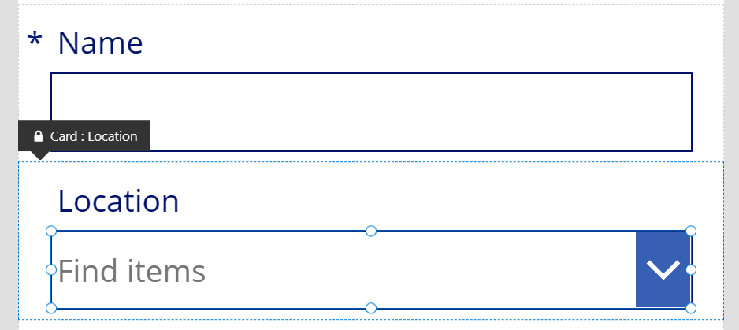
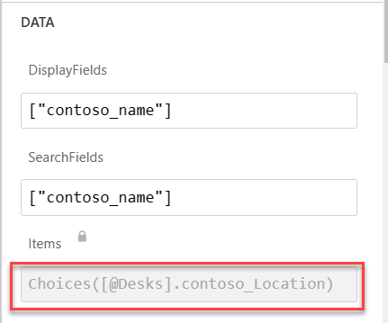
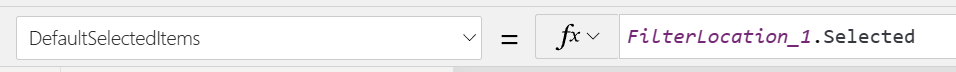

One-to-many relationships are the most common Dataverse relationships that you will work with. This unit continues the scenario regarding Contoso's shared workspaces. To help explain how to work with relationships in a canvas app, the ensuing examples will use the relationship between the Location and Desk tables. The following diagram is a visualization of the relationship and the corresponding data.

> [!div class="mx-imgBorder"]
> 

If you want to allow a user to select a location and to have that location's desks show in a gallery underneath, you might create a screen similar to the following example.

> [!div class="mx-imgBorder"]
> 

As with most data sources, you could use the Filter() function to filter the desks to only show the desks for the selected location. Your formula would appear similar to the following example.

> [!div class="mx-imgBorder"]
> 

Because you are working with a Dataverse one-to-many relationship, you can instead use the dot notation to reference the location's desks by using **Control.Selected.Desks**, as shown in the following formula.

> [!div class="mx-imgBorder"]
> 

In this example, both formulas produce the same list of desks that are related to the selected location. Using the dot notation is simpler and more concise than using the Filter() function.

When you navigate a one-to-many relationship by using the dot notation syntax, by default, you will get all related records. You can use a filter to apply more criteria to the related rows. The following expression uses the one-to-many relationship and also filters the results on the active status.

`Filter(FilterLocation_1.Selected.Desks, Status= 'Status (Desks)'.Active)`

Additionally, you can use the relationship starting from the desk row. Consider an example where, in the gallery, you want to show the location address for each desk. You might be familiar with using a lookup to retrieve the location record and then accessing the address column as a property.

> [!div class="mx-imgBorder"]
> 

Instead of using the Lookup() formula, you can use the dot notation and reference `ThisItem.Location.Address`.

> [!div class="mx-imgBorder"]
> 

You are not limited to one level of relationship navigation. For example, if you have a location that has a related primary contact, and you want to show the full name column, you could compose the following formula:

`ThisItem.Location.'Primary Contact'.'Full Name'`

By using the dot notation, you can quickly include related data, regardless of which side of the relationship that you are starting from.

## Add and update related rows

The simplest way to establish the one-to-many relationship is by using an edit form to create or update the related row. When you add the lookup column to the form, it uses the Choices() function to present possible values to the user. The following example shows the process of adding a desk row where the location lookup column is added to the form.

> [!div class="mx-imgBorder"]
> 

The advanced properties on the dropdown control show how the **Items** property is set up.

> [!div class="mx-imgBorder"]
> 

By using the Choices() function, you will eliminate the need to add the lookup table as another data source. The Choices() function result is a table, so you can add more filtering and sorting, as follows:

`Filter(Choices([@Desks].contoso_Location), Status='Status (Locations)'.Active)`

If you already had the lookup value that you wanted to set (for example when creating a desk record from the Location screen), you could set the **DefaultSelectedItems** property on the data card value and then set the form field's **Visible** property to **Off**. This setting would allow the default value to be passed when the SubmitForm() function is invoked.

> [!div class="mx-imgBorder"]
> 

If you are using the Patch() function to set a lookup column, set the value of the column to a record from the primary table. The following example shows the establishment of a relationship between a desk row and a primary location row that is currently selected in the location dropdown list.

`Patch(Desks, ThisItem, {Location:FilterLocation_1.Selected})`

You could also achieve the same result by using the Relate() function. The first parameter is the list of the rows (desks) that are related to the primary row (location), and the second parameter is the row (desk) to be added to that list or *related*.

`Relate(FilterLocation_1.Selected.Desks,ThisItem)`

Similarly, you could use the Unrelate() function to disassociate the rows, for example removing ThisItem (Desk) from the desks that are associated with the selected location FilterLocation_1.Selected.

`Unrelate(FilterLocation_1.Selected.Desks,ThisItem)`

When using the Unrelate() function, remember that it will set the value of the primary lookup on the related record to **Nothing** (or null). Avoid having rows that are orphaned because the app might not have the ability to display the row without the primary association. In the Contoso example, if the list of desks is displayed only as related to the location, then any desk without a location will be orphaned and inaccessible through the app. This situation can also occur as a side effect of deleting the primary row when the relationship behavior property is set up to remove the link to related rows.

