Many-to-many relationships provide the flexibility to track when multiple rows have the same related data. Unlike one-to-many there isn't a concept of a primary table. The relationship is entirely symmetrical, and you can access the set of related rows starting from either side of the many-to-many relationship. Using our sample Hot-desking data model, we will explore how to work with them in a canvas app. We will use the many-to-many relationship between the desk and the desk feature. The following is a visualization of the relationship and the corresponding data.

> [!div class="mx-imgBorder"]
> [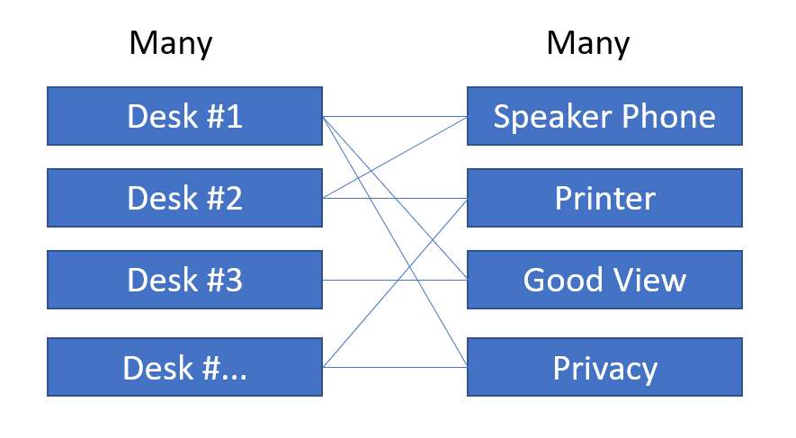](../media/desk-feature-relationships.png#lightbox)

As you can see each desk can have multiple associated desk features rows and each desk feature can be associated with multiple desks. You could access the set of desk features from a desk row using **ThisItem.'Desk Features'** expression. From the desk features row you can use the **ThisItem.Desks** expression to access all the desks associated with that specific desk feature.

You could use this to show a comma-separated list of values for each desk in a gallery as you can see in the following example.

> [!div class="mx-imgBorder"]
> [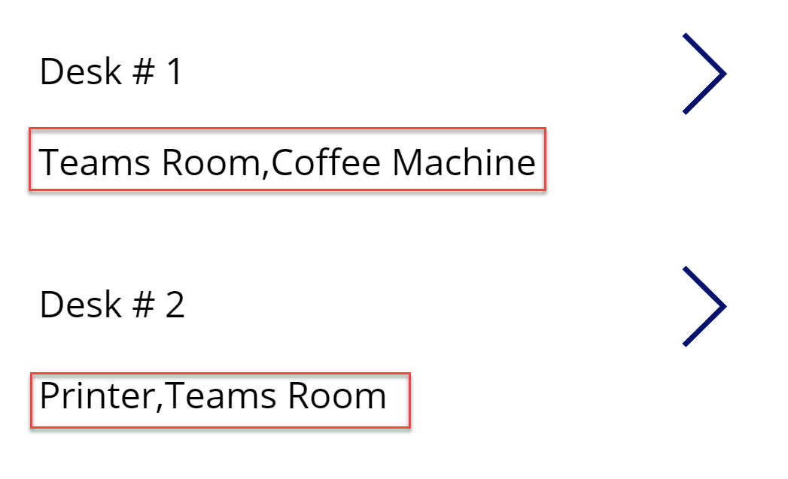](../media/desk-list.png#lightbox)

To accomplish populating the label text, you would set the Text property on the label to the following formula:

`Concat(ThisItem.'Desk Features',Name ,",")`

You need to be aware of performance implications when you use this formula, especially if you have many records because of how the data is accessed from Dataverse. As you can see from the following image from the monitor one call to getRows is done to get the list of desks and for each desk a call to getNavigatedRowInTableRow is made to retrieve the desk features.

> [!div class="mx-imgBorder"]
> [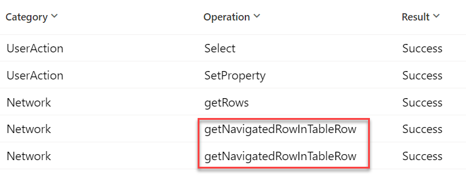](../media/output.png#lightbox)

As an alternative it might be more performant to only show the desk features after the user has selected a single desk row in a gallery or drilled down into the details of the desk row.

Another way to use the relationship is to allow a user to pick a desk feature and the use the **controlName.Selected.Desks** property to populate items in a gallery.

> [!div class="mx-imgBorder"]
> [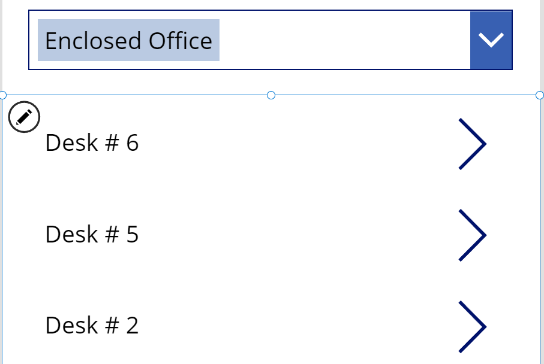](../media/desks.png#lightbox)

This works great when you only allow a single selection in the combo box. If you enable multiple selections the logic gets much more complex. Currently Power Fx does not have a simple way to express intersection of two collections, which is required to make the scenario work. Workarounds are possible, for example you could iterate through all selected features, collect related desks in a single collection, remove the duplicates, and then use the collection as the item's source. However, because of the multiple Dataverse requests (one per each selected feature), the performance of this approach will quickly degrade as the tables grow

## Establish the relationship

The primary way to establish a many-to-many relationship is to use the Relate() function similar to how you would with a one-to-many relationship. The main difference is it doesn't matter which record is the first or second parameter to Relate() because there is no primary table in the relationship.

Managing many-to-many relationships on a form is more complex than many-to-one lookup columns. The many-to-many relationship is available in the fields list however, when you add the field to the form the system doesn't generate the formulas for the control to work and you will see an error similar to the following:

> [!div class="mx-imgBorder"]
> [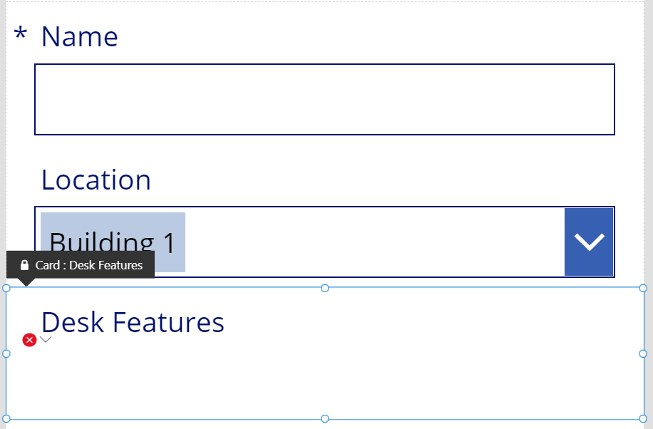](../media/desk-features.png#lightbox)

To resolve the issue the Items property Choices() function needs to be updated for the table that is on the other side of the many to many relationship. To do that you must unlock the card from the advanced tab.

> [!div class="mx-imgBorder"]
> [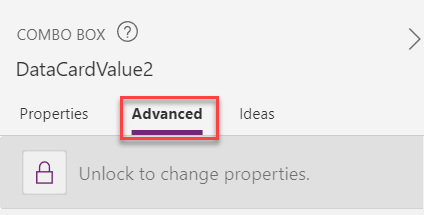](../media/advanced.png#lightbox)

In our example we want to use desk features so after unlocking the control, the Items property needs to be to **'Desk Features'** as the data source.

> [!div class="mx-imgBorder"]
> [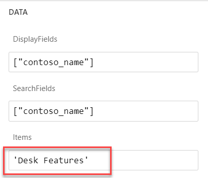](../media/data-card-properties.png#lightbox)

> [!NOTE]
> Scenario described here uses the form to add a row. To support the edit capabilities, the DisplayMode property for the card also needs to be changed from the default View setting to Edit.

After the properties are adjusted the form user interface works, and you can choose items from the combo box. However, if you attempt to submit the form, you will get an error like the following.

> [!div class="mx-imgBorder"]
> [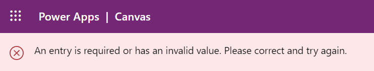](../media/error.png#lightbox)

To work around the issue, you need to clear the update property and manually process the many-to-many association after the form is submitted.

> [!div class="mx-imgBorder"]
> [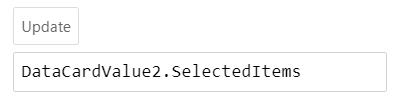](../media/update.png#lightbox)

After clearing the update property, the form submission works however the relationships between the desk and the desk feature table rows are not created. To establish the relationships, we need to add the following logic to the OnSelect property of the check icon used to submit the form by default:

1.  Save the desk features selected in the combo box as a collection. This is required because the form submission resets the fields, and the value will be lost.

1.  Submit the form.

1.  Use the saved collection of the desk features to establish the relationship.

> [!div class="mx-imgBorder"]
> [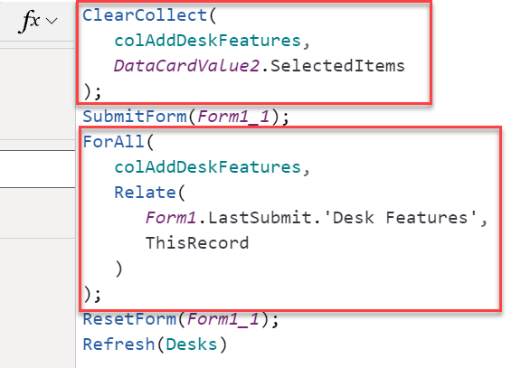](../media/property.png#lightbox)

## Other design options

User experience with many-to-many relationship is similar to that where choices column is used. Choices values are predetermined by the maker, cannot be disabled, or secured. That makes choices fields suitable for scenarios with rarely modified data, for example, a list of countries. Rows in the related tables, on the other hand, can be deactivated, secured, and added at run time. That makes many-to-many relationship a good option in the scenarios where some flexibility is needed at runtime, for example, a tagging solution where contact has many-to-many relationship with tag and tags need to be added by the users as needed.

Many-to-many relationships are good for situations where you want to capture the association between rows of two tables. The relationship between the rows cannot store any other data. For example, if you had a relationship between contact and a language table you could track that a person spoke two languages.

> [!div class="mx-imgBorder"]
> [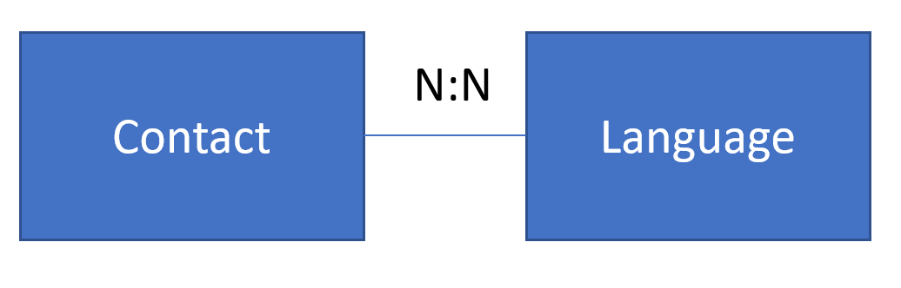](../media/contact-language.png#lightbox)

You would not know however, how long they had spoken each language and how proficient they are speaking it.

A common alternative design pattern is to create your own intersect table. The Language Spoken table below is just another custom Dataverse table. You can add columns to this table for any other properties describing the specific relationship. This new table will then have N:1 relationships to contact and language.

> [!div class="mx-imgBorder"]
> 

Working with these tables from your application is just like working with any other tables that have one-to-many or many-to-one relationships. Since there is an extra table involved, you may find that some extra logic will be required to ensure the smooth user experience. It is important to understand the requirements of your application and to know upfront if many-to-many relationship needs to track other data since this decision must be made at the time that the tables are related.
