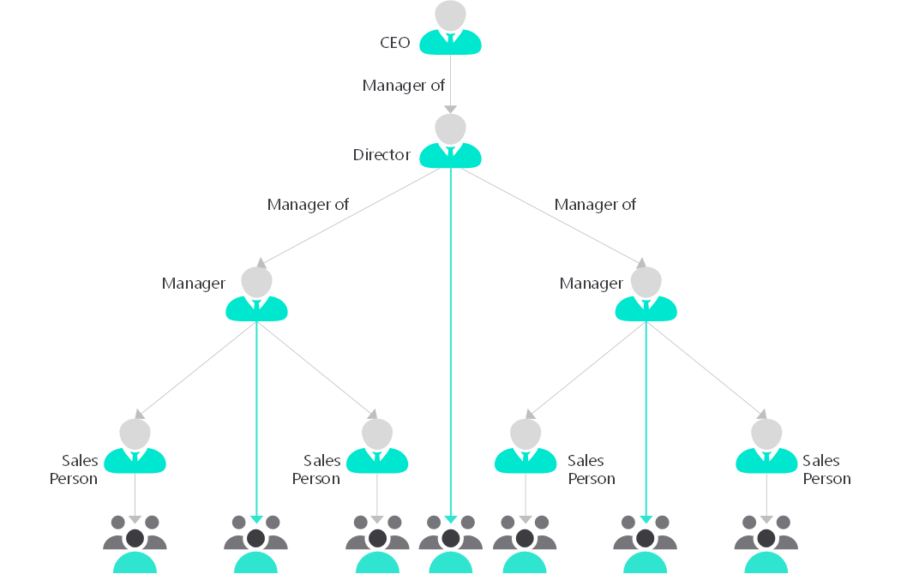

Data should always be considered as a valuable asset. Therefore designing a security model to ensure the proper usage and access to that valuable asset is important in security design. Microsoft Dataverse stores data for the Power Platform and provides services for apps. The Power Platform has layered security to control access to a Dataverse environment, but once a user has access to the environment, the solution architect needs to control access within the database. One of the key features of Dataverse is its rich security model that can adapt to many business usage scenarios.

## Authorization

Authorization is the function of specifying access rights, or privileges, to resources. Security design implements authorization to access data and features. Deciding who can get access to what data and what services is an essential part of any solution's design.

Bad security design can lead to poor system design and these can have far-reaching impacts and can be costly to fix:

- Manageability: Difficulty in managing individual access.
- Performance: For example, PrincipalAccessObject (POA) table growth when sharing.
- Usability: Cumbersome procedures to grant access.
- Visibility: Impossible to tell just by looking at the record who has access to it)

Every solution has unique requirements, but common capabilities and patterns can be identified and reused.

## Common patterns

Here are some common usage patterns within many business apps:

- Active involvement: Regular, significant involvement directly with the customer/data. Informed, with existing knowledge of the customer/data and current related activity, and personal actions based on a direct relationship with the people involved.
- Secondary involvement: Informed involvement, maintaining active knowledge of activity but not directly participating or acting on the data or with the customer, such as providing cover for absence of actively involved staff. Supporting others who have a personal relationship with customer such as providing advice or support to the people actively involved, providing specialist knowledge to a specific piece of data or customer.
- Transactional interaction: Specific activity-oriented involvement, for example, receiving and acting on a request to update a customer’s address. No personal or on-going engagement, such as in a contact center.
- Management oversight: Managerial or governance responsibility across a business or geographical area  Viewing and directing involvement of others rather than specific involvement.
- Reporting: Aggregated business reporting  Data organized to preserve anonymity rather providing direct access to customers/deals.
- Compliance:  Oversight read-only access to all records for a business area.

When designing security, the solution architect needs to understand how users work that is, do they work by themselves, work as part of a static team, or work in dynamic teams that change based on certain rules. These will affect the security design. Then the solution architect needs to understand how do other staff provide support. Do they have assigned support staff and are the support staff shared between other users? What happens if support staff are unavailable and overnight and at weekends? Also how is oversight handled?

## Design Principles

When designing security, there are some principles to follow:

- Assigned responsibility does not always need restricted access.
- Treat exceptions as exceptions, favor frequent access patterns.
- You cannot take back access for one record where you granted access to a broader set of data containing it.
- Use business units for manageability and containment, not for matching organizational structure.
- Use the simplest, performant design that meets the requirements.

> [!NOTE]
> There are times where the organizational structure aligns with the required security structure but this is rare. When designing security, do not just use the organizational structure as the default.

## Security features

Dataverse provides many security features for accessing data:

- Table ownership
- Users
- Teams
- Teams
- Business units
- Security roles
- Sharing
- Azure AD Security groups
- Column-level security
- Hierarchical security
- Auditing

The solution architect needs to understand each of these features and how they combine to create the security model for their solution. This topic does not go into detail about each of these security features, but aims to explain how they can be used together to create a security model for your solution.

### Table ownership

Tables in Dataverse can either be User/Team owned or Organization owned. User/Team owned tables have an owner field and each row in the table can be assigned an owner. The owner of a row is used with the other security features to determine who has access to the row that is, access to rows is granular and can be horizontally partitioned. On the other hand, access to individual rows on Organization owned tables cannot be restricted and users will have access to all records or none.

> [!NOTE]
> You cannot change the ownership type after creation of a table. If in doubt, specify User/Team ownership when creating tables.

### Teams

Teams is collections of users that are used to allow users access to data. Teams is a powerful way of granting permissions to users in a broad way without micromanaging access at the individual user level. Users can be members of multiple teams.

There are three types of team:

- Owner team: Owner Teams can own rows, which give any team member direct access to that row.
- Access team: Access Teams is a method for users to easily share a row with another from within a form.
- Azure AD group team: Similar to Owner Teams but membership of the team is controlled in Azure AD.

### Security roles

Security roles are the cornerstone of data security in Dataverse. You do not grant discrete privileges to users, you create security roles. Dataverse uses role-based security to group together a collection of privileges.

Security roles can be assigned to users and to teams. Teams and users can have security roles that provide aggregate privileges.

> [!IMPORTANT]
> All privilege grants are accumulative with the greatest amount of access prevailing. If you gave broad organization level read access to all contact records, you cannot go back and hide a single record.

### Business units

Business units contain users and teams and act as security boundaries. Business units are the primary method for controlling access to subsets of data within a table that is, horizontal partitioning of data. With Business units, you can segment users and their data.

Every Dataverse database has a single root business unit. You can create child business units to represent groups of users in a strict hierarchy.

> [!NOTE]
> Business units have a default team containing all users in that business unit. You cannot manually add or remove users from default teams so they can become blockers for some scenarios as the solution evolves.

> [!IMPORTANT]
> It is the combination of security roles and business units that is the foundation of the security model for Dataverse.

Business units provide an efficient way of managing large number of users and record access. Business units are not visible to the users in the applications, only to administrators. You should not simply mirror an organization's org chart but design the business unit hierarchy to meet the security requirements. This can sometimes mean creating business units to achieve a security requirement such as create a business unit to parent the Sales and Marketing business units to allow some users to access those units and preventing access to the Operations business unit.

### Sharing

Individual rows can be shared with both users and teams. This permits users to access records that are restricted by the security model generated by business units. Sharing allows rows to be accessed outside of the strict business unit hierarchy.

### Security Roles and Teams

Security roles can be associated with teams. Users can then be associated with the team, and therefore all users associated with the team will benefit from the role. Users will have access to the rows owner by the team and depending on other security features, may have access to rows owned by other users in the team.

There is an option on the security role that controls how the security role operates with a team. There are two options:

- Default - Team privileges
- Direct User (Basic) access level and Team privileges

Using the Direct User option treats privileges as if they were directly assigned directly to the user. Using this option you can avoid having to assign security roles to users and just use teams and security roles assigned to teams.

> [!NOTE]
> Owner Teams belongs to Business Units. A user can only belong to one business unit at a time, but a user can be added to a team in another business units. This allows users to access data in a business unit that is not in their hierarchy.

### Column-level security

The privileges provided by security roles operate at the row level. If a user has update privilege on a row, they can update all columns on that row. Sometimes row-level control of access is not adequate such as columns containing personal identifiable information (PII). Dataverse has a column-level security feature to allow more granular control of security at the column level.

Column-level security operates separately to security roles. Column security profiles define the read/write privilege on the columns and these profiles are assigned to users and teams.

> [!NOTE]
> If a user does not have the privilege to read a secured column, the can still see the column on the form but will not be able to see its contents i.e., the value of the data. When using code to access secured field, the value will be null if the user does not have read privilege.

### Hierarchical security

One of the issues with the use of business units is their strict hierarchy. Access to data can only follow the hierarchy of the business units, , in the diagram of business units a user in Sales can be given access to the North, Central, and South business units, conversely a user in the Operations business unit cannot access data that belongs to Sales without being given access to all data in the organization.

In hierarchical security, the user in the position above can read and write all the data for their subordinates. They can then read data for the users lower in the hierarchy.

Hierarchical security is an alternative security model that is designed for scenarios where a user that requires management oversight is not within the same part of the business unit hierarchy. Hierarchical security is useful where managers are in different countries or departments from their direct reports.  Hierarchical security has two options:

- Manager hierarchy: This uses the user hierarchy on the systemuser table. There is a restriction that a manager in in the same business unit or in the direct chain of business units above.
- Positional hierarchy: This uses the Position table. This is more flexible and ignores the business unit structure. Positional hierarchy also allows for more than one person in a position.

Only one of the hierarchical types can be used at the same time.

### Audit

Audit captures all data changes. Auditing can help post monitor who has made what changes and can also help analyze how users are actually using the system. The audit functionality within Dataverse does not capture read of data or actions such as exporting to Excel.

There is other auditing available, called activity logging, in the Microsoft 365 Security and Compliance Center that includes data reads and other operations. Activity logging must be enabled and helps meet compliance objectives.

### Managing security across multiple environments

Security roles and Column-security profiles can be packaged into solutions and transported to other environments. Access Team templates are part of the table metadata and are included with the table when added to the solution. Other security features, such as Business units and Teams, cannot be packaged in solutions and the solution architect will need to plan for their population on environments.

## Strategies for defining security roles

There are three basic strategies for building security roles:

- Position specific
- Baseline + Position
- Baseline + Capability

The position specific is the creation of a single security role that contains all the privileges that the job role requires. The out-of-the-box roles are position-specific and are named after job roles, for example, Salesperson. You can follow this model of roles for specific job roles, but you may end up with many security roles that are similar and that you must maintain. For example, adding a new custom table will mean changing many, if not all, the roles.

A more modern model is to use a layered security model. In this model, you would copy an out-of-the-box role, such as Salesperson or Basic User, and change the
access levels to the common, or minimal, levels that all users require. You might name this role Baseline. You would then create new roles and just set the access levels for the few privileges that each group of users would need in addition to the base role. These minimal roles contain the other privileges required for the position or the capability required.

In the following diagram, the baseline role is named All Staff and all users will be assigned this role. All users in Sales will also be assigned the role named Sales, a position role, with some sales users being assigned the Mobile role, a capability role, that just has the Go Mobile privilege, and manager being assigned the Sales role and the Manager role.

Security roles, although this is not obvious are linked to business units. Roles created at the root business unit are inherited by all child business units. You can create a security role for a specific business unit if you want to limit that role to the users in that business unit. Be aware, however, that security roles in solutions are always added to the root business unit when the solution is imported.

## Azure AD Group Teams

An Azure AD group team is similar to an Owner team in that it can own records and can have security roles assigned to the team. The difference is that team membership in Dataverse is dynamically derived from the membership of the associated Azure AD group. Azure AD group membership can be manually assigned or can be  further derived from rule-based assignment based on the user's attributes in Azure AD.

Combining Azure AD Group Teams with assigning security roles to teams with the Direct User option can significantly simplify management of adding new users.

Both Security groups and Office 365 groups can be used for Azure AD Group Teams.
