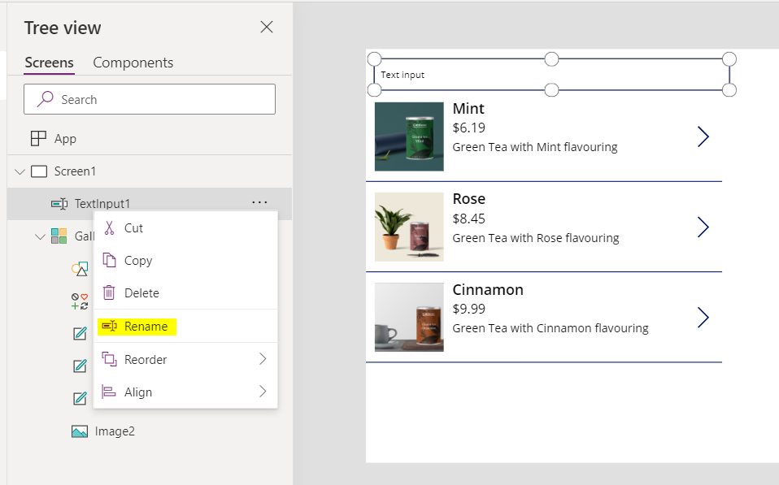

In this exercise, you will shape data in your canvas app.

You will need to download the [spreadsheet](https://github.com/MicrosoftDocs/mslearn-developer-tools-power-platform/blob/master/power-apps/shape-data/shape-data-learn.zip) to complete this exercise. Select download once the link opens. Extract the Excel spreadsheet and upload the spreadsheet to your own OneDrive.

**Add a Data Source**

1.  Sign into [Power Apps](https://powerapps.microsoft.com/).

2.  Create a new Power Apps Canvas app from blank and call it "ShapeData". Select the **Tablet** format.

3.  Make sure you have added [this Excel spreadsheet](https://github.com/MicrosoftDocs/mslearn-developer-tools-power-platform/blob/master/power-apps/shape-data/shape-data-learn.zip) to your OneDrive.

4.  On the **Insert** tab, select **Gallery**, and then select the option for a vertical gallery.

5.  In the properties pane on the right, select the drop-down menu for the **Data source** property.

6.  In the Search box type **OneDrive for Business** and select **OneDrive for Business** from the list. You could have also expanded Connectors and scrolled through all the available connectors until you found the **OneDrive for Business** connector.

7.  Select **+ Add a connection**.

8.  At the bottom of **OneDrive for Business**, select **Connect**.

9.  When prompted to **Choose an Excel file,** navigate to where you stored the Excel file you downloaded in step 3 and select it.

10. Check the **Items** table and then select **Connect**.

You have connected to your **Excel** table in **OneDrive for Business** list, and you can display the data in the gallery control.

**Format data in your gallery**

1.  Select on the gallery you have added.

2.  In the properties pane on the right, select the drop-down menu for the **Layout** property.

3.  Select the **Image, title, subtitle, and body** layout.

4.  In the properties pane on the right, select the Edit button for the **columns** property and set the following points:

    -   **Body1**: Description

    -   **Image2**: Image

    -   **Subtitle2**: UnitPrice

    -   **Title2**: Name

5.  Select the X towards the right of **Data** to exit

6.  On the gallery, select on the price in the first row.

7.  In the formula bar, make sure Text is Selected and type the following.

    ```powerappsfl
    "$" & ThisItem.UnitPrice
    ```

8.  On the gallery, select on the image in the first row

9.  In the properties pane on the right, select the drop-down menu for the **Image Position** property

10. Select **Fill** and you will see that the image now fills up the space.

You have now configured and interacted with the data in your gallery.

**Filter data in a gallery**

1.  Select on the gallery

2.  Make sure the **Items** property is selected in the formula bar.

3.  Change the expression to this:

    ```powerappsfl
    Filter(Items, Origin = "China")
    ```
    Notice that the gallery now only shows two items where the Origin is China.

4.  Try doing the same thing but with the *And* operator

    ```powerappsfl
    Filter(Items, Origin = "China" And UnitsSold > 25)
    ```

    Notice that the gallery now only shows one item that matches both the criteria above.

5.  Now we will change the **Items** property back to the Items Data Source. We will revisit this Filter function later.

    ```powerappsfl
    Items
    ```

**Using the Search function**

1.  On the **Insert** tab, select **Input** and then select **Text Input.** Position the Text Input above the gallery.

2.  On the left panel, Under Tree View > Screens > Screen1 >  select the three dots to the right select **Rename** to rename the text input to **SearchInput.** We are renaming this component so we can refer to it later.

    

3.  Now select on the gallery. Make sure the Items property is selected in the formula bar and then write this expression:

    ```powerappsfl
    Search(Items, SearchInput.Text, "Name")
    ```

    What you have is:

    **Search(Items**...) - A function that allows you to do a more flexible query against a string column.

    **SearchInput.Text** - This retrieves the text typed into the *SearchInput* text input control.

    **"Name"** - Represents the column or column where the search is made

    This will return all the rows where the *Name* column contained the value entered in the Text Input control *SearchInput*.

4.  If you wanted to search more than one column, you can append the column names at the end of the expression.

    ```powerappsfl
    Search(Items, SearchInput.Text, "Name", "Description")
    ```

**Combine data shaping functions**

As explained in unit 3, you can combine functions for more complex functionality in your application. We have tested the *Filter* function, as well as the *Search* function and it is now time to combine them into one function.

1.  Start with the Search function that we completed in the previous step.

2.  Replace *Items* with *Filter(Items, Origin = "China")* which will then make your expression look like this:

    ```powerappsfl
    Search(Filter(Items, Origin = "China"), SearchInput.Text, "Name", "Description")
    ```

For the **Search** function, the first option you are required to provide is a table of data. The **Filter** function returns a table of data. This means it is possible to use the **Filter** function as a data source for your Search function. By adding this as the formula for the Items property of your gallery control, you are displaying to your users the data they need with the added ability to Search.

Within Power Apps, you can utilize the concept of using one function to supply information to another function in many places.

**Move data between collections and data sources**

1.  On the **Insert** tab, select **Button** and position your button underneath your gallery.

2.  Change the text on the button to **Add to Collection**

3.  Select on the button, and in the formula bar, replace false with this expression:

    ```powerappsfl
    Collect(ItemsCollection, Items)
    ```

    **ItemsCollection** - Refers to the Collection name

    **Items** - Refers to the Data Source name

    **Collect** - Will copy all rows from the **Items** into the **ItemsCollection** collection

4.  Run the app. select the button. Stop running the app.

5.  On the **View** tab, select **Collections** and then select **ItemsCollection**. You will then see that all rows from **Items** data source have been added into the **ItemsCollection** collection

**Explore other functions, which can be used with Collections**

1.  On the **Insert** Tab, select **New Screen** and then select on **Blank**

2.  On the **Insert** Tab, select **Data Table** and position it next to the gallery.

3.  In the formula bar, make sure Items is selected and then enter **ItemsCollection**.

    This means that the Data Source for the table is the **ItemsCollection** collection and not the **Items** table in the Excel sheet.

4.  In the properties pane on the right, select the **Edit columns** button for the **columns** property.

5.  Select **+ Add column**

6.  Select all available columns and then select **Add**

7.  Select the X towards the right of **Data** to exit

8.  On the **Insert** tab, select **Button** and position your button underneath your table. Repeat this process four times.

9.  Change the text on all four buttons to: **Add Column, Drop Column, Show Column, Rename Column** respectively.

10. Select the **Add Column** button.

11. Update the formula bar to this expression:

    ```powerappsfl
    Collect(AddCollection, AddColumns(ItemsCollection, "Revenue", UnitPrice * UnitsSold))
    ```

    Here, we have created a new collection called *AddCollection*, which copies all data from the *ItemsCollection* collection but in addition, we use the *AddColumns* function to add a new column called *Revenue*, which is calculated as UnitPrice * UnitsSold.

6.  Select the **Drop Column** button.

7.  Update the formula bar to this expression:

    ```powerappsfl
    Collect(DropCollection, DropColumns(ItemsCollection, "UnitPrice"))
    ```

    Here, we have created a new collection called *DropCollection*, which copies all data from the *ItemsCollection* collection but in addition, we use the *DropColumns* function to remove the UnitPrice Column.

8.  Select the **Rename Column** button.

9.  Update the formula bar to this expression:

    ```powerappsfl
    Collect(RenameCollection, RenameColumns(ItemsCollection, "Name", "Product"))
    ```

    Here, we have created a new collection called *RenameCollection*, which copies all data from the *ItemsCollection* collection but in addition, we use the *RenameColumns* function to rename the *Name* column to *Product.*

10. Select the **Show Column** button.

11. Update the formula bar to this expression:

    ```powerappsfl
    Collect(ShowCollection, ShowColumns(ItemsCollection, "Name"))
    ```

    Here, we have created a new collection called *ShowCollection*, which copies all data from the *ItemsCollection* collection but in addition, we use the *ShowColumns* function to only show the *Name* column.

12. Run the app. Select all four buttons. Stop running the app.

13. On the **View** tab, select **Collections** and then select each of the additional collections you have created to see what effect the functions had.
