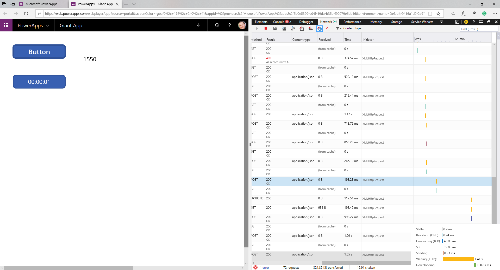

Now that you have learned about performance bottlenecks and some of the
ways to mitigate them this unit will discuss testing techniques. These
techniques are a combination of guidance, techniques, and discovery that
apply both to performance testing and general debugging.

Using the Timer control to get metrics
--------------------------------------

When it comes to working with data connections for retrieving or
uploading data, hard numbers are helpful. In Power Apps, you can use
a variable and a Timer control to capture how long your formula takes to
run. The following scenario will show you how.

Assume you have a Button with the **OnSelect** property set to the
following:

```
Collect(collectDepartmentList, Filter(DepartmentList, Status = "Active"))
```

1.  Modify that formula to the following to add a variable that you
    will use to Start and Stop the timer.

```
Reset(Timer1);Set(varTimerStart,
true);Refresh(collectDepartmentList);
ClearCollect(collectDepartmentList, Filter(DepartmentList, Status =
 "Active"));Set(varTimerStart, false)
 ```

2. You will see an error about Timer1 because you have not added it to the app yet. You can ignore the error until you complete the next step.

2.  To capture exactly how long that formula takes, you will need to
    first add a **Timer** control to your app and make sure that it
    is named Timer1. The Timer control is on the **Insert** menu under
    **Controls**.

3.  For the **Timer** control, set the **Start** property to the following: varTimerStart.

4.  Now insert a **Label** control to display the time.

5.  For the **Text** property of the **Label** control set the formula to the following: Timer1.Value

6.  Now preview the app and click the **Button**.

In your label, you will see how long your collection takes to create in
milliseconds.

This works well for when you want to understand exactly how long a specific query is taking. You could log this data to a different collection and then average the numbers to determine how long it takes. You can also apply this concept to submitting data. Remember to test not only from your local computer but from all of the scenarios for your user's environments.

Test where your users will use the app
--------------------------------------

This is more advice than technique. For most app builders the best place
to run an app is from the local PC they use to build the app. Testing
from that machine generally gives the best case results but may not
match your user's experience. Far too often they forget to test the way
the user will run the app. For example, if you are going to build a
mobile app that runs over a cellular network then make sure your testing
includes the same. Understanding the smaller form factor of the mobile
device and the latency of a varying internet connection needs to factor
into your app's design. The previous timer testing method is great here.
Compare the app's query or upload performance between your PC, your
mobile phone on Wi-Fi, and your mobile phone on cellular data. Determine if you are satisfied with all three scenarios or if you need to optimize your app for the slower network.

Use labels to help with testing
-------------------------------

As your app incorporates more complex logic and more behind the scenes
variables to facilitate that logic consider using label controls as part
of your testing toolkit. Simply adding a label to the screen that
displays the value of the variable can go a long way to helping you
understand why your app is or is not doing something. You can use this
during the building and testing phase. When your app is live, you can add additional functionality for hiding and showing these
troubleshooting tools.

While you are in the Power Apps Studio you can also select
**File** and **Variables** to see all of your variables, their values, where
they were created, and where they are used in the app.

Another way to use labels during the build process is to add a label to
the welcome screen where you manually display a version number.
Power Apps caches your app to optimize your experience. When you are
publishing repetitively, like when customizing a SharePoint form, it can
be confusing to know which version of the form you are seeing as you may
see a cached version. By simply adding a label with v1 or v2 in the
corner, you will always be able to check the version.

Preview versus Published apps
--------------------------

Using the preview capability of the Power Apps Studio gives you great
insight into how your app will run when you publish it. But sometimes
you may find some inconsistency due to cache or other things your local
PC is doing versus what the published app will do in the player. Always
remember to test your app after published, in a manner that is
consistent with how the user will use the app.

Looking at the network activity of your app
-------------------------------------------

Now that you have learned about testing from within the app you need to look at actual network calls and performance. To do this you can use your browsers built-in developer tools, Ctrl+Shift+I in Chrome or F12 in Edge/IE, or a third-party tool like Fiddler. This will allow you to view the individual network calls made by your app and view details, such as time that each call takes. From a performance point of view, this can be valuable.

One example of a way you can use this is to determine if performance slowness, as measured by the Timer control from the previous example, is within your app, the network, or the data source. By using the Developer Tools in Microsoft Edge, you can see the breakdown of the query that took 1.55 seconds in Power Apps.



By hovering over the query in the bottom right of the screen, you can see the time breakdown as follows.


In this instance, most of the time was spent waiting on the data source
to filter the data and respond. This tells you that you cannot make the
call faster by changing the app. Instead, you would need to focus on
refining the query or speeding up the data source.

This level of information can be overwhelming at first but don't try to
learn the whole interface of the developer tools, instead, concentrate
on just the pieces you need like the network timelines.

Additionally, you can use the developer tools to get more details about
error messages returned in the app or a stronger indication where
connectivity issues are occurring.
 
