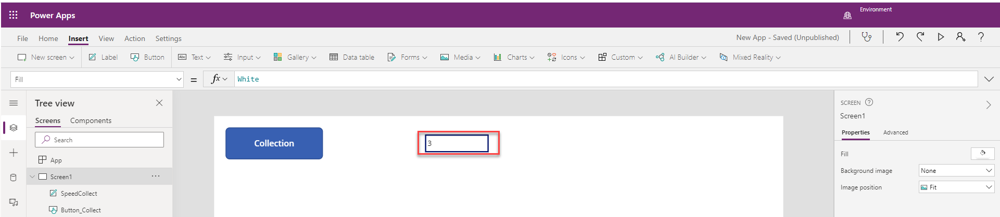
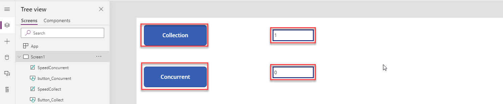

This hands-on lab shows you how to use the Concurrent function to test performance. 

1. Sign into [Power Apps](https://make.powerapps.com/?azure-portal=true).

1. On the Home screen select **Canvas app from blank**.

    

1.   Name your app **New App** , format **Tablet** and click **Create**.
    
	

1. Select the **Insert** tab and add a button, name it button_Collection, set its **Text** property to Collection and set its **OnSelect** property to this formula:

    ```powerappsfl
    Set(varStart,Now());
    ClearCollect(collectFruit, 
    {Name: "banana", 	    Category: "fruit",AvgCost: .49},
    {Name: "peach", 	    Category: "fruit",AvgCost: 1.12},
    {Name: "strawberry",	Category: "fruit",AvgCost: 2.99},
    {Name: "apple", 	    Category: "fruit",AvgCost: 0.98},
    {Name: "orange",	    Category: "fruit",AvgCost: 1.49},
    {Name: "pear", 		    Category: "fruit",AvgCost: 0.97},
    {Name: "cantaloupe",	Category: "fruit",AvgCost: 3.99},
    {Name: "pineapple", 	Category: "fruit",AvgCost: 2.49},
    {Name: "cherry", 	    Category: "fruit",AvgCost: 4.99},
    {Name: "mango",		    Category: "fruit",AvgCost: .99}
    );
    ClearCollect(collectVegetable,
    {Name: "carrot", 	    Category: "vegetable",AvgCost: .95},
    {Name: "lettuce", 	    Category: "vegetable",AvgCost: 1.69},
    {Name: "potato", 	    Category: "vegetable",AvgCost: 5.14},
    {Name: "zuccini", 	    Category: "vegetable",AvgCost: 1.99},
    {Name: "broccoli",	    Category: "vegetable",AvgCost: 1.49},
    {Name: "cabbage", 	    Category: "vegetable",AvgCost: 2.48},
    {Name: "celery", 	    Category: "vegetable",AvgCost: 1.65},
    {Name: "asparagus",     Category: "vegetable",AvgCost: 2.99},
    {Name: "kale", 		    Category: "vegetable",AvgCost: 1.99},
    {Name: "cauliflower",   Category: "vegetable",AvgCost: 3.24});
    Set(varSpeedCollect, Text(DateDiff(varStart, Now(), Milliseconds)));
    ```

 1. Select the **Insert** tab and add a label, set its **BorderThickness** property to 3, rename it to SpeedCollect, and set its **Text** property to:
 
    ```powerappsfl
    varSpeedCollect
    ```

1.  Press and hold **Alt Key**, and select the **Collection Button** control (This will create two collections named collectFruit and collectVegetable. The SpeedCollect label will display in milliseconds the amount of time it took to run the process information.).

	> [!div class="mx-imgBorder"]
	> [](../media/exercise-1-performance-collection.png#lightbox)

    The lbl_SpeedCollect shows the amount of time it took to run the OnSelect process.

	Now lets add the Concurrent function and check the performance.

1. Select the **Insert** tab and add a button, name it button_Concurrent, set its **Text** property to Concurrent and set its **OnSelect** property to this formula:

    ```powerappsfl
    Set(varStart,Now());
    Concurrent(
    ClearCollect(collectFruit, 
    {Name: "banana", 	    Category: "fruit",AvgCost: .49},
    {Name: "peach", 	    Category: "fruit",AvgCost: 1.12},
    {Name: "strawberry",	Category: "fruit",AvgCost: 2.99},
    {Name: "apple", 	    Category: "fruit",AvgCost: 0.98},
    {Name: "orange",	    Category: "fruit",AvgCost: 1.49},
    {Name: "pear", 		    Category: "fruit",AvgCost: 0.97},
    {Name: "cantaloupe",	Category: "fruit",AvgCost: 3.99},
    {Name: "pineapple", 	Category: "fruit",AvgCost: 2.49},
    {Name: "cherry", 	    Category: "fruit",AvgCost: 4.99},
    {Name: "mango",		    Category: "fruit",AvgCost: .99}
    ),
    ClearCollect(collectVegetable,
    {Name: "carrot", 	    Category: "vegetable",AvgCost: .95},
    {Name: "lettuce", 	    Category: "vegetable",AvgCost: 1.69},
    {Name: "potato", 	    Category: "vegetable",AvgCost: 5.14},
    {Name: "zuccini", 	    Category: "vegetable",AvgCost: 1.99},
    {Name: "broccoli",	    Category: "vegetable",AvgCost: 1.49},
    {Name: "cabbage", 	    Category: "vegetable",AvgCost: 2.48},
    {Name: "celery", 	    Category: "vegetable",AvgCost: 1.65},
    {Name: "asparagus", 	Category: "vegetable",AvgCost: 2.99},
    {Name: "kale", 		    Category: "vegetable",AvgCost: 1.99},
    {Name: "cauliflower",	Category: "vegetable",AvgCost: 3.24}));
    Set(varSpeedConcurrent, Text(DateDiff(varStart, Now(), Milliseconds)));
    ```

 1. Select the **Insert** tab and add a label, set its **BorderThickness** property to 3, rename it to SpeedConcurrent, and set its **Text** property to:
 
    ```powerappsfl
    varSpeedConcurrent
    ```

1.  Press and hold **Alt Key**, and select the **Concurrent Button** control (This will create two collections named collectFruit and collectVegetable. The SpeedConcurrent label will display in millisecond the amount of time it took to run the process information.).

    

 You see that adding the **Concurrent** function improved the performance of the **OnStart** collection process. Keep in mind because you can't predict the order in which formulas within the Concurrent function start and end. The Concurrent function shouldn't contain dependencies on other formulas within the same Concurrent function.


    
